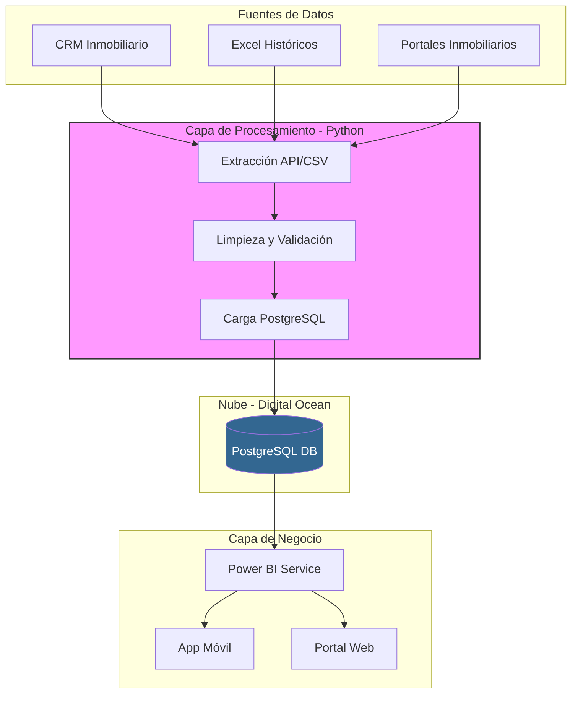

# Diagrama de Arquitectura del Sistema CMI-DAC

Este gráfico describe la arquitectura técnica, desde las fuentes de datos hasta la visualización final.

## Descripción de Componentes

1. **Fuentes**: Datos crudos de diversas plataformas.
2. **ETL**: Scripts Python ejecutados mediante CRON en Digital Ocean.
3. **Base de Datos**: PostgreSQL para almacenamiento robusto y seguro.
4. **Power BI**: Motor de visualización y modelado de datos.
