# Mockups del Dashboard CMI-DAC

A continuación se presentan varios prototipos visuales que muestran el diseño y la interfaz del Cuadro de Mando Integral.

## 1. Monitor Principal (Home)

Vista general con los indicadores estratégicos de la compañía.

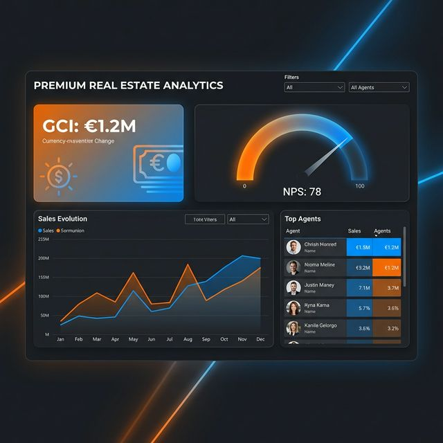

## 2. Mapa de Calor (Urban Analytics)

Visualización geográfica de la rentabilidad y tendencias por zonas.

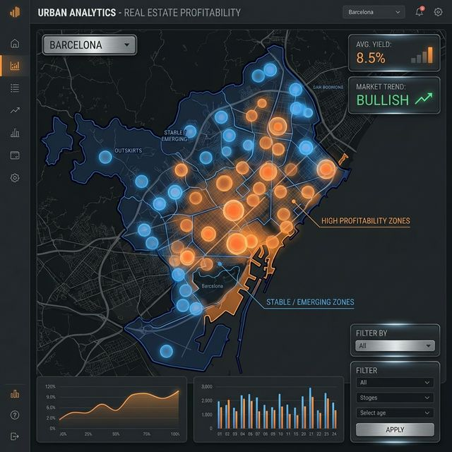

## 3. Rendimiento de Agentes

Detalle del leaderboard y métricas individuales de los agentes comerciales.

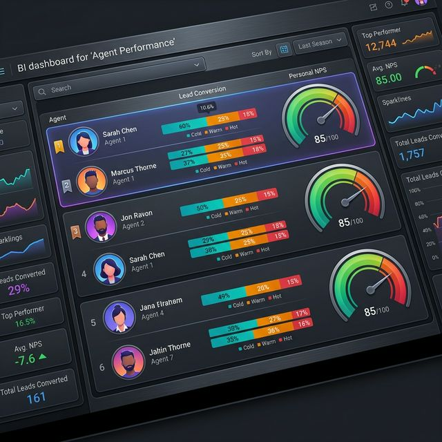

## 4. Vista Móvil (Power BI Mobile)

Adaptación de la interfaz para dispositivos móviles y tablets.

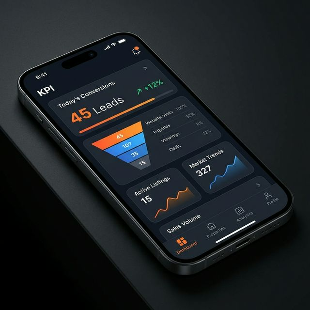

---

---

## 5. El Corazón de Power BI (Back-end)

Aquí se muestran los componentes técnicos que dan potencia al CMI-DAC.

### 5.1. El Modelo de Datos (Star Schema)

El "esqueleto" del sistema: una arquitectura robusta que conecta tablas de hechos y dimensiones para cálculos instantáneos.

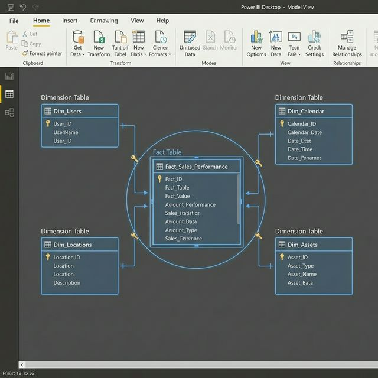

### 5.2. Inteligencia de Tiempo (Fórmulas DAX)

Lógica avanzada que permite comparar periodos, calcular crecimientos YoY y medir la rentabilidad con precisión quirúrgica.

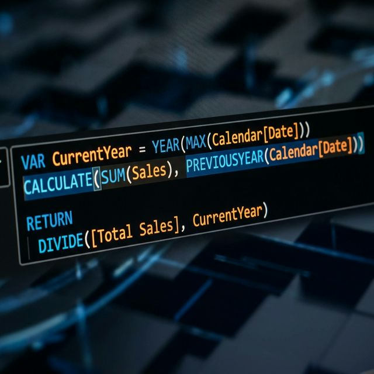

### 5.3. Inteligencia Artificial (Q&A)

Función de lenguaje natural que permite al usuario preguntar al sistema como si fuera un asistente humano.

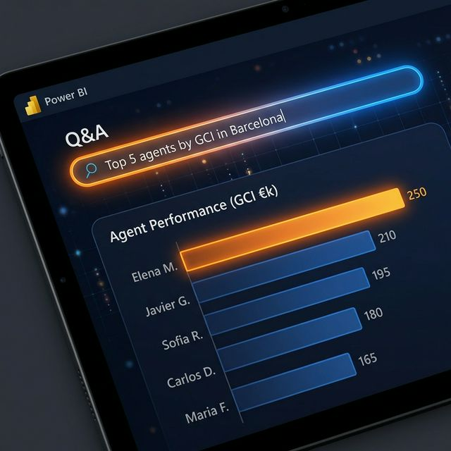

---

## 6. Infraestructura y Procesos Técnicos

El backend que sostiene toda la operación del CMI-DAC.

### 6.1. Pipeline de Datos (ETL)

Visualización conceptual del flujo de limpieza y estructuración de datos mediante Python.

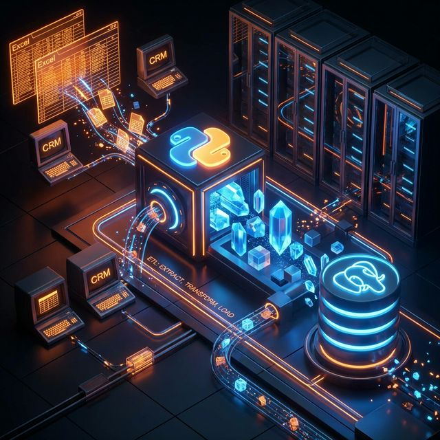

### 6.2. Arquitectura en la Nube (Digital Ocean)

El servidor central (Droplet) donde residen la base de datos PostgreSQL y los procesos de automatización.

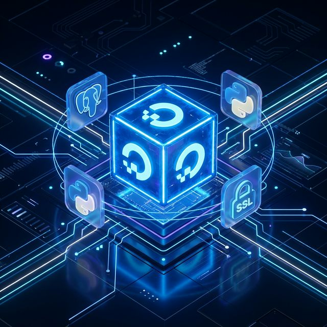

---

## 7. Experiencia de Usuario y Alertas

Cómo interactúa el sistema con el usuario final en su día a día.

### 7.1. Sistema de Alertas Inteligentes (Push Notifications)

Notificaciones en tiempo real sobre hitos críticos o desviaciones de KPIs directly en el smartwatch o smartphone.

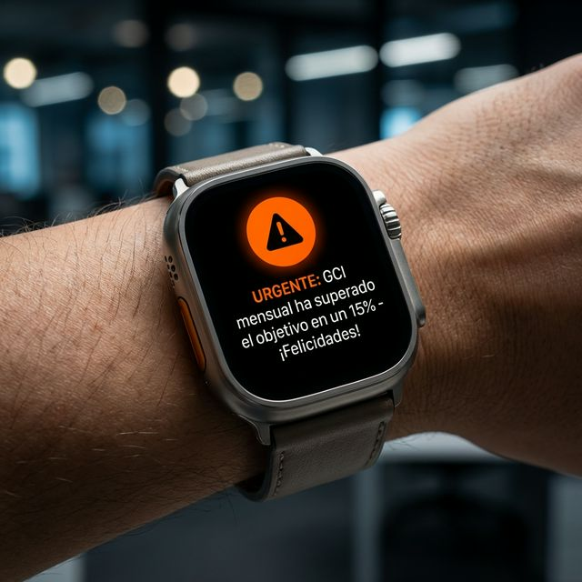

### 7.2. Visualización en Sala de Juntas (Samsung Flip 65")

Uso del dashboard interactivo en la pantalla táctil de gran formato para reuniones estratégicas.

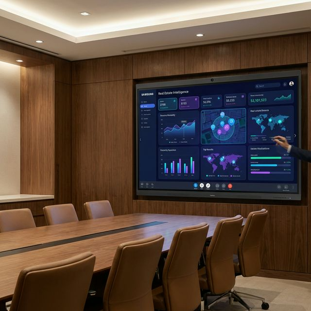

---

## 8. El Futuro: Análisis Predictivo y Control Holográfico

Visualizaciones de vanguardia basadas en modelos de datos avanzados y tendencias de mercado a largo plazo.

### 8.1. Centro de Control Predictivo (Minority Report Style)

Interfaz holográfica para la simulación de escenarios de mercado y análisis de riesgos mediante gestos.

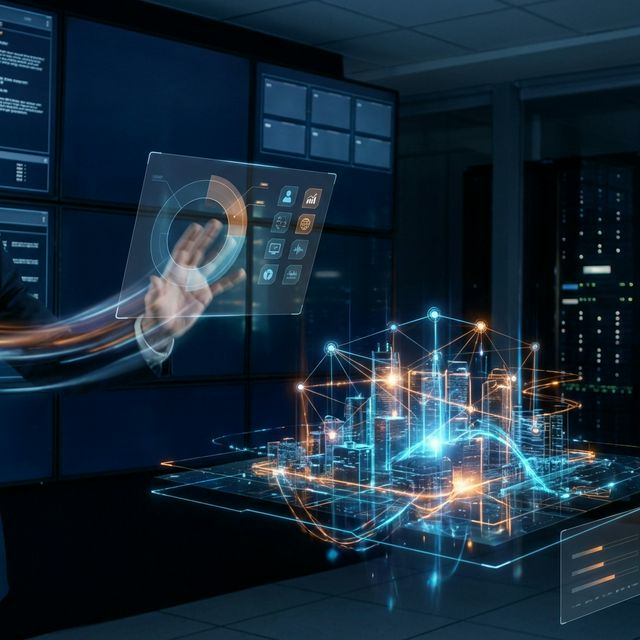

### 8.2. Forecasting Inmobiliario 2030

Modelos de redes neuronales aplicados a la evolución de precios y demanda en la próxima década.

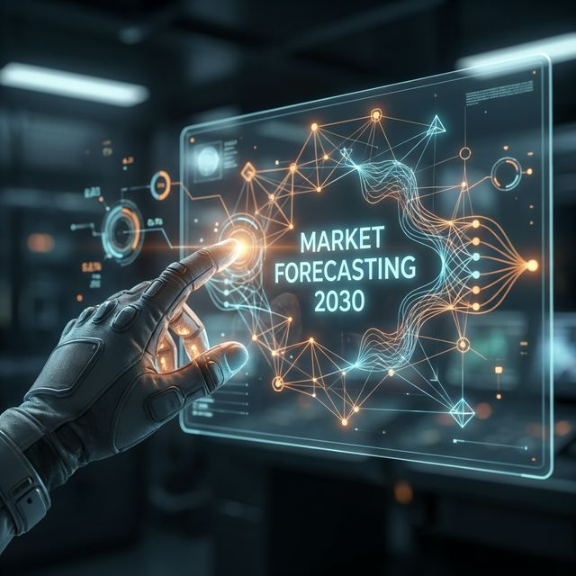

### 8.3. Command Center Corporativo

Vista de 360 grados de la operación global de División de Agentes Consultores, permitiendo una supervisión total en tiempo real.

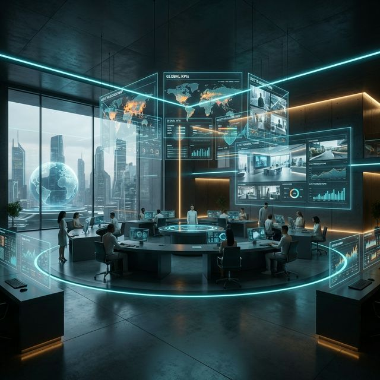

---

## 9. Seguridad, Colaboración y Nuevas Tecnologías

El CMI-DAC no es solo una herramienta de análisis, es un ecosistema protegido y colaborativo.

### 9.1. Ciberseguridad de Datos (Data Defense)

Protección de grado empresarial con cifrado SSL y monitoreo de amenazas en tiempo real para la base de datos de activos.

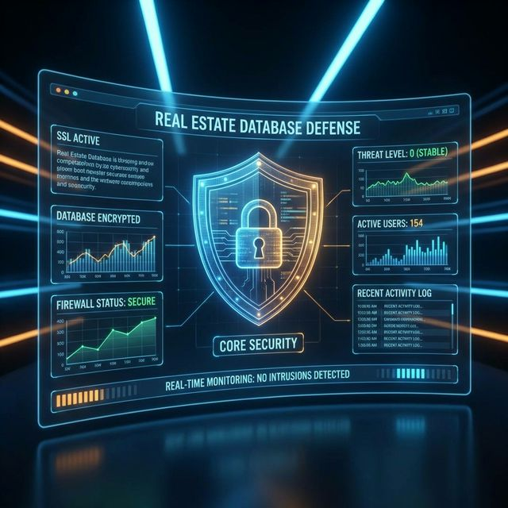

### 9.2. Gemelos Digitales (Digital Twins)

Modelado 3D de activos inmobiliarios integrando métricas operativas y financieras directamente sobre el edificio virtual.

### 9.3. Colaboración en Tiempo Real (Teams Integration)

Integración nativa con Microsoft Teams para discutir KPIs y tomar decisiones en equipo sin salir del flujo de trabajo.

### 9.4. Backups Automatizados (Híbrido Nube-Local)

Sincronización diaria entre el servidor cloud y la infraestructura NAS física para garantizar la disponibilidad absoluta de la información.

### 9.5. Realidad Aumentada (AR) para Agentes

El futuro de las visitas: superposición de datos financieros y de rentabilidad en tiempo real mediante gafas de AR.

### 9.6. Reporting Ejecutivo (Premium Experience)

Visualización de resúmenes directivos en dispositivos de alta gama para una experiencia de usuario élite.

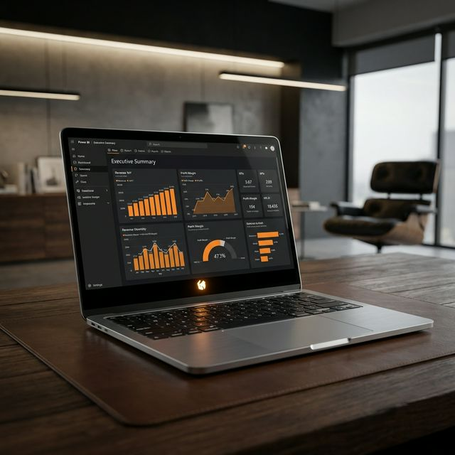

---

## 9. Seguridad, Infraestructura y Colaborativa

Visualizaciones de los sistemas de soporte y la experiencia integrada.

### 9.1. Blindaje de Ciberseguridad

Monitorización en tiempo real de la seguridad del dataset.

### 9.2. Gemelo Digital (Digital Twin)

Modelado 3D de activos para análisis de ocupación.
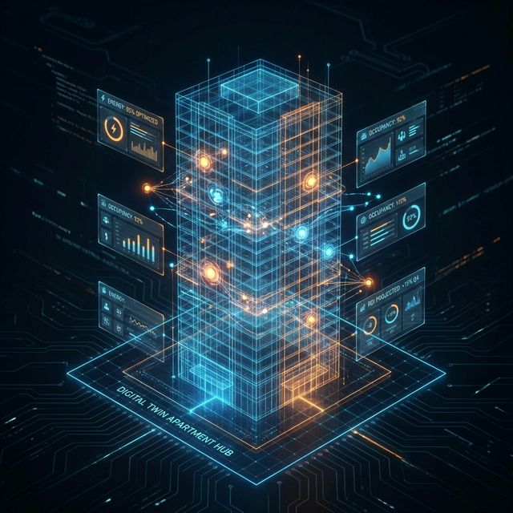

### 9.3. Respaldo NAS 3D

Visualización del sistema de backup físico y nube.
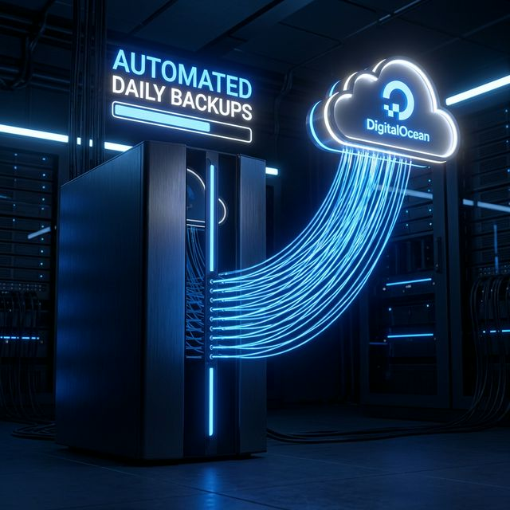

### 9.4. Hub de Colaboración (Teams)

Integración nativa en el flujo de trabajo del equipo.
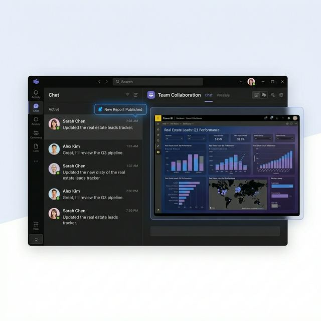

### 9.5. Visión AR (Augmented Reality)

El futuro de la captación: datos proyectados sobre el mundo real.
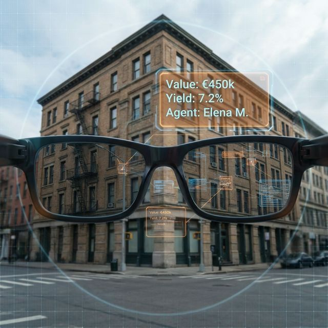

### 9.6. Oficina Ejecutiva (Premium)

El CMI en el entorno de trabajo real.

## Elementos Clave del Diseño

1. **Panel Superior (KPI Cards)**: Resumen instantáneo de GCI, Rentabilidad y NPS.
2. **Gráfico Central**: Evolución temporal de ventas comparada con el año anterior (YoY).
3. **Filtros Laterales**: Segmentación por Oficina, Agente y Periodo.
4. **Mapa de Calor**: Visualización geográfica de la rentabilidad por zonas.
