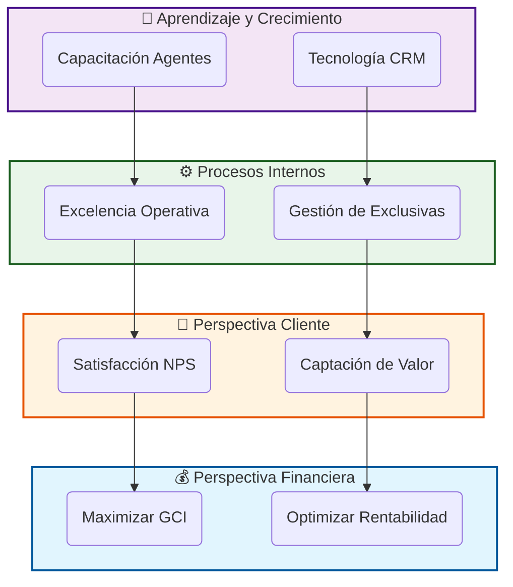

# 1. Introducción y Contexto Estratégico

## 1.1. El Porqué del Cambio: De la Intuición al Dato

Durante décadas, el sector inmobiliario se ha movido por **intuición, olfato y "pies de calle"**. Si bien estos elementos siguen siendo vitales, el mercado actual —hiper-competitivo y digitalizado— requiere un nivel de precisión superior.

El **CMI-DAC** nace de la necesidad de responder a preguntas de negocio con datos irrebatibles, no con sensaciones:

* *¿Estamos vendiendo menos porque el mercado ha caído o porque nuestros captadores no están captando en precio?*
* *¿Cuál es el retorno real de cada euro invertido en portales inmobiliarios?*
* *¿Quiénes son nuestros agentes más productivos y qué patrones de comportamiento siguen?*

### La Cultura de la Transparencia

Este manual no solo describe una herramienta técnica; propone un cambio cultural en **LegalIntermedia**. El uso del CMI garantiza que todos los miembros del equipo, desde el CEO hasta el agente más novel, vean la misma realidad reflejada en los números. La transparencia genera confianza y la confianza acelera la toma de decisiones.

---

## 1.2. El Ecosistema BI en el Sector Inmobiliario Moderno

El proyecto **CMI-DAC** se sitúa en la vanguardia tecnológica del sector. No se trata simplemente de un "visualizador de tablas", sino de un sistema de **Inteligencia de Negocio (Business Intelligence)** que integra múltiples fuentes de información:

1. **Datos Internos (CRM)**: Historial de llamadas, visitas, captaciones y cierres.
2. **Datos de Mercado (Portales)**: Precios de la competencia, demanda por zonas y tiempos de absorción.
3. **Datos Financieros (Contabilidad)**: Gastos operativos, márgenes y beneficios reales.

### Beneficios Estratégicos a Largo Plazo

Al adoptar de forma rigurosa este Cuadro de Mando, la empresa se prepara para:

* **Predictibilidad**: Anticipar caídas de facturación con 4 meses de antelación mediante el análisis de la tasa de captación.
* **Optimización del Inventario**: Reducir el DOM (Días en Mercado) medio de la oficina, aumentando la liquidez de la empresa.
* **Retención de Talento**: Identificar necesidades de formación antes de que el agente se desmotive por falta de cierres.

---

## 1.3. Historia y Evolución del Proyecto

El desarrollo del **CMI-DAC** ha seguido una hoja de ruta de mejora continua, dividida en tres hitos fundamentales:

### Fase 1: Recolección y Limpieza (The Foundation)

El mayor desafío no fue crear los gráficos, sino garantizar que los datos de origen fueran fiables. Se invirtieron cientos de horas en "limpiar" el histórico de ventas y normalizar los nombres de las zonas y agentes.

### Fase 2: Automatización y Nube (The Cloud Leap)

Se migró la infraestructura de servidores locales a la nube de **Digital Ocean**. Este salto eliminó los cuellos de botella técnicos y permitió que el manual y los dashboards estuvieran disponibles 24/7 en cualquier lugar del mundo con seguridad de grado bancario (SSL).

### Fase 3: Analítica Avanzada (The Insight Age)

Es la fase actual, donde el sistema no solo dice "qué ha pasado" (analítica descriptiva), sino que empieza a sugerir "qué debemos hacer" (analítica prescriptiva) mediante escenarios de uso y alertas tempranas.

---

## 1.4. Cómo Leer y Usar este Manual

Este documento ha sido diseñado para ser una herramienta viva. Se recomienda:

* **Para el Usuario de Negocio**: Centrarse en las secciones 3, 4 y 5.
* **Para el Equipo de IT**: Estudiar minuciosamente la sección 6 y los Anexos II y V.
* **Para la Dirección**: Revisar los Casos Prácticos de la sección 5 para maximizar el ROI de las reuniones de estrategia.

> **Compromiso de Autoría**: El diseño técnico y la consultoría estratégica de este modelo han sido ejecutados por la consultora **T*Posiciona**, en colaboración estrecha con el departamento de operaciones de **LegalIntermedia SL**.

El proyecto se estructura rigurosamente bajo las **cuatro perspectivas del Balanced Scorecard** de Kaplan y Norton, asegurando una visión holística del negocio:

1. **Perspectiva Financiera**: Analiza los ingresos, la rentabilidad y la salud económica. Responde a: *¿Cómo nos ven nuestros accionistas?*
2. **Perspectiva del Cliente**: Mide la satisfacción, captación y fidelización. Responde a: *¿Cómo nos ven nuestros clientes?*
3. **Perspectiva de Procesos Internos**: Evalúa la eficiencia operativa y la calidad del servicio. Responde a: *¿En qué debemos sobresalir?*
4. **Perspectiva de Aprendizaje y Crecimiento**: Se centra en el capital humano y tecnológico. Responde a: *¿Podemos seguir mejorando y creando valor?*

### 🗺️ Mapa Estratégico Visual

## 1.4. Características Clave del Sistema

El CMI-DAC no es un simple reporte, sino una plataforma analítica completa que incluye:

* ✅ **Automatización Total**: Procesos ETL (Extract, Transform, Load) en Python que limpian y estructuran los datos cada noche.
* ✅ **Base de Datos Profesional**: Almacenamiento en PostgreSQL gestionado en la nube (Digital Ocean) para máxima seguridad y escalabilidad.
* ✅ **Modelo en Estrella**: Arquitectura de datos optimizada para consultas multidimensionales instantáneas en Power BI.
* ✅ **Interacción Táctil**: Diseñado para ser operado tanto en PCs de escritorio como en pantallas táctiles de sala de juntas.

## 1.5. Audiencia Objetivo

Este manual y el cuadro de mando están diseñados para tres perfiles clave:

| Perfil | Uso Principal | Frecuencia |
| :--- | :--- | :--- |
| **CEO / Dirección** | Visión estratégica, cumplimiento de objetivos financieros, rentabilidad global. | Semanal / Mensual |
| **Jefes de Equipo** | Monitorización del rendimiento de los agentes, asignación de leads, control de calidad. | Diario / Semanal |
| **Agentes** | Autoevaluación, seguimiento de comisiones propias y estado de su cartera. | Diario |

## 1.6. Preguntas de Negocio Clave

El CMI responde, entre otras, a las siguientes preguntas críticas:

* *¿Estamos cumpliendo con la facturación prevista para este trimestre?*
* *¿Qué agentes están convirtiendo más leads en ventas reales?*
* *¿Cuál es el tiempo promedio que tarda una propiedad en venderse (DOM) y cómo reducirlo?*
* *¿Qué fuente de marketing nos trae los clientes más rentables?*
* *¿Es sostenible nuestro coste de adquisición de clientes (CAC) actual?*
