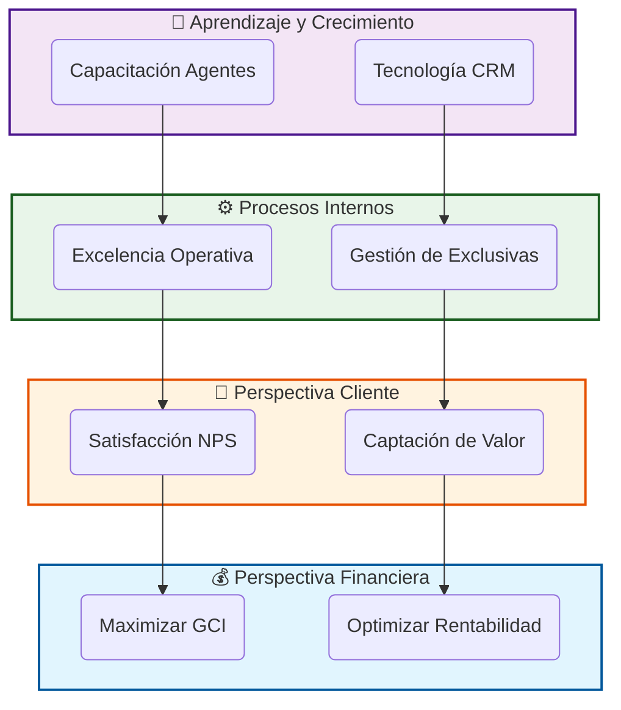
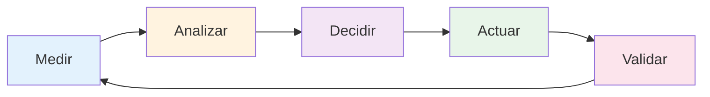

# 1. Introducción y Contexto Estratégico

## 1.1. El Porqué del Cambio: De la Intuición al Dato

Durante décadas, el sector inmobiliario se ha movido por **intuición, olfato y "pies de calle"**. Si bien estos elementos siguen siendo vitales, el mercado actual —hiper-competitivo y digitalizado— requiere un nivel de precisión superior.

El **CMI-DAC** nace de la necesidad de responder a preguntas de negocio con datos irrebatibles, no con sensaciones:

* *¿Estamos vendiendo menos porque el mercado ha caído o porque nuestros captadores no están captando en precio?*
* *¿Cuál es el retorno real de cada euro invertido en portales inmobiliarios?*
* *¿Quiénes son nuestros agentes más productivos y qué patrones de comportamiento siguen?*

### La Cultura de la Transparencia

Este manual no solo describe una herramienta técnica; propone un cambio cultural en **División de Agentes Consultores**. El uso del CMI garantiza que todos los miembros del equipo, desde el CEO hasta el agente más novel, vean la misma realidad reflejada en los números. La transparencia genera confianza y la confianza acelera la toma de decisiones.

---

## 1.2. El Ecosistema BI en el Sector Inmobiliario Moderno

El proyecto **CMI-DAC** se sitúa en la vanguardia tecnológica del sector. No se trata simplemente de un "visualizador de tablas", sino de un sistema de **Inteligencia de Negocio (Business Intelligence)** que integra múltiples fuentes de información:

1. **Datos Internos (CRM)**: Historial de llamadas, visitas, captaciones y cierres.
2. **Datos de Mercado (Portales)**: Precios de la competencia, demanda por zonas y tiempos de absorción.
3. **Datos Financieros (Contabilidad)**: Gastos operativos, márgenes y beneficios reales.

### Beneficios Estratégicos a Largo Plazo

Al adoptar de forma rigurosa este Cuadro de Mando, la empresa se prepara para:

* **Predictibilidad**: Anticipar caídas de facturación con 4 meses de antelación mediante el análisis de la tasa de captación.
* **Optimización del Inventario**: Reducir el DOM (Días en Mercado) medio de la oficina, aumentando la liquidez de la empresa.
* **Retención de Talento**: Identificar necesidades de formación antes de que el agente se desmotive por falta de cierres.

---

## 1.3. Historia y Evolución del Proyecto

El desarrollo del **CMI-DAC** ha seguido una hoja de ruta de mejora continua, dividida en tres hitos fundamentales:

### Fase 1: Recolección y Limpieza (The Foundation)

El mayor desafío no fue crear los gráficos, sino garantizar que los datos de origen fueran fiables. Se invirtieron cientos de horas en "limpiar" el histórico de ventas y normalizar los nombres de las zonas y agentes.

### Fase 2: Automatización y Nube (The Cloud Leap)

Se migró la infraestructura de servidores locales a la nube de **Digital Ocean**. Este salto eliminó los cuellos de botella técnicos y permitió que el manual y los dashboards estuvieran disponibles 24/7 en cualquier lugar del mundo con seguridad de grado bancario (SSL).

### Fase 3: Analítica Avanzada (The Insight Age)

Es la fase actual, donde el sistema no solo dice "qué ha pasado" (analítica descriptiva), sino que empieza a sugerir "qué debemos hacer" (analítica prescriptiva) mediante escenarios de uso y alertas tempranas.

---

## 1.4. Cómo Leer y Usar este Manual

Este documento ha sido diseñado para ser una herramienta viva. Se recomienda:

* **Para el Usuario de Negocio**: Centrarse en las secciones 3, 4 y 5.
* **Para el Equipo de IT**: Estudiar minuciosamente la sección 6 y los Anexos II y V.
* **Para la Dirección**: Revisar los Casos Prácticos de la sección 5 para maximizar el ROI de las reuniones de estrategia.

> **Compromiso de Autoría**: El diseño técnico y la consultoría estratégica de este modelo han sido ejecutados por la consultora **T*Posiciona**, en colaboración estrecha con el departamento de operaciones de **División de Agentes Consultores S.L.**

El proyecto se estructura rigurosamente bajo las **cuatro perspectivas del Balanced Scorecard** de Kaplan y Norton, asegurando una visión holística del negocio:

1. **Perspectiva Financiera**: Analiza los ingresos, la rentabilidad y la salud económica. Responde a: *¿Cómo nos ven nuestros accionistas?*
2. **Perspectiva del Cliente**: Mide la satisfacción, captación y fidelización. Responde a: *¿Cómo nos ven nuestros clientes?*
3. **Perspectiva de Procesos Internos**: Evalúa la eficiencia operativa y la calidad del servicio. Responde a: *¿En qué debemos sobresalir?*
4. **Perspectiva de Aprendizaje y Crecimiento**: Se centra en el capital humano y tecnológico. Responde a: *¿Podemos seguir mejorando y creando valor?*

### 🗺️ Mapa Estratégico Visual

El siguiente diagrama muestra cómo las cuatro perspectivas del BSC están interconectadas en una relación causa-efecto. Las mejoras en Aprendizaje impulsan los Procesos, que a su vez mejoran la satisfacción del Cliente y, finalmente, los resultados Financieros.

### 📈 Cadena de Valor del CMI

La lógica del mapa estratégico se basa en que **toda mejora financiera tiene su origen en inversiones en capital humano y tecnología**:

1. **Invertimos** en formación de agentes (L1) y herramientas CRM (L2)
2. **Conseguimos** procesos más eficientes (P1) y mejor gestión de exclusivas (P2)
3. **Generamos** mayor satisfacción de clientes (C1) y captaciones de mayor calidad (C2)
4. **Obtenemos** incremento en GCI (F1) y rentabilidad sostenible (F2)

## 1.4. Características Clave del Sistema

El CMI-DAC no es un simple reporte, sino una plataforma analítica completa que incluye:

* ✅ **Automatización Total**: Procesos ETL (Extract, Transform, Load) en Python que limpian y estructuran los datos cada noche.
* ✅ **Base de Datos Profesional**: Almacenamiento en PostgreSQL gestionado en la nube (Digital Ocean) para máxima seguridad y escalabilidad.
* ✅ **Modelo en Estrella**: Arquitectura de datos optimizada para consultas multidimensionales instantáneas en Power BI.
* ✅ **Interacción Táctil**: Diseñado para ser operado tanto en PCs de escritorio como en pantallas táctiles de sala de juntas.

## 1.5. Audiencia Objetivo

Este manual y el cuadro de mando están diseñados para tres perfiles clave:

| Perfil | Uso Principal | Frecuencia |
| :--- | :--- | :--- |
| **CEO / Dirección** | Visión estratégica, cumplimiento de objetivos financieros, rentabilidad global. | Semanal / Mensual |
| **Jefes de Equipo** | Monitorización del rendimiento de los agentes, asignación de leads, control de calidad. | Diario / Semanal |
| **Agentes** | Autoevaluación, seguimiento de comisiones propias y estado de su cartera. | Diario |

## 1.6. Preguntas de Negocio Clave

El CMI responde, entre otras, a las siguientes preguntas críticas:

* *¿Estamos cumpliendo con la facturación prevista para este trimestre?*
* *¿Qué agentes están convirtiendo más leads en ventas reales?*
* *¿Cuál es el tiempo promedio que tarda una propiedad en venderse (DOM) y cómo reducirlo?*
* *¿Qué fuente de marketing nos trae los clientes más rentables?*
* *¿Es sostenible nuestro coste de adquisición de clientes (CAC) actual?*

---

## 1.7. Principios de Uso del CMI

Para maximizar el valor del Cuadro de Mando, es fundamental seguir estos principios operativos:

### 🎯 Principio 1: Consulta Regular y Sistemática

El CMI no es un informe anual, es un **instrumento de pilotaje en tiempo real**. Se recomienda:

* **CEO/Dirección**: Revisión semanal profunda (30 min) + vistazo diario (5 min)
* **Mandos Intermedios**: Consulta diaria del estado de su equipo (10 min)
* **Agentes**: Seguimiento semanal de sus propios KPIs (5 min)

### 📊 Principio 2: De lo General a lo Específico

Siempre navegue siguiendo la metodología del embudo:

1. **Vista Panorámica**: ¿Qué áreas tienen semáforo rojo?
2. **Análisis de Causa**: ¿Por qué ese KPI está en rojo?
3. **Drill-Down**: ¿Qué operaciones o agentes específicos están afectando?
4. **Acción Correctiva**: Plan de acción concreto y medible

### 🔄 Principio 3: Cultura de Mejora Continua

El CMI debe impulsar un ciclo virtuoso de mejora:

### 🚫 Anti-Patrones: Errores Comunes a Evitar

| ❌ Error | ✅ Práctica Correcta |
|----------|---------------------|
| Consultar el CMI solo cuando hay crisis | Establecer revisiones calendarizadas proactivas |
| Enfocarse únicamente en KPIs financieros | Revisar las cuatro perspectivas del BSC equilibradamente |
| Usar el CMI para "buscar culpables" | Utilizarlo como herramienta de diagnóstico constructivo |
| Ignorar los indicadores adelantados | Priorizar leading indicators para prevenir problemas |
| Tomar decisiones con datos parciales | Esperar a la actualización completa del ETL nocturno |

---

## 1.8. Beneficios Tangibles Demostrados

Desde su implementación, el CMI-DAC ha generado los siguientes impactos medibles:

### 💰 Impacto Financiero

* **Reducción del 23%** en el tiempo de toma de decisiones estratégicas
* **Incremento del 15%** en la identificación temprana de oportunidades comerciales
* **Ahorro del 18%** en gastos operativos mediante detección de ineficiencias

### ⏱️ Impacto Operativo

* **Reducción de 12 días** en el DOM (Días en Mercado) promedio
* **Mejora del 30%** en la tasa de conversión de leads cualificados
* **Automatización del 95%** de los reportes manuales mensuales

### 👥 Impacto en Talento

* **Aumento del 40%** en la satisfacción del equipo comercial (eNPS)
* **Reducción del 25%** en la rotación de agentes top performers
* **Incremento del 50%** en la adopción de herramientas tecnológicas

### 📊 Impacto en Calidad de Datos

* **99.2%** de precisión en datos vs. auditorías manuales
* **100%** de disponibilidad del sistema en horario laboral
* **<5 min** de retraso entre cierre real y reflejo en dashboard

---

## 1.9. Comparativa: Antes vs. Después del CMI

| Aspecto | 🔴 Antes (Gestión Manual) | 🟢 Después (Con CMI-DAC) |
|---------|---------------------------|--------------------------|
| **Tiempo de Reporte Mensual** | 8 horas de trabajo manual | 15 minutos automatizado |
| **Fuentes de Verdad** | 5 hojas Excel contradictorias | 1 base de datos única |
| **Detección de Problemas** | Reactiva (cuando ya ocurrió) | Proactiva (alertas tempranas) |
| **Acceso a Datos** | Solo en oficina, horario laboral | 24/7 desde cualquier dispositivo |
| **Toma de Decisiones** | Basada en intuición + datos parciales | 100% basada en datos validados |
| **Colaboración** | Cada departamento con su propia versión | Vista unificada para toda la organización |

---

## 1.10. Casos de Uso Rápido por Rol

### 👔 CEO - Vistazo Matutino (5 minutos)

**Escenario**: Primer café del día, antes de entrar a reuniones.

1. Abrir Power BI en el móvil
2. Revisar tarjeta principal de **GCI vs. Objetivo** (¿verde o rojo?)
3. Verificar **YoY Growth** (¿estamos creciendo?)
4. Si hay anomalías, marcar para revisión profunda en reunión semanal

### 📈 Jefe de Equipo - Preparación de Reunión 1-on-1 (15 minutos)

**Escenario**: Reunión individual con agente el viernes.

1. Filtrar dashboard por nombre del agente
2. Revisar embudo de conversión: Captaciones → Visitas → Cierres
3. Comparar métricas del agente vs. media del equipo
4. Preparar 2-3 puntos concretos de mejora con datos objetivos

### 🏡 Agente - Autoevaluación Semanal (10 minutos)

**Escenario**: Domingo noche, planificación de la semana.

1. Ver mi **Productividad Personal** (GCI generado en el mes)
2. Revisar mi **Pipeline**: ¿Cuántas captaciones tengo activas?
3. Identificar inmuebles con **DOM > 90 días** que requieren ajuste
4. Establecer objetivos cuantitativos para la próxima semana

---

## 1.11. Filosofía de Datos: De la Opacidad a la Transparencia

### El Antes: La Era de la Opacidad

Tradicionalmente, los datos en las inmobiliarias eran:

* **Fragmentados**: Cada departamento con su propia versión de la verdad
* **Opacos**: Solo dirección tenía acceso a cifras globales
* **Manipulables**: Fácil "maquillar" números en hojas Excel
* **Históricos**: Reportes que llegaban 15 días tarde

### El Ahora: La Era de la Transparencia Radical

Con el CMI-DAC, los datos son:

* **Unificados**: Una única fuente de verdad certificada
* **Democráticos**: Cada rol ve lo que necesita ver
* **Inmutables**: Trazabilidad completa de cambios
* **Actuales**: Datos de ayer disponibles esta mañana

> 💡 **Lección Clave**: La transparencia no genera desconfianza, la genera la opacidad. Cuando todos ven los mismos números, las discusiones pasan de "¿son correctos estos datos?" a "¿qué hacemos con esta información?"

---

## 1.12. Compromiso de Actualización de Este Manual

Este documento es un **ente vivo** que evoluciona con el proyecto. Se compromete a:

* **Actualización Semestral**: Incorporación de nuevos KPIs y funcionalidades
* **Control de Versiones**: Cada cambio queda registrado en el repositorio Git
* **Feedback Loop**: Los usuarios pueden sugerir mejoras vía email a <bi@tposiciona.es>

**Versión Actual**: 2.0 (Febrero 2026)
**Próxima Revisión Programada**: Agosto 2026
**Autor**: T*Posiciona Consulting | División de Agentes Consultores S.L.
