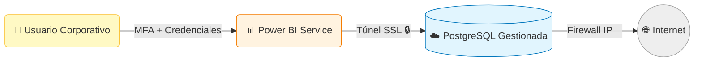

# 2. Acceso y Requisitos de Sistema

## 2.1. Credenciales y Seguridad de Acceso

El Cuadro de Mando Integral (CMI-DAC) es una solución profesional alojada en **Microsoft Power BI Service**. El acceso está estrictamente regulado y requiere de una doble verificación.

* **Cuenta de Usuario Corporativo**: `divisionagentesconsultores@cuningcc.onmicrosoft.com`
* **Nivel de Licencia**: **Power BI Pro**. Esto garantiza la capacidad de compartir dashboards de forma segura y visualizarlos en dispositivos móviles.

> 🔒 **Importante**: La gestión de la contraseña es responsabilidad del Administrador de Sistemas. En caso de olvido o necesidad de restablecimiento, contacte inmediatamente con IT. **Nunca comparta estas credenciales por email o mensajería instantánea.**

## 2.1. Plataformas de Acceso

El CMI-DAC es accesible desde tres entornos diferentes, optimizados para distintos casos de uso:

### 💻 Acceso Web (Escritorio) - Uso Estándar

Es la forma principal de consumo para el análisis profundo.

* **URL Oficial**: `https://app.powerbi.com` (Requiere login corporativo).
* **Requisitos del Navegador**: El sistema está optimizado para **Microsoft Edge** y **Google Chrome**. No se recomienda el uso de Internet Explorer (deprecado) o versiones antiguas de Safari por incompatibilidad con los gráficos dinámicos de mapas.

### 📱 Acceso Mobile (Smartphone / Tablet) - Uso en Calle

Ideal para directivos o agentes que necesitan consultar un dato rápido antes de entrar en una reunión con un propietario.

* **Aplicación**: Descargue "Microsoft Power BI" desde App Store (iOS) o Google Play (Android).
* **Ventaja**: Permite configurar **Alertas Automáticas**. Si un KPI (ej. Ventas del día) alcanza un umbral, recibirá una notificación en su móvil.

---

## 2.2. Política de Seguridad y Privacidad (RGPD)

La información contenida en el CMI-DAC es **Estrictamente Confidencial** y propiedad de **LegalIntermedia SL**. El acceso está regulado bajo los siguientes principios:

### 🗝️ Autenticación de Doble Factor (MFA)

Para proteger los datos de ventas y comisiones, es obligatorio tener activo el MFA en su cuenta de Microsoft 365. Esto evita que, si su contraseña es robada, alguien pueda acceder al manual o a los datos financieros.

### 🛡️ Niveles de Permisos (Row-Level Security)

El sistema utiliza seguridad a nivel de fila. Esto significa que:

* **Dirección**: Ve todos los datos de todas las oficinas y agentes.
* **Jefes de Equipo**: Ven los datos de su oficina específica.
* **Agentes**: Ven únicamente sus propias operaciones y un resumen anónimo del promedio de la oficina.

> ⚠️ **Prohibición de Extracción Masiva**: La descarga de tablas completas de clientes o ventas está monitorizada. Cualquier descarga inusual de más de 500 registros activará una alerta de seguridad automática al administrador.

---

## 2.3. Configuración de Puestos de Trabajo

Para una experiencia visual fluida y precisa, se recomiendan los siguientes parámetros:

1. **Resolución de Pantalla**: Mínimo Full HD (1920x1080). En resoluciones inferiores (ej. portátiles antiguos de 1366x768), algunos gráficos pueden solaparse.
2. **Zoom del Navegador**: Mantener siempre al **100%**. Un zoom del 125% distorsiona la alineación de las tarjetas de KPI.
3. **Memoria RAM**: Mínimo 8GB. El motor gráfico de Power BI consume recursos significativos durante el renderizado de mapas de calor.

---

## 2.4. Resolución de Problemas de Acceso "Primer Nivel"

Antes de reportar una incidencia a IT, verifique:

* **Caché del Navegador**: Si los gráficos aparecen en blanco, presione `Ctrl + F5` para forzar la recarga de los scripts de visualización.
* **Sesión Bloqueada**: Power BI cierra la sesión por inactividad tras 8 horas. Salga de la cuenta y vuelva a entrar si nota que los filtros no responden.
* **Gateway**: Si el mensaje es "Data source error", espere 5 minutos; es posible que la base de datos PostgreSQL se esté reiniciando tras el backup nocturno.

## 2.5. Seguridad y Privacidad de los Datos

La arquitectura del CMI-DAC implementa múltiples capas de seguridad para proteger la información confidencial de la empresa y sus clientes:

1. **Seguridad a Nivel de Fila (Row Level Security - RLS)**:
    * El sistema permite configurar qué datos ve cada usuario.
    * Por defecto, el perfil **Administrador/CEO** tiene visibilidad total.
    * Se pueden crear roles específicos para que cada agente vea únicamente su propia producción y cartera, sin acceso a los datos financieros globales.

2. **Encriptación en Tránsito (SSL/TLS)**:
    * Toda la comunicación entre la base de datos (PostgreSQL en la nube) y Power BI está cifrada mediante certificados SSL dedicados.
    * Esto impide que terceros puedan interceptar los datos mientras viajan por internet.

3. **Base de Datos Gestionada y Segura**:
    * Los datos residen en servidores de **Digital Ocean** con geolocalización en Europa.
    * El acceso a la base de datos está restringido por IP (Firewall) y requiere certificados de cliente CA para cualquier conexión externa.
    * Se realizan copias de seguridad automáticas diarias para garantizar la recuperabilidad ante desastres.

### 🛡️ Esquema de Seguridad

## 2.4. Instalación (Solo Administradores)

Para el despliegue técnico o reinstalación del entorno de desarrollo, el sistema utiliza **Docker**.

* El repositorio incluye un archivo `docker-compose.yml` que levanta todos los servicios necesarios (Base de datos local, scripts de Python, pgAdmin) con un solo comando.
* Consulte el [**Anexo II: Guía de Despliegue**](../anexos/Guia_Despliegue.md) para ver los pasos técnicos detallados.
