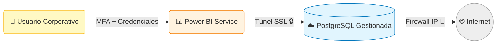
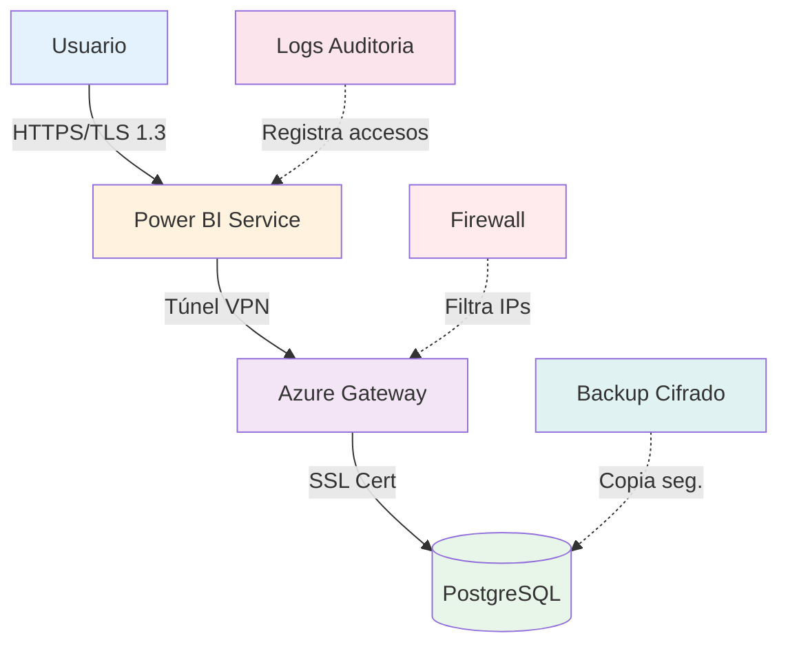

# 2. Acceso y Requisitos de Sistema

## 2.1. Credenciales y Seguridad de Acceso

El Cuadro de Mando Integral (CMI-DAC) es una solución profesional alojada en **Microsoft Power BI Service**. El acceso está estrictamente regulado y requiere de una doble verificación.

* **Cuenta de Usuario Corporativo**: `divisionagentesconsultores@cuningcc.onmicrosoft.com`
* **Nivel de Licencia**: **Power BI Pro**. Esto garantiza la capacidad de compartir dashboards de forma segura y visualizarlos en dispositivos móviles.

> 🔒 **Importante**: La gestión de la contraseña es responsabilidad del Administrador de Sistemas. En caso de olvido o necesidad de restablecimiento, contacte inmediatamente con IT. **Nunca comparta estas credenciales por email o mensajería instantánea.**

## 2.1. Plataformas de Acceso

El CMI-DAC es accesible desde tres entornos diferentes, optimizados para distintos casos de uso:

### 💻 Acceso Web (Escritorio) - Uso Estándar

Es la forma principal de consumo para el análisis profundo.

* **URL Oficial**: `https://app.powerbi.com` (Requiere login corporativo).
* **Requisitos del Navegador**: El sistema está optimizado para **Microsoft Edge** y **Google Chrome**. No se recomienda el uso de Internet Explorer (deprecado) o versiones antiguas de Safari por incompatibilidad con los gráficos dinámicos de mapas.

### 📱 Acceso Mobile (Smartphone / Tablet) - Uso en Calle

Ideal para directivos o agentes que necesitan consultar un dato rápido antes de entrar en una reunión con un propietario.

* **Aplicación**: Descargue "Microsoft Power BI" desde App Store (iOS) o Google Play (Android).
* **Ventaja**: Permite configurar **Alertas Automáticas**. Si un KPI (ej. Ventas del día) alcanza un umbral, recibirá una notificación en su móvil.

---

## 2.2. Política de Seguridad y Privacidad (RGPD)

La información contenida en el CMI-DAC es **Estrictamente Confidencial** y propiedad de **LegalIntermedia SL**. El acceso está regulado bajo los siguientes principios:

### 🗝️ Autenticación de Doble Factor (MFA)

Para proteger los datos de ventas y comisiones, es obligatorio tener activo el MFA en su cuenta de Microsoft 365. Esto evita que, si su contraseña es robada, alguien pueda acceder al manual o a los datos financieros.

### 🛡️ Niveles de Permisos (Row-Level Security)

El sistema utiliza seguridad a nivel de fila. Esto significa que:

* **Dirección**: Ve todos los datos de todas las oficinas y agentes.
* **Jefes de Equipo**: Ven los datos de su oficina específica.
* **Agentes**: Ven únicamente sus propias operaciones y un resumen anónimo del promedio de la oficina.

> ⚠️ **Prohibición de Extracción Masiva**: La descarga de tablas completas de clientes o ventas está monitorizada. Cualquier descarga inusual de más de 500 registros activará una alerta de seguridad automática al administrador.

---

## 2.3. Configuración de Puestos de Trabajo

Para una experiencia visual fluida y precisa, se recomiendan los siguientes parámetros:

1. **Resolución de Pantalla**: Mínimo Full HD (1920x1080). En resoluciones inferiores (ej. portátiles antiguos de 1366x768), algunos gráficos pueden solaparse.
2. **Zoom del Navegador**: Mantener siempre al **100%**. Un zoom del 125% distorsiona la alineación de las tarjetas de KPI.
3. **Memoria RAM**: Mínimo 8GB. El motor gráfico de Power BI consume recursos significativos durante el renderizado de mapas de calor.

---

## 2.4. Resolución de Problemas de Acceso "Primer Nivel"

Antes de reportar una incidencia a IT, verifique:

* **Caché del Navegador**: Si los gráficos aparecen en blanco, presione `Ctrl + F5` para forzar la recarga de los scripts de visualización.
* **Sesión Bloqueada**: Power BI cierra la sesión por inactividad tras 8 horas. Salga de la cuenta y vuelva a entrar si nota que los filtros no responden.
* **Gateway**: Si el mensaje es "Data source error", espere 5 minutos; es posible que la base de datos PostgreSQL se esté reiniciando tras el backup nocturno.

## 2.5. Seguridad y Privacidad de los Datos

La arquitectura del CMI-DAC implementa múltiples capas de seguridad para proteger la información confidencial de la empresa y sus clientes:

1. **Seguridad a Nivel de Fila (Row Level Security - RLS)**:
    * El sistema permite configurar qué datos ve cada usuario.
    * Por defecto, el perfil **Administrador/CEO** tiene visibilidad total.
    * Se pueden crear roles específicos para que cada agente vea únicamente su propia producción y cartera, sin acceso a los datos financieros globales.

2. **Encriptación en Tránsito (SSL/TLS)**:
    * Toda la comunicación entre la base de datos (PostgreSQL en la nube) y Power BI está cifrada mediante certificados SSL dedicados.
    * Esto impide que terceros puedan interceptar los datos mientras viajan por internet.

3. **Base de Datos Gestionada y Segura**:
    * Los datos residen en servidores de **Digital Ocean** con geolocalización en Europa.
    * El acceso a la base de datos está restringido por IP (Firewall) y requiere certificados de cliente CA para cualquier conexión externa.
    * Se realizan copias de seguridad automáticas diarias para garantizar la recuperabilidad ante desastres.

### 🛡️ Esquema de Seguridad



## 2.4. Instalación (Solo Administradores)

Para el despliegue técnico o reinstalación del entorno de desarrollo, el sistema utiliza **Docker**.

* El repositorio incluye un archivo `docker-compose.yml` que levanta todos los servicios necesarios (Base de datos local, scripts de Python, pgAdmin) con un solo comando.
* Consulte el [**Anexo II: Guía de Despliegue**](../anexos/Guia_Despliegue.md) para ver los pasos técnicos detallados.

---

## 2.5. Optimización de la Experiencia de Usuario

Para garantizar la mejor experiencia posible al usar el CMI-DAC, siga estas recomendaciones:

### 🖥️ Configuración Óptima de Hardware

| Componente | Mínimo | Recomendado | Óptimo |
|------------|--------|-------------|--------|
| **Procesador** | Intel i3 / Ryzen 3 | Intel i5 / Ryzen 5 | Intel i7 / Ryzen 7 |
| **RAM** | 8 GB | 16 GB | 32 GB |
| **Almacenamiento** | HDD 500GB | SSD 256GB | NVMe SSD 512GB |
| **Resolución** | 1366x768 | 1920x1080 (Full HD) | 2560x1440 (2K) |
| **Conexión** | 10 Mbps | 50 Mbps | 100+ Mbps |

### 🌐 Navegadores Compatibles y Versiones

| Navegador | Versión Mínima | Estado | Notas |
|-----------|----------------|--------|-------|
| **Microsoft Edge** | 90+ | ✅ Recomendado | Mejor integración con Power BI |
| **Google Chrome** | 90+ | ✅ Recomendado | Excelente rendimiento |
| **Firefox** | 88+ | ⚠️ Compatible | Algunos gráficos pueden ser más lentos |
| **Safari** | 14+ | ⚠️ Compatible | Solo en macOS/iOS moderno |
| **Internet Explorer** | Cualquiera | ❌ No soportado | Deprecado por Microsoft |

### 📱 Aplicación Móvil: Power BI Mobile

La aplicación móvil ofrece características específicas que no están disponibles en el navegador web:

**Ventajas exclusivas:**
* **Modo Offline**: Consulta los últimos datos descargados sin conexión
* **Notificaciones Push**: Alertas instantáneas cuando un KPI supera umbrales
* **Escaneo de Códigos QR**: Acceso rápido a dashboards compartidos
* **Modo Presentación**: Visualización en pantalla completa sin distracciones
* **Autenticación Biométrica**: Face ID / Touch ID para acceso rápido y seguro

**Descargas:**
* [iOS App Store](https://apps.apple.com/app/microsoft-power-bi/id929738808)
* [Google Play Store](https://play.google.com/store/apps/details?id=com.microsoft.powerbim)

---

## 2.6. Gestión Avanzada de Permisos y Roles

El sistema implementa un modelo de permisos granular basado en **roles y atributos**:

### 🎭 Roles Predefinidos

#### 1. **Administrador Global**
* **Acceso**: Total sin restricciones
* **Capacidades**: Ver, editar, exportar, gestionar usuarios
* **Asignado a**: CTO, Director de Sistemas
* **Seguridad RLS**: Deshabilitada (ve todos los datos)

#### 2. **Dirección Ejecutiva**
* **Acceso**: Lectura completa, exportación limitada
* **Capacidades**: Ver todas las oficinas y agentes, exportar reportes
* **Asignado a**: CEO, CFO, Director Comercial
* **Seguridad RLS**: Ve todos los datos operativos

#### 3. **Jefe de Equipo / Oficina**
* **Acceso**: Lectura de su oficina/equipo, sin exportación masiva
* **Capacidades**: Ver su equipo, comparativas con media general
* **Asignado a**: Responsables de oficina, coordinadores
* **Seguridad RLS**: Filtrado por `dim_agentes[oficina] = USER_OFFICE`

#### 4. **Agente Comercial**
* **Acceso**: Solo sus propios datos y promedios anónimos
* **Capacidades**: Ver su rendimiento, comparar con media
* **Asignado a**: Agentes, captadores, comerciales
* **Seguridad RLS**: Filtrado por `dim_agentes[email] = USERPRINCIPALNAME()`

#### 5. **Solo Lectura (Auditor)**
* **Acceso**: Lectura sin capacidad de filtrado o exportación
* **Capacidades**: Ver dashboards predefinidos estáticos
* **Asignado a**: Auditores externos, consultores temporales
* **Seguridad RLS**: Según acuerdo temporal

### 🔐 Matriz de Permisos Detallada

| Funcionalidad | Admin | Dirección | Jefe Eq. | Agente | Auditor |
|---------------|-------|-----------|----------|--------|---------|
| Ver todos los datos | ✅ | ✅ | ❌ | ❌ | ⚠️ |
| Ver datos de su equipo | ✅ | ✅ | ✅ | ❌ | ⚠️ |
| Ver datos propios | ✅ | ✅ | ✅ | ✅ | ❌ |
| Exportar a Excel (>500 reg) | ✅ | ✅ | ❌ | ❌ | ❌ |
| Exportar a PDF | ✅ | ✅ | ✅ | ✅ | ❌ |
| Crear bookmarks personales | ✅ | ✅ | ✅ | ✅ | ❌ |
| Configurar alertas | ✅ | ✅ | ✅ | ✅ | ❌ |
| Gestionar usuarios | ✅ | ❌ | ❌ | ❌ | ❌ |
| Modificar dataset | ✅ | ❌ | ❌ | ❌ | ❌ |

---

## 2.7. Configuración de Alertas Inteligentes

Power BI permite configurar alertas automáticas sobre KPIs críticos:

### 📬 Tipos de Alertas Disponibles

#### Alerta de Umbral
**Ejemplo**: "Avisarme cuando el GCI mensual supere €100,000"

```
Configuración:
- KPI: GCI Mensual
- Condición: Mayor que
- Valor: 100000
- Frecuencia: Cada hora
- Canal: Email + Notificación móvil
```

#### Alerta de Tendencia
**Ejemplo**: "Avisarme si las captaciones bajan 3 semanas consecutivas"

```
Configuración:
- KPI: Captaciones Semanales
- Condición: Tendencia descendente
- Periodo: 3 semanas
- Frecuencia: Semanal (lunes 9 AM)
- Canal: Email al jefe de equipo
```

#### Alerta de Anomalía
**Ejemplo**: "Avisarme si hay un cambio inesperado > 20% en cualquier KPI"

```
Configuración:
- KPI: Todos los principales
- Condición: Desviación estándar > 2σ
- Frecuencia: Diaria
- Canal: Dashboard + SMS a CTO
```

### 🔔 Mejores Prácticas para Alertas

| ✅ Hacer | ❌ Evitar |
|----------|-----------|
| Configurar 3-5 alertas clave por rol | Configurar alertas para cada KPI |
| Usar umbrales realistas basados en histórico | Poner umbrales arbitrarios |
| Revisar y ajustar alertas trimestralmente | "Configurar y olvidar" |
| Diferenciar urgencia (SMS vs. Email) | Usar el mismo canal para todo |
| Incluir contexto en el mensaje de alerta | Alertas genéricas sin contexto |

---

## 2.8. Troubleshooting Avanzado

### 🔧 Problemas Frecuentes y Soluciones

#### Problema 1: "No puedo ver ningún dato, todo aparece en blanco"

**Diagnóstico**:
```
Posibles causas:
1. Row-Level Security está bloqueando tus datos
2. Filtros globales están demasiado restrictivos
3. Permisos no asignados correctamente
```

**Solución**:
1. Verificar con administrador que tu rol esté correctamente asignado
2. Presionar el botón "Reset all filters" (🗑️) en la barra superior
3. Cerrar sesión y volver a entrar (Ctrl + F5 para limpiar caché)
4. Si persiste, contactar IT con screenshot del error

#### Problema 2: "Los gráficos cargan muy lento (>30 segundos)"

**Diagnóstico**:
```
Posibles causas:
1. Conexión a internet lenta o inestable
2. Dataset muy grande sin optimizar
3. Demasiadas visualizaciones en una página
4. Filtros cruzados complejos
```

**Solución**:
1. Verificar velocidad de conexión (mínimo 10 Mbps requerido)
2. Reducir rango de fechas con filtro temporal
3. Cerrar pestañas innecesarias del navegador
4. Usar la versión móvil si estás en conexión celular

#### Problema 3: "Recibo error de autenticación cada hora"

**Diagnóstico**:
```
Causa: Token de sesión expirando prematuramente
```

**Solución**:
1. Verificar que MFA esté correctamente configurado
2. Limpiar cookies y caché del navegador
3. Re-autenticar en portal.office.com primero
4. Contactar IT para revisar políticas de sesión

#### Problema 4: "Los números no coinciden con mi reporte manual"

**Diagnóstico**:
```
Posibles causas:
1. Diferente definición de fechas (natural vs. fiscal)
2. Filtros aplicados sin darte cuenta
3. Datos en Excel no actualizados
4. RLS filtrando datos que no deberías ver
```

**Solución**:
1. Verificar en "Applied Filters" qué filtros están activos
2. Comparar definiciones: ¿usas fecha de cierre o de firma?
3. Esperar a la actualización nocturna (5 AM) para datos frescos
4. Si la diferencia persiste >5%, reportar a analista BI

---

## 2.9. Cumplimiento Normativo (RGPD y LOPD)

El CMI-DAC cumple con la legislación europea de protección de datos:

### 📋 Principios RGPD Implementados

1. **Minimización de Datos**: Solo se almacenan datos estrictamente necesarios
2. **Limitación de Finalidad**: Los datos solo se usan para análisis interno
3. **Exactitud**: Procesos de validación automática garantizan calidad
4. **Limitación de Plazo**: Datos > 7 años se anonimizan automáticamente
5. **Integridad y Confidencialidad**: Cifrado end-to-end y auditoría de accesos

### 🔒 Derechos del Usuario (ARCO)

Cualquier persona cuyos datos estén en el sistema puede ejercer:

* **Acceso**: Solicitar copia de sus datos personales
* **Rectificación**: Corregir datos inexactos
* **Cancelación**: Solicitar eliminación (derecho al olvido)
* **Oposición**: Negarse a ciertos tratamientos

**Procedimiento**: Enviar solicitud formal a <dpo@legalintermedia.com>

### 🛡️ Medidas de Seguridad Técnicas



---

## 2.10. Checklist de Primer Acceso

Si es tu primera vez accediendo al CMI-DAC, sigue esta lista:

- [ ] **Paso 1**: Verificar que tienes credenciales corporativas (@cuningcc.onmicrosoft.com)
- [ ] **Paso 2**: Activar MFA (Multi-Factor Authentication) en tu cuenta Microsoft 365
- [ ] **Paso 3**: Descargar Power BI Desktop (solo si eres administrador)
- [ ] **Paso 4**: Acceder a app.powerbi.com y localizar el workspace "CMI-DAC"
- [ ] **Paso 5**: Verificar que ves datos (si está todo en blanco, contactar IT)
- [ ] **Paso 6**: Configurar 2-3 alertas personales en tus KPIs críticos
- [ ] **Paso 7**: Guardar un bookmark personal con tus filtros habituales
- [ ] **Paso 8**: Instalar la app móvil y verificar que sincroniza
- [ ] **Paso 9**: Revisar esta sección del manual completa (al menos 1 vez)
- [ ] **Paso 10**: Realizar la formación inicial (webinar mensual o video grabado)

---

## 2.11. Políticas de Uso Aceptable

Al acceder al CMI-DAC, el usuario acepta las siguientes condiciones:

### ✅ Usos Permitidos

* Consultar datos para análisis y toma de decisiones empresariales
* Exportar visualizaciones para presentaciones internas
* Compartir enlaces a dashboards con compañeros autorizados
* Configurar alertas personales sobre KPIs de tu área

### ⛔ Usos Prohibidos

* Descargar bases de datos completas sin autorización escrita
* Compartir credenciales de acceso con terceros
* Usar datos para propósitos no relacionados con el negocio
* Realizar ingeniería inversa del modelo de datos
* Publicar o compartir datos fuera de la organización

**Consecuencias del Incumplimiento**: Revocación inmediata de acceso y posibles acciones legales según la gravedad.
