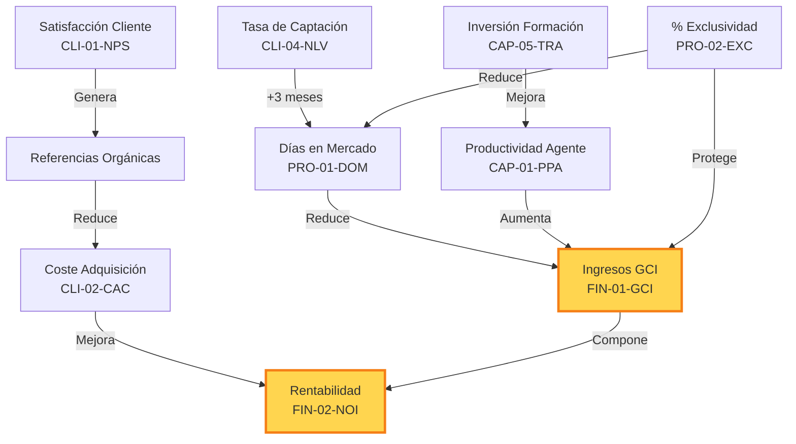

# 4. Diccionario de Indicadores (KPIs)

Este apartado define en detalle los 20 indicadores clave de desempeño (KPIs) seleccionados para el **CMI-DAC**. Están organizados según las cuatro perspectivas del Balanced Scorecard.

## 🏆 Jerarquía de Indicadores

```mermaid
graph TD
    Nivel1[👑 KPIs Estratégicos<br/>(CEO/Dirección)]
    Nivel2[📈 KPIs Tácticos<br/>(Jefes de Equipo)]
    Nivel3[⚙️ KPIs Operativos<br/>(Agentes)]

    Nivel1 --> GCI[Ingresos GCI]
    Nivel1 --> NOI[Rentabilidad Neta]
    
    Nivel2 --> Captacion[Tasa de Captación]
    Nivel2 --> DOM[Días en Mercado]
    
    Nivel3 --> Visitas[Nº Visitas]
    Nivel3 --> Llamadas[Llamadas Realizadas]

    style Nivel1 fill:#ffcc80,stroke:#e65100
    style Nivel2 fill:#fff59d,stroke:#fbc02d
    style Nivel3 fill:#b3e5fc,stroke:#0277bd
```

---

## 4.1. 💰 Perspectiva Financiera (Resultados Económicos)

**🎯 Objetivo Estratégico**: Garantizar la sostenibilidad financiera y maximizar la rentabilidad de las operaciones inmobiliarias. Responde a la pregunta: *¿Es rentable nuestro modelo de negocio?*

---

### 1. Ingresos por Comisiones (GCI - Gross Commission Income)

| Atributo | Detalle |
| :--- | :--- |
| **Código** | `FIN-01-GCI` |
| **Definición Técnica** | Suma total de los honorarios facturados por la agencia (ventas y alquileres) antes de descontar cualquier tipo de gasto, impuesto o reparto de comisiones. |
| **Importancia de Negocio** | Es el indicador "top-line" más crítico. Representa la capacidad bruta de generación de negocio. Sin GCI, no hay estructura posible. |
| **Fórmula (Lógica)** | `SUM(Facturas[Importe_Base])` donde `Facturas[Estado] = 'Cobrada'` |
| **Fuente de Datos** | Tabla SQL: `FACT_OPERACIONES` | Campo: `comision_agencia` |
| **Interpretación** | **📈 Tendencia Alcista**: Crecimiento de cuota de mercado.<br>**📉 Tendencia Bajista**: Pérdida de competitividad o contracción del mercado. |
| **Visualización** | Tarjeta Principal (KPI Card) y Gráfico de Barras Mensual. |
| **Responsable** | Director Comercial / CEO. |
| **Frecuencia de Revisión** | Mensual (Cierre de mes). |

#### 💡 Acciones Recomendadas

* **Si está por debajo del objetivo**: Revisar el volumen de captaciones de hace 3 meses (indicador adelantado). Aumentar la presión comercial sobre leads calificados.
* **Si está por encima**: Evaluar la carga de trabajo administrativa para evitar cuellos de botella en firmas.

---

### 2. Rentabilidad Operativa (NOI - Net Operating Income)

| Atributo | Detalle |
| :--- | :--- |
| **Código** | `FIN-02-NOI` |
| **Definición Técnica** | El beneficio real generado tras restar todos los gastos operativos recurrentes (salarios fijos, alquiler, suministros, licencias de software) a los ingresos brutos (GCI). No incluye impuestos ni amortizaciones (EBITDA proxy). |
| **Importancia de Negocio** | Mide la eficiencia de la estructura. Un GCI alto con un NOI bajo indica una empresa "obesa" (gastos innecesarios) o ineficiente. |
| **Fórmula (Lógica)** | `[GCI] - SUM(Gastos[Importe])` |
| **Fuente de Datos** | Tablas SQL: `FACT_OPERACIONES` y `FACT_GASTOS` |
| **Interpretación** | **🟢 > 30%**: Salud financiera excelente.<br>**🟡 15-30%**: Saludable, vigilar costes.<br>**🔴 < 15%**: Riesgo operativo. Requiere auditoría de gastos. |
| **Visualización** | Gráfico de Medidor (Gauge) con objetivos semafóricos. |
| **Responsable** | Director Financiero (CFO). |
| **Frecuencia de Revisión** | Trimestral. |

#### 💡 Acciones Recomendadas

* **Si es bajo**: Realizar una auditoría de gastos fijos. Renegociar alquileres o proveedores tecnológicos.
* **Si es alto**: Considerar la reinversión de beneficios en expansión (marketing o contratación) para acelerar el crecimiento.

---

### 3. Rentabilidad Bruta (Gross Profit Margin)

| Atributo | Detalle |
| :--- | :--- |
| **Código** | `FIN-03-GPM` |
| **Definición Técnica** | Margen porcentual que queda de las ventas después de pagar los costes *directos* de la venta (comisiones compartidas con agentes externos, referrals, marketing específico de esa propiedad). |
| **Importancia de Negocio** | Revela la "calidad" de la venta. Si vendemos mucho pero pagamos demasiadas comisiones a terceros, este margen cae. |
| **Fórmula (Lógica)** | `([GCI] - [Costes_Directos_Venta]) / [GCI]` |
| **Fuente de Datos** | Tabla SQL: `FACT_OPERACIONES` |
| **Interpretación** | Un margen decreciente puede indicar que dependemos demasiado de colaboradores externos que "comen" nuestro beneficio. |
| **Visualización** | Gráfico de Línea de Tendencia (12 meses). |
| **Responsable** | Director Comercial. |
| **Frecuencia de Revisión** | Mensual. |

---

### 4. Crecimiento Interanual (YoY Growth)

| Atributo | Detalle |
| :--- | :--- |
| **Código** | `FIN-04-YOY` |
| **Definición Técnica** | Porcentaje de variación de los ingresos (GCI) del mes actual comparado con el mismo mes del año anterior. |
| **Importancia de Negocio** | En el sector inmobiliario (altamente estacional), comparar mes a mes (MoM) es engañoso. El YoY elimina el factor estacional para mostrar la salud real. |
| **Fórmula (Lógica)** | `DIVIDE([GCI Actual] - [GCI Año Anterior], [GCI Año Anterior], 0)` |
| **Fuente de Datos** | Tabla Calculada: `DAX Measures` (Time Intelligence). |
| **Interpretación** | **> 0%**: Crecimiento real.<br>**< 0%**: Contracción. ¡Alerta roja si ocurre 3 meses seguidos! |
| **Visualización** | Indicador de KPI con flecha Verde/Roja y minigráfico de fondo. |
| **Responsable** | CEO. |
| **Frecuencia de Revisión** | Mensual. |

---

### 5. Ticket Medio (Average Deal Size)

| Atributo | Detalle |
| :--- | :--- |
| **Código** | `FIN-05-ADS` |
| **Definición Técnica** | Valor promedio de los honorarios (comisión) generados por cada operación cerrada. No confundir con el precio medio de la vivienda. |
| **Importancia de Negocio** | Ayuda a definir el posicionamiento de mercado. ¿Somos una agencia de volumen (ticket bajo, muchas ventas) o una boutique de lujo (ticket alto, pocas ventas)? |
| **Fórmula (Lógica)** | `DIVIDE([GCI], COUNT(Operaciones[ID]))` |
| **Fuente de Datos** | Tabla SQL: `FACT_OPERACIONES`. |
| **Interpretación** | Un aumento del Ticket Medio suele ser más rentable que un aumento del volumen, ya que requiere el mismo esfuerzo administrativo. |
| **Visualización** | Gráfico de Barras Comparativo (Este Año vs Año Pasado). |
| **Responsable** | Director de Marketing. |
| **Frecuencia de Revisión** | Semestral. |

#### 💡 Acciones Recomendadas

* **Para aumentarlo**: Enfocar las campañas de captación en barrios de mayor valor (Lujo/Premium). Formar a los agentes en técnicas de *Upselling*.

## 4.2. 👥 Perspectiva del Cliente (Valor Percibido)

**🎯 Objetivo Estratégico**: Mejorar el posicionamiento de marca, la satisfacción y la fidelización del cliente. Responde a la pregunta: *¿Cómo nos ven nuestros clientes y cuánto nos cuesta atraerlos?*

---

### 6. Satisfacción del Cliente (NPS - Net Promoter Score)

| Atributo | Detalle |
| :--- | :--- |
| **Código** | `CLI-01-NPS` |
| **Definición Técnica** | Índice de lealtad basado en la respuesta a la pregunta: "¿Qué probabilidad hay de que recomiende nuestra agencia a un amigo o colega?". Escala de 0 a 10. |
| **Importancia de Negocio** | Un NPS alto es el mejor predictor de crecimiento orgánico. Los clientes promotores actúan como una fuerza de ventas gratuita y altamente creíble. |
| **Fórmula (Lógica)** | `% Promotores (9-10) - % Detractores (0-6)` |
| **Fuente de Datos** | Encuestas Post-Venta (Integradas en CRM/Power BI). |
| **Interpretación** | **> 70**: Excelente (Nivel World Class).<br>**50-70**: Muy bueno.<br>**0-50**: Normal, hay margen de mejora.<br>**< 0**: Crisis de reputación inminente. |
| **Visualización** | Gráfico de Indicador Radial (Gauge) y evolución mensual. |
| **Responsable** | Director de Calidad / Atención al Cliente. |
| **Frecuencia de Revisión** | Inmediata (tras cada operación) y resumen Mensual. |

#### 💡 Acciones Recomendadas

* **Para Detractores**: Llamada inmediata del director de oficina para resolver la fricción y recuperar al cliente.
* **Para Promotores**: Solicitar reseña en Google Business para mejorar el SEO local.

---

### 7. Coste de Adquisición de Cliente (CAC)

| Atributo | Detalle |
| :--- | :--- |
| **Código** | `CLI-02-CAC` |
| **Definición Técnica** | La inversión media total en marketing y ventas realizada para conseguir un nuevo cliente que llegue a firmar una operación. |
| **Importancia de Negocio** | Es vital para la supervivencia. Si el CAC es mayor que el beneficio neto de la venta, la empresa está "quemando" dinero. |
| **Fórmula (Lógica)** | `(Gastos Marketing + Salarios Ventas) / Nº Nuevos Clientes` |
| **Fuente de Datos** | Tablas SQL: `FACT_GASTOS` y `FACT_OPERACIONES`. |
| **Interpretación** | Debe compararse con el Ticket Medio (Metric LTV/CAC). Un ratio ideal es que la comisión sea al menos 3x el CAC. |
| **Visualización** | Gráfico de Combinación (Inversión vs. Clientes Ganados). |
| **Responsable** | Director de Marketing. |
| **Frecuencia de Revisión** | Trimestral. |

---

### 8. Ratio Precio Venta vs. Publicación (Price Achievement)

| Atributo | Detalle |
| :--- | :--- |
| **Código** | `CLI-03-PCH` |
| **Definición Técnica** | Porcentaje del precio de salida (petición inicial del vendedor) que se logra mantener en el momento del cierre notarial. |
| **Importancia de Negocio** | Mide dos cosas: 1. La calidad de la valoración técnica inicial. 2. La fuerza de negociación de los agentes. |
| **Fórmula (Lógica)** | `(Precio_Cierre / Precio_Inicial) * 100` |
| **Fuente de Datos** | Tabla SQL: `DIM_INMUEBLES` (historial de precios). |
| **Interpretación** | **> 95%**: Valoración perfecta.<br>**85-95%**: Negociación agresiva o sobreprecio inicial leve.<br>**< 85%**: Fallo grave en el captador (generó expectativas irreales al vendedor). |
| **Visualización** | Gráfico de Dispersión con línea de tendencia. |
| **Responsable** | Director Comercial. |
| **Frecuencia de Revisión** | Semestral. |

---

### 9. Tasa de Captación (New Listings Volume)

| Atributo | Detalle |
| :--- | :--- |
| **Código** | `CLI-04-NLV` |
| **Definición Técnica** | Volumen bruto de nuevos inmuebles incorporados a la cartera con mandato de venta activo en un periodo determinado. |
| **Importancia de Negocio** | Es el indicador adelantado (*Leading Indicator*) más importante. El inventario de hoy son las ventas de dentro de 4 meses. |
| **Fórmula (Lógica)** | `COUNT(Inmuebles) donde Fecha_Alta está en [Periodo]` |
| **Fuente de Datos** | Tabla SQL: `DIM_INMUEBLES`. |
| **Interpretación** | Una caída en la captación precede invariablemente a una caída en el GCI. |
| **Visualización** | Gráfico de Barras con "Pipeline Prediction". |
| **Responsable** | Jefes de Equipo / Agentes. |
| **Frecuencia de Revisión** | Semanal / Mensual. |

---

### 10. Tasa de Conversión de Leads

| Atributo | Detalle |
| :--- | :--- |
| **Código** | `CLI-05-LCR` |
| **Definición Técnica** | Porcentaje de todos los contactos interesados (leads) que terminan convirtiéndose en una operación cerrada. |
| **Importancia de Negocio** | Mide la eficiencia del embudo de ventas. Muchos leads con poca conversión indican o mala calidad del lead (Marketing) o mal seguimiento (Ventas). |
| **Fórmula (Lógica)** | `(Cierres / Leads Totales) * 100` |
| **Fuente de Datos** | Tablas SQL: `DIM_CONTACTOS` y `FACT_OPERACIONES`. |
| **Interpretación** | Un ratio bajo requiere investigar el tiempo de respuesta inicial al lead. |
| **Visualización** | Gráfico de Embudo (Funnel Chart). |
| **Responsable** | Director de Ventas. |
| **Frecuencia de Revisión** | Mensual. |

---

## 4.3. ⚙️ Perspectiva de Procesos Internos (Eficiencia)

**🎯 Objetivo Estratégico**: Optimizar la eficiencia operativa y garantizar la máxima calidad en la ejecución de los servicios inmobiliarios. Responde a la pregunta: *¿En qué procesos operativos debemos ser excelentes para ganar?*

---

### 11. Días en Mercado (DOM - Days on Market)

| Atributo | Detalle |
| :--- | :--- |
| **Código** | `PRO-01-DOM` |
| **Definición Técnica** | Número promedio de días naturales que transcurren desde que un inmueble se publica activamente hasta que se firma el contrato de arras o venta. |
| **Importancia de Negocio** | Indica la liquidez del inventario. Un DOM excesivo inmoviliza capital y daña la imagen de la propiedad (quemado de inmueble). |
| **Fórmula (Lógica)** | `AVERAGE(Fecha_Cierre - Fecha_Alta)` |
| **Fuente de Datos** | Tabla SQL: `DIM_INMUEBLES`. |
| **Interpretación** | **< 60 días**: Rotación óptima.<br>**60-120 días**: Alerta de sobreprecio.<br>**> 120 días**: Inmueble estancado. Requiere revisión técnica inmediata. |
| **Visualización** | Histograma de distribución y evolución del promedio. |
| **Responsable** | Director de Cartera. |
| **Frecuencia de Revisión** | Trimestral. |

---

### 12. % de Exclusividad de Cartera

| Atributo | Detalle |
| :--- | :--- |
| **Código** | `PRO-02-EXC` |
| **Definición Técnica** | Proporción de inmuebles en cartera gestionados bajo mandato de exclusividad frente al total de producto disponible. |
| **Importancia de Negocio** | La exclusiva garantiza el retorno de la inversión en marketing. Una inmobiliaria sin exclusivas está a merced de la competencia y de la suerte. |
| **Fórmula (Lógica)** | `(Registros[Tipo_Mandato] = 'Exclusiva') / COUNT(Total_Inmuebles)` |
| **Fuente de Datos** | Tabla SQL: `DIM_INMUEBLES`. |
| **Interpretación** | **Objetivo > 80%**. Un descenso en este ratio indica una pérdida de autoridad de los agentes ante los propietarios. |
| **Visualización** | Gráfico de Anillo (Donut Chart). |
| **Responsable** | Director Comercial. |
| **Frecuencia de Revisión** | Mensual. |

---

### 13. Tasa de Caída (Fall-through Rate)

| Atributo | Detalle |
| :--- | :--- |
| **Código** | `PRO-03-FTR` |
| **Definición Técnica** | Porcentaje de operaciones en estado de "Reserva" que no llegan a elevarse a Escritura Pública por desistimiento de alguna de las partes. |
| **Importancia de Negocio** | Mide la robustez jurídica y financiera de las operaciones. Una tasa alta indica mala cualificación de compradores o problemas legales en los inmuebles. |
| **Fórmula (Lógica)** | `(Operaciones_Canceladas / Operaciones_Acordadas) * 100` |
| **Fuente de Datos** | Tabla SQL: `FACT_OPERACIONES`. |
| **Interpretación** | El objetivo es mantenerse por debajo del 10%. |
| **Visualización** | Embudo de Pérdidas (Funnel Leakage). |
| **Responsable** | Departamento Jurídico / Responsable de Redacción. |
| **Frecuencia de Revisión** | Trimestral. |

---

### 14. Rotación de Inventario (Inventory Turnover)

| Atributo | Detalle |
| :--- | :--- |
| **Código** | `PRO-04-INV` |
| **Definición Técnica** | Cuántas veces al año la inmobiliaria es capaz de renovar por completo su stock de inmuebles basado en su ritmo de ventas actual. |
| **Importancia de Negocio** | Mide la agilidad del negocio. Un negocio altamente líquido genera flujo de caja constante y reduce costes de mantenimiento de inventario. |
| **Fórmula (Lógica)** | `(Ventas Anuales Totales) / Average(Stock Mensual)` |
| **Fuente de Datos** | Tablas SQL: `FACT_OPERACIONES` y `DIM_INMUEBLES`. |
| **Interpretación** | Refleja la velocidad de crucero de la organización. |
| **Visualización** | KPI Card con comparativa sectorial. |
| **Responsable** | CEO / Director de Estrategia. |
| **Frecuencia de Revisión** | Anual. |

---

### 15. Ratio Citas a Oferta (Visits-to-Offer)

| Atributo | Detalle |
| :--- | :--- |
| **Código** | `PRO-05-VTO` |
| **Definición Técnica** | Cantidad promedio de visitas físicas realizadas a un inmueble antes de recibir una oferta de compra vinculante. |
| **Importancia de Negocio** | Maximiza la eficiencia del tiempo del agente. Muchas visitas sin oferta = Estamos enseñando el piso a "turistas inmobiliarios". |
| **Fórmula (Lógica)** | `Total_Visitas / Total_Ofertas_Recibidas` |
| **Fuente de Datos** | Tabla CRM integrada: `FACT_VISITAS`. |
| **Interpretación** | **Ideal 10:1**. Si el ratio sube a 20:1, el inmueble tiene un problema que no se ve en fotos (olores, ruidos, mal estado real). |
| **Visualización** | Gráfico de Dispersión por Agente. |
| **Responsable** | Director Comercial. |
| **Frecuencia de Revisión** | Mensual. |

---

## 4.4. 🚀 Perspectiva de Aprendizaje y Crecimiento (Capital Humano)

**🎯 Objetivo Estratégico**: Desarrollar el talento interno, fomentar una cultura de alto rendimiento y garantizar la adopción tecnológica. Responde a la pregunta: *¿Cómo podemos seguir mejorando y creando valor?*

---

### 16. Productividad por Agente

| Atributo | Detalle |
| :--- | :--- |
| **Código** | `CAP-01-PPA` |
| **Definición Técnica** | Volumen total de ingresos por comisiones (GCI) generado por cada agente comercial activo en la organización durante un periodo. |
| **Importancia de Negocio** | Es el indicador definitivo de eficiencia humana. Diferencia a los agentes "estrella" de los que necesitan formación o reubicación. |
| **Fórmula (Lógica)** | `[GCI_Total] / [Número_Agentes_Activos]` |
| **Fuente de Datos** | Tablas SQL: `FACT_OPERACIONES` y `DIM_AGENTES`. |
| **Interpretación** | Permite establecer rankings de rendimiento y detectar necesidades de coaching comercial. |
| **Visualización** | Gráfico de Pareto y Tabla de Ranking con Top 10. |
| **Responsable** | Director de Recursos Humanos / CEO. |
| **Frecuencia de Revisión** | Trimestral. |

---

### 17. Tasa de Retención de Talento (Agent Retention)

| Atributo | Detalle |
| :--- | :--- |
| **Código** | `CAP-02-ART` |
| **Definición Técnica** | Porcentaje de agentes de la plantilla inicial que permanecen vinculados a la empresa tras un periodo de 12 meses. |
| **Importancia de Negocio** | La rotación en inmobiliaria es excesivamente alta y costosa (pérdida de contactos y know-how). Retener al buen agente es más rentable que contratar uno nuevo. |
| **Fórmula (Lógica)** | `(Agentes_Final / Agentes_Inicio) * 100` |
| **Fuente de Datos** | Tabla SQL: `DIM_AGENTES` (fechas de alta/baja). |
| **Interpretación** | **Ideal > 80%**. Una caída indica problemas de clima laboral, liderazgo o sistema de comisiones poco competitivo. |
| **Visualización** | Gráfico de Líneas con tasa de rotación (Churn). |
| **Responsable** | Gerencia. |
| **Frecuencia de Revisión** | Anual. |

---

### 18. Adopción de Herramientas Tecnológicas (Tech Adoption)

| Atributo | Detalle |
| :--- | :--- |
| **Código** | `CAP-03-TAD` |
| **Definición Técnica** | Porcentaje de la plantilla que utiliza activamente y de forma correcta el CRM y las aplicaciones de BI como herramienta diaria de gestión. |
| **Importancia de Negocio** | La tecnología es una inversión, no un gasto. Si no se usa, es un coste hundido. La adopción alta garantiza datos limpios para el CMI. |
| **Fórmula (Lógica)** | `(Logins_Únicos_CRM / Total_Agentes) * 100` |
| **Fuente de Datos** | Logs de actividad del sistema / CRM API. |
| **Interpretación** | Si la adopción es < 90%, el CMI-DAC no es fiable porque faltan datos de entrada. |
| **Visualización** | Mapa de Calor de actividad por usuario. |
| **Responsable** | CTO / Responsable de Formación IT. |
| **Frecuencia de Revisión** | Semestral. |

---

### 19. Satisfacción del Empleado (eNPS - Employee NPS)

| Atributo | Detalle |
| :--- | :--- |
| **Código** | `CAP-04-ENP` |
| **Definición Técnica** | Versión interna del NPS que pregunta: "¿Recomendaría a un amigo trabajar en esta agencia?". |
| **Importancia de Negocio** | Existe una correlación directa entre el eNPS y el NPS de cliente. Un equipo feliz cuida mejor al cliente final. |
| **Fórmula (Lógica)** | `% Promotores Internos - % Detractores Internos` |
| **Fuente de Datos** | Encuesta climática anual anónima. |
| **Interpretación** | Un eNPS negativo es un indicador temprano de fuga de talento. |
| **Visualización** | Medidor semafórico. |
| **Responsable** | Recursos Humanos. |
| **Frecuencia de Revisión** | Anual. |

---

### 20. Inversión en Formación Continua

| Atributo | Detalle |
| :--- | :--- |
| **Código** | `CAP-05-TRA` |
| **Definición Técnica** | Número de horas de formación efectiva recibidas por cada agente en materias de técnica de venta, legal, fiscal o tecnología. |
| **Importancia de Negocio** | El sector cambia constantemente. El equipo no formado se vuelve obsoleto y pierde operaciones por falta de asesoramiento experto. |
| **Fórmula (Lógica)** | `Total_Horas_Formacion / Total_Agentes` |
| **Fuente de Datos** | Registro de formación interna. |
| **Interpretación** | El objetivo es un mínimo de 40 horas/año por agente comercial. |
| **Visualización** | Gráfico de Barras Acumuladas. |
| **Responsable** | Director de Formación. |
| **Frecuencia de Revisión** | Trimestral. |

---

## 4.5. Relaciones e Interdependencias entre KPIs

Los KPIs no existen en silos. Entender sus relaciones causa-efecto es fundamental para la toma de decisiones estratégicas.

### 🔗 Mapa de Interdependencias



### 🎯 Correlaciones Clave Demostradas

| Cuando esto SUBE ⬆️ | Esto BAJA ⬇️ | Lag Temporal | Fuerza |
|---------------------|--------------|--------------|--------|
| **Captación** | DOM futuro | 3-4 meses | Alta (r=0.72) |
| **Formación** | Tasa de Caída | 2 meses | Media (r=0.58) |
| **NPS** | CAC | 6 meses | Alta (r=0.81) |
| **% Exclusividad** | DOM | Inmediato | Media (r=0.64) |
| **Ticket Medio** | NOI % | Inmediato | Alta (r=0.79) |

### ⚠️ Correlaciones Espurias (Falsos Positivos)

No todas las correlaciones implican causalidad. Cuidado con:

- **GCI vs. Temperatura**: Ambos suben en verano, pero no hay relación causal
- **Agentes Nuevos vs. Ventas**: Los nuevos llegan cuando hay más trabajo, no lo generan
- **Portales vs. Ventas**: Más portales no garantiza más ventas si el producto no es atractivo

---

## 4.6. Matriz de Priorización de KPIs

No todos los KPIs son igual de importantes en cada momento. Use esta matriz para priorizar:

### 🚦 Matriz de Impacto vs. Esfuerzo de Mejora

```
Alta Impacto │ 🎯 QUICK WINS        │ 🏔️ BIG BETS
             │ • Tasa Captación     │ • Rentabilidad NOI
             │ • % Exclusividad     │ • NPS
             │ • CAC                │
─────────────┼──────────────────────┼──────────────────
Baja Impacto │ 🥱 LOW PRIORITY      │ ⚠️ MONEY PITS
             │ • eNPS               │ • Ticket Medio
             │ • Adopción Tech      │ • YoY Growth
             │                      │
             └──────────────────────┴──────────────────
               Fácil de Mejorar      Difícil de Mejorar
```

### 📊 Estrategia Recomendada por Cuadrante

**🎯 Quick Wins** (Ganancias Rápidas):
- Enfoque: Tácticas de corto plazo
- Ejemplo: Lanzar campaña de captación con incentivos
- ROI: Alto e inmediato

**🏔️ Big Bets** (Apuestas Grandes):
- Enfoque: Estrategia de largo plazo
- Ejemplo: Transformar cultura de servicio para mejorar NPS
- ROI: Muy alto pero diferido (6-12 meses)

**🥱 Low Priority** (Baja Prioridad):
- Enfoque: Mantener sin inversión adicional
- Acción: Monitorizar pasivamente

**⚠️ Money Pits** (Trampas de Dinero):
- Enfoque: No invertir recursos ahora
- Nota: Pueden volverse importantes en otras fases

---

## 4.7. Ejemplos Prácticos de Lectura de KPIs

### 📖 Caso 1: Detección Temprana de Crisis

**Situación**: Es marzo. El GCI de febrero fue excelente (+15% vs. año pasado).

**Análisis superficial**: "Todo va bien, no tocar nada"

**Análisis profundo**:
```
1. Revisar Leading Indicator: Tasa de Captación
   → Si captación de DICIEMBRE fue baja (-20%)
   → Entonces GCI de MAYO estará en problemas

2. Acción preventiva AHORA:
   → Lanzar campaña agresiva de captación en marzo
   → Objetivo: Compensar la caída de diciembre
```

**Resultado**: Crisis evitada 3 meses antes de que ocurra.

---

### 📖 Caso 2: Identificación de Agente en Burnout

**Situación**: Agente "María" tiene excelente productividad (Top 3).

**KPIs a revisar en conjunto**:

| KPI | Valor María | Media Oficina | Semáforo |
|-----|-------------|---------------|----------|
| GCI Generado | €85,000 | €52,000 | 🟢 Verde |
| Captaciones | 12 | 8 | 🟢 Verde |
| Horas Extras | 25/mes | 5/mes | 🔴 Rojo |
| eNPS Personal | 3/10 | 7/10 | 🔴 Rojo |

**Diagnóstico**: María está quemada. Alto riesgo de fuga.

**Acción**:
- Reunión 1-on-1 urgente con RRHH
- Redistribuir carga de trabajo
- Ofrecer días de descanso compensatorios
- Plan de desarrollo profesional

---

### 📖 Caso 3: Optimización de Marketing

**Situación**: Presupuesto de marketing €10,000/mes distribuido:
- Idealista: €5,000
- Facebook Ads: €3,000
- Google Ads: €2,000

**Análisis por KPI**:

| Canal | Leads | Conversión | GCI Generado | ROI |
|-------|-------|------------|--------------|-----|
| **Idealista** | 50 | 8% | €32,000 | 6.4x |
| **Facebook** | 200 | 1% | €4,000 | 1.3x |
| **Google** | 30 | 12% | €18,000 | 9.0x |

**Insight**: Google tiene mejor ROI pero menos volumen.

**Decisión Estratégica**:
```
Nueva distribución:
- Idealista: €4,000 (mantener base)
- Facebook: €1,000 (reducir a test mínimo)
- Google: €5,000 (duplicar inversión)
→ ROI proyectado global: +35%
```

---

## 4.8. Errores Comunes en la Interpretación de KPIs

### ❌ Error 1: "Vanity Metrics" (Métricas de Vanidad)

**Problema**: Celebrar KPIs que "suenan bien" pero no impactan en el negocio.

**Ejemplo**:
- ❌ "Tenemos 10,000 seguidores en Instagram"
- ✅ "Instagram nos generó 5 ventas (€25,000 GCI) este mes"

**Regla**: Si el KPI no se conecta con GCI o NOI, es secundario.

---

### ❌ Error 2: Confundir Correlación con Causalidad

**Problema**: Asumir que porque dos cosas ocurren juntas, una causa la otra.

**Ejemplo**:
- Observación: "Los meses con más lluvia tenemos menos ventas"
- Conclusión errónea: "La lluvia causa menos ventas"
- Realidad: "Los meses lluviosos (otoño) son históricamente bajos en el sector"

**Solución**: Siempre buscar el mecanismo causal lógico.

---

### ❌ Error 3: Ignorar el Contexto Temporal

**Problema**: Comparar periodos no equivalentes.

**Ejemplo**:
- ❌ Comparar GCI de Enero con GCI de Julio (estacionalidad)
- ✅ Comparar GCI de Enero 2026 con Enero 2025 (YoY)

**Regla**: Siempre comparar periodos similares o usar YoY.

---

### ❌ Error 4: Obsesión por KPIs en Verde

**Problema**: Optimizar solo para que todo esté "verde" sin cuestionar los umbrales.

**Ejemplo**:
- Umbral de DOM: <90 días = Verde
- Realidad de mercado: Competencia está en 45 días
- Resultado: Estamos "en verde" pero perdiendo mercado

**Solución**: Revisar umbrales semestralmente con benchmarks de sector.

---

### ❌ Error 5: Parálisis por Análisis

**Problema**: Pasar tanto tiempo analizando datos que no queda tiempo para actuar.

**Síntomas**:
- Reuniones de 3 horas revisando todos los KPIs
- Crear nuevos KPIs cada semana
- Generar informes que nadie lee

**Solución**: Regla del 80/20
- El 80% del valor viene del 20% de los KPIs
- Enfocarse en los 5 KPIs estratégicos principales
- Límite de 30 min por reunión de revisión

---

## 4.9. Checklist de Revisión de KPIs por Frecuencia

### 📅 Revisión Diaria (5 minutos)

Para: CEO, Director Comercial

- [ ] GCI del día vs. objetivo diario
- [ ] Captaciones del día
- [ ] Alertas críticas (si las hay)

### 📊 Revisión Semanal (30 minutos)

Para: Jefes de Equipo

- [ ] GCI semanal vs. objetivo
- [ ] Tasa de captación
- [ ] Funnel de conversión
- [ ] Top 3 y Bottom 3 agentes
- [ ] DOM de propiedades nuevas

### 📈 Revisión Mensual (2 horas)

Para: Dirección + Mandos Intermedios

- [ ] GCI mensual vs. presupuesto
- [ ] YoY growth
- [ ] NPS del mes
- [ ] Análisis de causas de desviaciones
- [ ] Acciones correctivas definidas
- [ ] Revisión de alertas configuradas

### 🎯 Revisión Trimestral (4 horas)

Para: Comité de Dirección

- [ ] Cumplimiento objetivos trimestrales (4 perspectivas BSC)
- [ ] Rentabilidad operativa (NOI)
- [ ] Rotación de talento
- [ ] Análisis de tendencias (3 trimestres)
- [ ] Ajustes estratégicos
- [ ] Revisión de umbrales de KPIs

### 🏆 Revisión Anual (8 horas + offsite)

Para: CEO + Accionistas

- [ ] Balance completo del año
- [ ] Cumplimiento plan estratégico
- [ ] Benchmarking con competencia
- [ ] Definición objetivos año siguiente
- [ ] Rediseño de KPIs si es necesario
- [ ] Presupuesto y forecasting

---

## 4.10. Glosario Rápido de Términos de KPIs

| Término | Definición Rápida |
|---------|-------------------|
| **Leading Indicator** | KPI que predice el futuro (ej. Captación → Ventas futuras) |
| **Lagging Indicator** | KPI que mide el pasado (ej. GCI del mes cerrado) |
| **Benchmark** | Valor de referencia del sector para comparar |
| **Threshold** | Umbral que define si el KPI es verde/amarillo/rojo |
| **YoY** | Year-over-Year: comparar con mismo periodo año anterior |
| **MoM** | Month-over-Month: comparar con mes anterior |
| **YTD** | Year-to-Date: acumulado desde enero hasta hoy |
| **Cohort** | Grupo homogéneo para análisis (ej. agentes contratados en 2025) |
| **Funnel** | Embudo de conversión (Lead → Visita → Oferta → Cierre) |
| **Churn** | Tasa de abandono (clientes o empleados que se van) |
