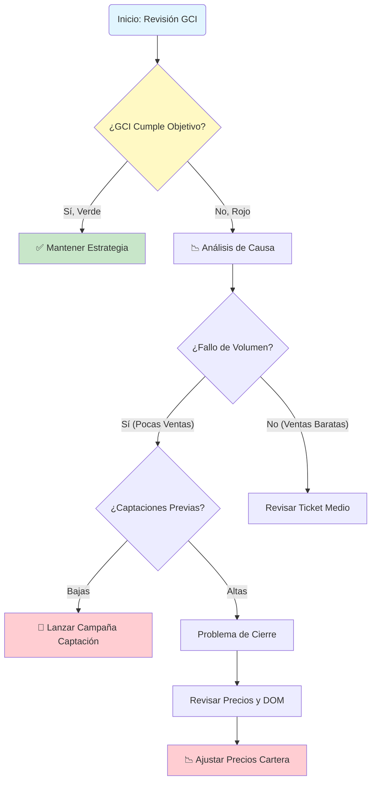
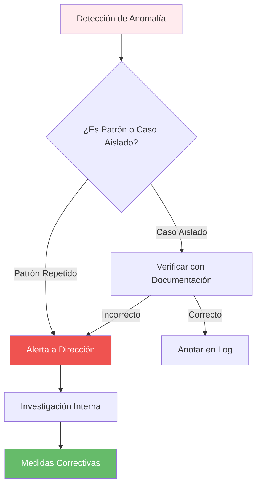

# 5. Escenarios de Uso (Casos Prácticos)

Para facilitar la adopción del CMI, hemos documentado flujos de trabajo específicos para las situaciones de negocio más comunes.

---

## 5.1. Reunión Mensual de Estrategia (CEO / Dirección)

**Objetivo**: Evaluar la salud global del negocio y decidir ajustes presupuestarios.

1. **Paso 1: Visión General (Overview)**
    * Navegue a la página **"Visión General"**.
    * Filtrar por **"Este Año"** para ver el acumulado YTD (Year-to-Date).
    * Observe el KPI de **GCI Total** y su semáforo. ¿Estamos en verde (cumpliendo presupuesto)?

2. **Paso 2: Análisis de Desviaciones**
    * Si el GCI está bajo, pregúntese: *¿Es por volumen (pocas ventas) o por valor (ventas baratas)?*
    * Revise el gráfico de **Ingresos Mensuales vs. Objetivo**. ¿Ha sido un mal mes puntual o una tendencia a la baja de 3 meses?

3. **Paso 3: Identificar la Causa Raíz (Drill-Down)**
    * Vaya a la pestaña **"Procesos"**. Revise la **Tasa de Captación** de hace 3 meses. (Recordatorio: Una baja captación en Enero provoca bajas ventas en Abril).
    * Si las captaciones fueron bajas, el problema es de actividad comercial, no de cierre.

4. **Acción Decisiva**:
    * Si el problema es de captación -> Lanzar incentivo de captación para el próximo mes.
    * Si el problema es de cierre -> Revisar precios de cartera (DOM alto).



---

## 5.2. Evaluación de Desempeño 1-to-1 (Jefe de Equipo con Agente)

**Objetivo**: Realizar una revisión trimestral constructiva con un agente senior.

1. **Paso 1: Filtrar Agente**
    * Vaya a la página **"Análisis de Agentes"**.
    * En el filtro lateral "Agente", seleccione el nombre (ej. "Carlos Gómez").

2. **Paso 2: Embudo de Conversión Personal**
    * Observe sus métricas clave: **Captaciones -> Visitas -> Cierres**.
    * *Escenario A*: Muchas visitas pero 0 cierres. -> Posible problema de cierre o negociación.
    * *Escenario B*: Pocas visitas. -> Posible problema de calidad del producto captado o precio fuera de mercado.

3. **Paso 3: Comparativa con la Media**
    * Utilice el gráfico de dispersión "Productividad". ¿Dónde está Carlos respecto al resto del equipo?
    * ¿Su **Ticket Medio** es superior o inferior a la media de la oficina?

4. **Acción Decisiva**:
    * Establecer un objetivo cuantificable para el próximo trimestre (ej. "Aumentar captación un 20%").

---

## 5.3. Monitorización de Campaña de Marketing (Departamento de Marketing)

**Objetivo**: Decidir si renovar o cancelar una campaña de Facebook Ads.

1. **Paso 1: Segmentar por Fuente**
    * Vaya a la página **"Clientes"**.
    * Utilice el filtro "Fuente de Lead" y seleccione **"Facebook Ads"**.

2. **Paso 2: Calcular el ROI Real**
    * No mire solo los "Leads recibidos". Mire las **"Operaciones Cerradas"** de esa fuente.
    * Compare el **GCI generado** por Facebook vs. el **Gasto de la Campaña**.
    * Si Gasto > GCI, la campaña está perdiendo dinero.

3. **Paso 3: Calidad del Lead**
    * Revise la **Tasa de Conversión**. ¿Es inferior al 1%?
    * Si es muy baja, los leads son "basura" (curiosos sin intención de compra), aunque sean baratos.

4. **Acción Decisiva**:
    * Si el ROI es positivo pero bajo, optimizar creatividades.
    * Si es negativo, detener inversión y mover presupuesto a portales (Idealista/Fotocasa).

---

## 5.4. Auditoría de Cartera Estancada (Coordinador de Ventas)

**Objetivo**: Limpiar el inventario de propiedades "invendibles" que consumen recursos de marketing sin generar retorno.

1. **Paso 1: Identificación de "Inmuebles Zombi"**
    * Vaya a la página **"Stock / Inmuebles"**.
    * Ordene la tabla por la columna **"Días en Mercado (DOM)"**. Marque en rojo todo lo que supere los **180 días**.
    * Cruce estos datos con el **Nº de Visitas en el último mes**.

2. **Paso 2: Diagnóstico "Precio vs. Producto"**
    * **Muchos "Clicks" en portales pero pocas Visitas físicas**: La casa es atractiva en fotos pero el precio asusta.
    * **Muchas Visitas físicas pero 0 Ofertas**: El problema es "el olor" (metáfora para problemas físicos no visibles en fotos: ruidos, comunidad, estado real). El precio debe bajar para compensar el defecto.

3. **Acción Decisiva**: Lanzar el protocolo de "Ajuste de Precio o Salida de Cartera".

---

## 5.5. Auditoría de Salud Financiera y Cash-Flow (CFO)

**Objetivo**: Asegurar que la empresa es rentable operativamente más allá de las ventas brutas.

1. **Paso 1: Análisis del Margen Neto (NOI)**
    * Localice el medidor de **Rentabilidad Operativa**.
    * Si el GCI sube pero el NOI baja significativamente, estamos en una crisis de eficiencia.

2. **Paso 2: Desglose de Gastos**
    * Revise la tabla de **Gastos Operativos por Categoría**.
    * ¿Ha habido un repunte inesperado en marketing o salarios variables?

3. **Acción Decisiva**: Implementar plan de contención de gastos o revisión de la política comercial de comisiones compartidas.

---

## 5.6. Planificación de Expansión (Apertura de Oficina/Zona)

**Objetivo**: Utilizar datos históricos para predecir el éxito en una nueva zona geográfica.

1. **Paso 1: Análisis de Correlación Zona vs. Ticket Medio**
    * Filtre el histórico por la zona colindante a la nueva expansión.
    * Observe el **Ticket Medio** de esa zona. ¿Justifica la inversión en un local físico?

2. **Paso 2: Capacidad de Captación**
    * Analice la **Productividad por Agente** en zonas similares. ¿Cuántos agentes necesitaremos contratar para alcanzar el punto de equilibrio (Break-even)?

---

## 5.7. Gestión de Crisis: Facturación en Caída Libre

**Objetivo**: Reaccionar ante un trimestre de pérdidas consecutivas.

1. **Paso 1: El Diagnóstico del "Primer Dominó"**
    * ¿Dónde empezó la caída? ¿En los leads, en las captaciones o en los cierres?
    * Use el **Crecimiento YoY** para ver si es algo cíclico del mercado o un problema interno de la agencia.

2. **Paso 2: Plan de Choque**
    * Cruce el **eNPS (Satisfacción empleado)** con las ventas. Si ambos caen, el problema es moral y de cultura de empresa.
    * Acción: Sesión de motivación y revisión de incentivos.

---

## 5.8. Resumen de Decisiones Basadas en Datos

| Si observas... | El problema es probablemente... | Acción recomendada |
| :--- | :--- | :--- |
| GCI Alto / NOI Bajo | Estructura de gastos obesa | Auditoría de costes fijos |
| Muchas Visitas / 0 Ofertas | Sobreprecio del inmueble | Ajuste de precio (-5%/-10%) |
| Muchos Leads / 0 Visitas | Mala calificación del lead | Re-entrenar al equipo de telemarketing |
| DOM subiendo en toda la agencia | Cambio de ciclo de mercado | Cambiar estrategia de captación a "Precios de Oportunidad" |

---

## 5.9. Caso Práctico: Detección de Fraude Interno

**Objetivo**: Identificar posibles irregularidades en las operaciones registradas.

### 🔍 Señales de Alerta a Monitorizar

1. **Paso 1: Análisis de Patrones Anómalos**
   * Filtrar operaciones por agente
   * Ordenar por "Días entre Captación y Cierre"
   * **Alerta**: Si un agente cierra operaciones en <7 días de forma recurrente (poco realista)

2. **Paso 2: Validación Cruzada**
   * Comparar comisiones declaradas vs. precios de mercado
   * Verificar si existen inmuebles sin contacto registrado
   * **Alerta**: Operaciones con comisión 0% o desproporcionadamente alta

3. **Paso 3: Auditoría de Modificaciones**
   * Revisar log de cambios en datos históricos
   * Identificar modificaciones masivas de fechas
   * **Alerta**: Cambios retroactivos no justificados

### 🚨 Protocolo de Actuación



---

## 5.10. Caso Práctico: Preparación de Reunión con Inversores

**Objetivo**: Generar un informe ejecutivo para presentar ante potenciales inversores o accionistas.

### 📊 Dashboard de Presentación (15 minutos)

1. **Diapositiva 1: Salud Financiera**
   * Exportar tarjeta de GCI YTD
   * Capturar gráfico de tendencia (últimos 3 años)
   * Incluir NOI % y comparativa con sector

2. **Diapositiva 2: Crecimiento y Escalabilidad**
   * YoY Growth por trimestre
   * Captura del treemap de zonas (mostrar diversificación)
   * Gráfico de evolución de ticket medio

3. **Diapositiva 3: Eficiencia Operativa**
   * DOM promedio vs. competencia
   * % de Exclusividad (fortaleza de marca)
   * Ratio de conversión leads

4. **Diapositiva 4: Calidad del Equipo**
   * Productividad por agente (Top 10)
   * Tasa de retención de talento
   * Horas de formación invertidas

### 💡 Narrativa Recomendada

> "Como pueden ver en la diapositiva 1, hemos logrado un crecimiento sostenido del 23% YoY mientras mantenemos una rentabilidad operativa del 32%, superando el promedio del sector del 18%. Esto se debe a nuestra estrategia de enfoque en exclusivas (diapositiva 3, 87% de cartera) y a un equipo altamente capacitado (diapositiva 4, 65 horas/agente/año de formación)."

---

## 5.11. Caso Práctico: Negociación Salarial con Agente Top

**Objetivo**: Utilizar datos objetivos para justificar (o no) un aumento salarial o mejora de comisiones.

### 📈 Preparación de la Reunión

**Escenario**: Carlos solicita aumento del 20% en su split de comisiones.

1. **Paso 1: Benchmarking Interno**

   ```
   Filtros:
   - Página: Análisis de Agentes
   - Filtro: Carlos Gómez
   - Periodo: Últimos 12 meses
   ```

   **Métricas a revisar**:
   * GCI generado: €95,000
   * Posición en ranking: 2 de 15
   * Captaciones: 18 propiedades
   * Tasa de conversión: 22% (vs. 15% media)

2. **Paso 2: Análisis de Valor Real**

   ```
   Pregunta clave: ¿Cuánto le cuesta a la empresa si Carlos se va?

   Cálculo:
   - Coste de reemplazo: €12,000 (reclutamiento + formación)
   - Pérdida de producción durante transición: €25,000
   - Coste total: €37,000

   vs.

   Coste de aumentar su split del 60% al 72%:
   - Incremento anual: 12% sobre €95,000 = €11,400

   Decisión: Es rentable retenerlo
   ```

3. **Paso 3: Negociación Basada en Datos**
   * Mostrar gráfico de su productividad vs. equipo
   * Reconocer su posición (Top 2)
   * Ofrecer split escalonado:
     * Actual: 60% sobre primeros €80k
     * Nuevo: 70% sobre lo que exceda €80k
   * Vincular a objetivos: Mantener top 3 durante 2 trimestres

---

## 5.12. Caso Práctico: Optimización de Horarios del Equipo

**Objetivo**: Identificar los mejores momentos para realizar llamadas, visitas y captaciones.

### 🕐 Análisis de Patrones Temporales

1. **Paso 1: Identificar Horarios de Mayor Conversión**
   * Filtrar operaciones cerradas
   * Analizar "Hora del primer contacto efectivo"
   * Resultado ejemplo:
     * 🟢 10:00-12:00: Tasa conversión 18%
     * 🟡 16:00-18:00: Tasa conversión 12%
     * 🔴 14:00-16:00: Tasa conversión 5% (hora de siesta)

2. **Paso 2: Optimizar Calendarios**

   ```
   Bloquear agendas:
   - 09:00-10:00: Preparación y planning
   - 10:00-12:00: Llamadas de captación (horario oro)
   - 12:00-14:00: Visitas físicas
   - 14:00-16:00: Trabajo administrativo (CRM)
   - 16:00-18:00: Llamadas de seguimiento
   - 18:00-20:00: Visitas a propietarios (post-trabajo)
   ```

3. **Paso 3: Medir Impacto**
   * Comparar conversión "antes vs. después" de implementar horario optimizado
   * Objetivo: Aumentar eficiencia +15% sin aumentar horas trabajadas

---

## 5.13. Caso Práctico: Análisis de Rentabilidad por Zona Geográfica

**Objetivo**: Decidir en qué zonas invertir más recursos de marketing y en cuáles reducir presencia.

### 🗺️ Matriz de Atractivo por Zona

1. **Paso 1: Crear Matriz de Decisión**

   | Zona | GCI Generado | Nº Operaciones | Ticket Medio | DOM | ROI Marketing | Valoración |
   |------|--------------|----------------|--------------|-----|---------------|------------|
   | **Centro** | €180k | 12 | €15k | 45 días | 8.2x | ⭐⭐⭐⭐⭐ |
   | **Zona Norte** | €95k | 18 | €5.3k | 78 días | 3.1x | ⭐⭐⭐ |
   | **Periferia** | €35k | 8 | €4.4k | 125 días | 1.2x | ⭐ |

2. **Paso 2: Estrategia Diferenciada**

   **Centro (Zona Premium)**:
   * ✅ Aumentar inversión en marketing (+30%)
   * ✅ Asignar agentes senior exclusivamente
   * ✅ Publicidad en medios premium (ABC, El País)

   **Zona Norte (Zona de Volumen)**:
   * ⚖️ Mantener inversión actual
   * 💡 Optimizar proceso (reducir DOM con mejores fotos)
   * 🎯 Enfoque en automatización

   **Periferia (Zona No Rentable)**:
   * ❌ Reducir inversión a mínimo mantenimiento
   * 🔄 Replantear estrategia o salir de la zona
   * 🚫 No asignar recursos exclusivos

---

## 5.14. Caso Práctico: Planificación de Vacaciones del Equipo

**Objetivo**: Evitar que las vacaciones del equipo impacten negativamente en las ventas.

### 📅 Análisis Predictivo

1. **Paso 1: Identificar Periodos Críticos**
   * Revisar histórico de GCI mensual (3 años)
   * Identificar meses de alta facturación:
     * Marzo, Abril, Mayo (primavera)
     * Septiembre, Octubre (post-verano)

2. **Paso 2: Política de Vacaciones Basada en Datos**

   ```
   Reglas:
   - ✅ PERMITIDO: Vacaciones en Agosto, Enero (meses bajos)
   - ⚠️ LIMITADO: Máx. 30% del equipo en Mayo/Septiembre
   - ❌ PROHIBIDO: Vacaciones agentes Top 3 en abril
   ```

3. **Paso 3: Plan de Contingencia**
   * Asignar "agente de guardia" para cubrir leads urgentes
   * Pre-agendar visitas para la vuelta de vacaciones
   * Automatizar respuestas iniciales por email

---

## 5.15. Caso Práctico: Evaluación de Proveedor de CRM

**Objetivo**: Justificar con datos si vale la pena cambiar o mejorar el software de CRM actual.

### 💰 Análisis Coste-Beneficio

1. **Paso 1: Cuantificar Dolor Actual**
   * Revisar KPI de "Adopción Tecnológica"
   * Si < 70% → El CRM actual tiene problemas de usabilidad
   * Estimar tiempo perdido: 2 horas/agente/semana en tareas manuales
   * **Coste oculto**: 15 agentes × 2h × €25/h × 52 semanas = **€39,000/año**

2. **Paso 2: Evaluar Alternativas**

   | Opción | Coste Anual | Ahorro Estimado | ROI | Decisión |
   |--------|-------------|-----------------|-----|----------|
   | **Mantener actual** | €12,000 | €0 | - | ❌ |
   | **Upgrade actual** | €18,000 | €25,000 | 139% | ✅ |
   | **Cambiar a nuevo** | €45,000 | €38,000 | 84% | ⚠️ |

3. **Paso 3: Presentar a Dirección**
   * Usar datos del CMI para mostrar ineficiencias actuales
   * Proyectar mejora en "Tasa de Conversión" (+5% esperado)
   * Traducir a GCI adicional: €87,000/año potencial

---

## 5.16. Plantillas de Reuniones Recurrentes

### 📋 Template: Reunión Semanal de Equipo (30 min)

**Asistentes**: Jefe de Equipo + Agentes
**Frecuencia**: Lunes 9:00 AM

**Agenda**:

1. **[5 min]** Revisión rápida GCI semanal anterior
2. **[10 min]** Análisis de pipeline: ¿Qué cerramos esta semana?
3. **[10 min]** Identificar bloqueos: ¿Qué propiedades están estancadas?
4. **[5 min]** Objetivos individuales para la semana

**Dashboards a proyectar**:
* Página "Análisis de Agentes"
* Filtro: "Últimos 7 días"

---

### 📋 Template: Reunión Mensual de Dirección (2 horas)

**Asistentes**: CEO, CFO, Dir. Comercial, Dir. RRHH
**Frecuencia**: Primer viernes de mes

**Agenda**:

1. **[20 min]** Revisión 4 perspectivas BSC (Financiera, Cliente, Procesos, Aprendizaje)
2. **[30 min]** Deep Dive en KPIs en rojo
3. **[30 min]** Presentación de iniciativas por departamento
4. **[20 min]** Revisión de proyecciones de cierre de trimestre
5. **[20 min]** Definición de acciones correctivas y responsables

**Dashboards a proyectar**:
* Página "Visión General"
* Página "Comparativas Temporales"

---

### 📋 Template: Reunión Trimestral Estratégica (medio día)

**Asistentes**: Comité de Dirección + Accionistas
**Frecuencia**: Al cerrar cada trimestre

**Agenda**:

1. **[1h]** Presentación de resultados trimestrales
2. **[1h]** Análisis de desviaciones y lecciones aprendidas
3. **[1h]** Planificación estratégica del próximo trimestre
4. **[30min]** Revisión de inversiones y presupuestos
5. **[30min]** Sesión de Q&A

**Documentos a preparar**:
* Reporte ejecutivo exportado desde CMI (PDF)
* Proyecciones financieras (Excel vinculado a CMI)
* Propuestas de inversión respaldadas por datos

---

## 5.17. Checklist de Uso Óptimo del CMI

### ✅ Antes de Tomar una Decisión Importante

* [ ] He revisado los KPIs de las 4 perspectivas BSC
* [ ] He comparado con el mismo periodo del año anterior (YoY)
* [ ] He identificado la causa raíz, no solo el síntoma
* [ ] He consultado con los responsables de área afectados
* [ ] He estimado el impacto económico de la decisión
* [ ] He definido KPIs para medir el éxito de la acción

### ✅ Antes de una Reunión Estratégica

* [ ] Dashboard actualizado (verificar fecha de última carga)
* [ ] Filtros configurados según audiencia de la reunión
* [ ] Exportaciones preparadas (PDF/PowerPoint)
* [ ] Narrativa preparada: datos + historia
* [ ] Proyector/pantalla probado con antelación

### ✅ Al Finalizar el Mes

* [ ] Revisar cumplimiento de objetivos mensuales
* [ ] Documentar lecciones aprendidas
* [ ] Ajustar alertas si es necesario
* [ ] Compartir insights con el equipo
* [ ] Actualizar forecasting del siguiente mes

---

## 5.18. Simulación de Escenarios (Analítica "What-If")

El CMI-DAC permite realizar simulaciones para prever el impacto de decisiones antes de ejecutarlas.

### 📉 Escenario A: Caída de Mercado (Recesión)

**Pregunta**: *¿Qué pasa si el volumen de leads baja un 20%?*

1. Use el parámetro de simulación en la pestaña "Proyecciones".
2. Ajuste el slider a -20%.
3. Observe el impacto en el flujo de caja (Cash Flow) y el punto de equilibrio.
4. **Acción**: Identificar qué gastos fijos pueden reducirse preventivamente.

### 💰 Escenario B: Inversión en Talento (Nueva Contratación)

**Pregunta**: *¿Cuánto tarda un nuevo agente en ser rentable?*

1. Filtre por la "Cohorte" de agentes contratados en el último año.
2. Observe la curva de GCI acumulado vs. Coste (Sueldo + Marketing).
3. **Dato Típico**: Un agente DAC suele alcanzar su break-even al 4º mes.
4. **Acción**: Asegurar reservas de liquidez para los primeros 4 meses de cada nueva contratación.

### 🏷️ Escenario C: Estrategia de Precio Ágil

**Pregunta**: *¿Debemos bajar el precio de este inmueble hoy o esperar?*

1. Compare el DOM del inmueble con la media de su zona exacta.
2. Si `DOM_Inmueble > 1.5 * Media_Zona`, la probabilidad de venta cae un 40% cada semana adicional.
3. **Acción**: Aplicar ajuste de precio proactivo para recuperar el impulso inicial del mercado.
