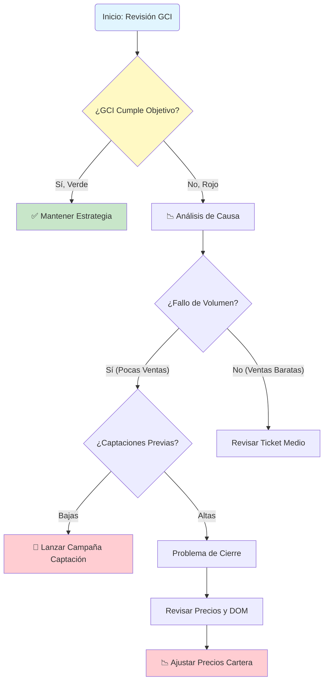

# 5. Escenarios de Uso (Casos Prácticos)

Para facilitar la adopción del CMI, hemos documentado flujos de trabajo específicos para las situaciones de negocio más comunes.

---

## 5.1. Reunión Mensual de Estrategia (CEO / Dirección)

**Objetivo**: Evaluar la salud global del negocio y decidir ajustes presupuestarios.

1. **Paso 1: Visión General (Overview)**
    * Navegue a la página **"Visión General"**.
    * Filtrar por **"Este Año"** para ver el acumulado YTD (Year-to-Date).
    * Observe el KPI de **GCI Total** y su semáforo. ¿Estamos en verde (cumpliendo presupuesto)?

2. **Paso 2: Análisis de Desviaciones**
    * Si el GCI está bajo, pregúntese: *¿Es por volumen (pocas ventas) o por valor (ventas baratas)?*
    * Revise el gráfico de **Ingresos Mensuales vs. Objetivo**. ¿Ha sido un mal mes puntual o una tendencia a la baja de 3 meses?

3. **Paso 3: Identificar la Causa Raíz (Drill-Down)**
    * Vaya a la pestaña **"Procesos"**. Revise la **Tasa de Captación** de hace 3 meses. (Recordatorio: Una baja captación en Enero provoca bajas ventas en Abril).
    * Si las captaciones fueron bajas, el problema es de actividad comercial, no de cierre.

4. **Acción Decisiva**:
    * Si el problema es de captación -> Lanzar incentivo de captación para el próximo mes.
    * Si el problema es de cierre -> Revisar precios de cartera (DOM alto).

---

## 5.2. Evaluación de Desempeño 1-to-1 (Jefe de Equipo con Agente)

**Objetivo**: Realizar una revisión trimestral constructiva con un agente senior.

1. **Paso 1: Filtrar Agente**
    * Vaya a la página **"Análisis de Agentes"**.
    * En el filtro lateral "Agente", seleccione el nombre (ej. "Carlos Gómez").

2. **Paso 2: Embudo de Conversión Personal**
    * Observe sus métricas clave: **Captaciones -> Visitas -> Cierres**.
    * *Escenario A*: Muchas visitas pero 0 cierres. -> Posible problema de cierre o negociación.
    * *Escenario B*: Pocas visitas. -> Posible problema de calidad del producto captado o precio fuera de mercado.

3. **Paso 3: Comparativa con la Media**
    * Utilice el gráfico de dispersión "Productividad". ¿Dónde está Carlos respecto al resto del equipo?
    * ¿Su **Ticket Medio** es superior o inferior a la media de la oficina?

4. **Acción Decisiva**:
    * Establecer un objetivo cuantificable para el próximo trimestre (ej. "Aumentar captación un 20%").

---

## 5.3. Monitorización de Campaña de Marketing (Departamento de Marketing)

**Objetivo**: Decidir si renovar o cancelar una campaña de Facebook Ads.

1. **Paso 1: Segmentar por Fuente**
    * Vaya a la página **"Clientes"**.
    * Utilice el filtro "Fuente de Lead" y seleccione **"Facebook Ads"**.

2. **Paso 2: Calcular el ROI Real**
    * No mire solo los "Leads recibidos". Mire las **"Operaciones Cerradas"** de esa fuente.
    * Compare el **GCI generado** por Facebook vs. el **Gasto de la Campaña**.
    * Si Gasto > GCI, la campaña está perdiendo dinero.

3. **Paso 3: Calidad del Lead**
    * Revise la **Tasa de Conversión**. ¿Es inferior al 1%?
    * Si es muy baja, los leads son "basura" (curiosos sin intención de compra), aunque sean baratos.

4. **Acción Decisiva**:
    * Si el ROI es positivo pero bajo, optimizar creatividades.
    * Si es negativo, detener inversión y mover presupuesto a portales (Idealista/Fotocasa).

---

## 5.4. Auditoría de Cartera Estancada (Coordinador de Ventas)

**Objetivo**: Limpiar el inventario de propiedades "invendibles" que consumen recursos de marketing sin generar retorno.

1. **Paso 1: Identificación de "Inmuebles Zombi"**
    * Vaya a la página **"Stock / Inmuebles"**.
    * Ordene la tabla por la columna **"Días en Mercado (DOM)"**. Marque en rojo todo lo que supere los **180 días**.
    * Cruce estos datos con el **Nº de Visitas en el último mes**.

2. **Paso 2: Diagnóstico "Precio vs. Producto"**
    * **Muchos "Clicks" en portales pero pocas Visitas físicas**: La casa es atractiva en fotos pero el precio asusta.
    * **Muchas Visitas físicas pero 0 Ofertas**: El problema es "el olor" (metáfora para problemas físicos no visibles en fotos: ruidos, comunidad, estado real). El precio debe bajar para compensar el defecto.

3. **Acción Decisiva**: Lanzar el protocolo de "Ajuste de Precio o Salida de Cartera".

---

## 5.5. Auditoría de Salud Financiera y Cash-Flow (CFO)

**Objetivo**: Asegurar que la empresa es rentable operativamente más allá de las ventas brutas.

1. **Paso 1: Análisis del Margen Neto (NOI)**
    * Localice el medidor de **Rentabilidad Operativa**.
    * Si el GCI sube pero el NOI baja significativamente, estamos en una crisis de eficiencia.

2. **Paso 2: Desglose de Gastos**
    * Revise la tabla de **Gastos Operativos por Categoría**.
    * ¿Ha habido un repunte inesperado en marketing o salarios variables?

3. **Acción Decisiva**: Implementar plan de contención de gastos o revisión de la política comercial de comisiones compartidas.

---

## 5.6. Planificación de Expansión (Apertura de Oficina/Zona)

**Objetivo**: Utilizar datos históricos para predecir el éxito en una nueva zona geográfica.

1. **Paso 1: Análisis de Correlación Zona vs. Ticket Medio**
    * Filtre el histórico por la zona colindante a la nueva expansión.
    * Observe el **Ticket Medio** de esa zona. ¿Justifica la inversión en un local físico?

2. **Paso 2: Capacidad de Captación**
    * Analice la **Productividad por Agente** en zonas similares. ¿Cuántos agentes necesitaremos contratar para alcanzar el punto de equilibrio (Break-even)?

---

## 5.7. Gestión de Crisis: Facturación en Caída Libre

**Objetivo**: Reaccionar ante un trimestre de pérdidas consecutivas.

1. **Paso 1: El Diagnóstico del "Primer Dominó"**
    * ¿Dónde empezó la caída? ¿En los leads, en las captaciones o en los cierres?
    * Use el **Crecimiento YoY** para ver si es algo cíclico del mercado o un problema interno de la agencia.

2. **Paso 2: Plan de Choque**
    * Cruce el **eNPS (Satisfacción empleado)** con las ventas. Si ambos caen, el problema es moral y de cultura de empresa.
    * Acción: Sesión de motivación y revisión de incentivos.

---

## 5.8. Resumen de Decisiones Basadas en Datos

| Si observas... | El problema es probablemente... | Acción recomendada |
| :--- | :--- | :--- |
| GCI Alto / NOI Bajo | Estructura de gastos obesa | Auditoría de costes fijos |
| Muchas Visitas / 0 Ofertas | Sobreprecio del inmueble | Ajuste de precio (-5%/-10%) |
| Muchos Leads / 0 Visitas | Mala calificación del lead | Re-entrenar al equipo de telemarketing |
| DOM subiendo en toda la agencia | Cambio de ciclo de mercado | Cambiar estrategia de captación a "Precios de Oportunidad" |
