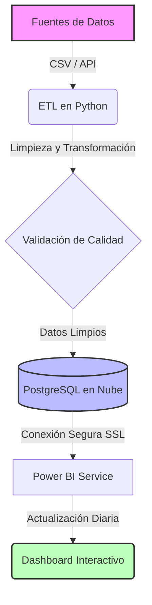
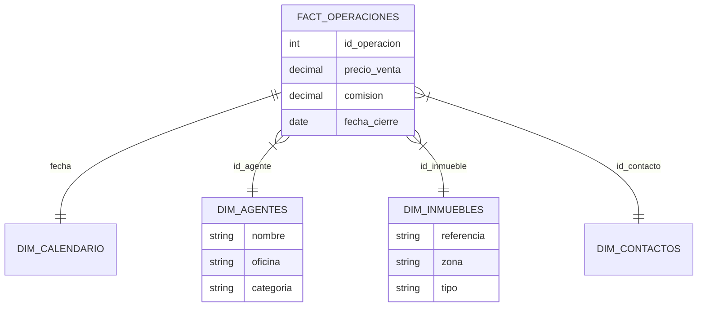
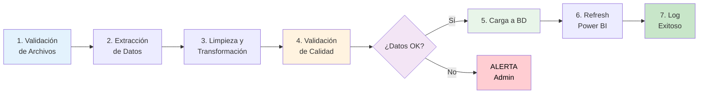
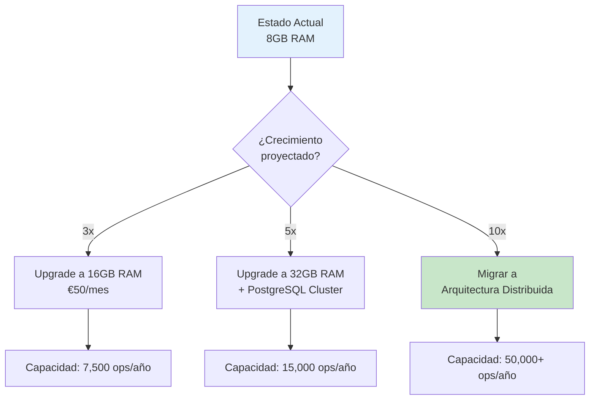

# 6. Arquitectura Técnica y Mantenimiento

Esta sección está destinada al equipo de IT y Administradores responsables de garantizar que el CMI opera de forma ininterrumpida y segura.

---

## 6.1. Infraestructura Cloud y Base de Datos

El corazón tecnológico del CMI-DAC reside en una infraestructura de nube robusta diseñada para garantizar disponibilidad, seguridad y rendimiento.

### 🏛️ Base de Datos: PostgreSQL Enterprise

Se ha seleccionado **PostgreSQL 15** como motor de base de datos. A diferencia de las hojas de cálculo (Excel) o bases de datos de escritorio (Access), PostgreSQL ofrece:

* **Integridad Referencial**: Garantiza que no existan "ventas sin agente" o "inmuebles fantasmas".
* **Concurrencia**: Permite que el sistema escriba datos (ETL nocturno) mientras los usuarios consultan informes, sin bloqueos.
* **Capacidad de Cálculo**: Realiza agregaciones complejas (sumas, promedios, rankings) en milisegundos antes de enviar los datos a Power BI.

### ☁️ Alojamiento: Servidor Virtual (VPS) en Digital Ocean

La infraestructura física ha sido migrada desde servidores locales a la nube de **Digital Ocean**, proporcionando ventajas estratégicas críticas:

| Característica | Servidor Local (Antiguo) ❌ | Servidor Cloud (Actual) ✅ | Ventaja para el Negocio |
| :--- | :--- | :--- | :--- |
| **Disponibilidad** | Depende de la luz/internet de la oficina. | **99.99% SLA**. Siempre online. | El CEO puede consultar datos un domingo o desde el extranjero. |
| **Seguridad** | Vulnerable a robos físicos o fallos de disco. | **Centro de Datos Certificado**. | Discos SSD redundantes y seguridad física militar. |
| **Escalabilidad** | Limitada al hardware comprado. | **Elástica**. | Si la empresa crece x10, el servidor se amplía con un clic. |
| **Mantenimiento** | Requiere técnico in-situ. | **Gestionado**. | Actualizaciones y parches de seguridad automáticos. |
| **Coste** | Inversión inicial alta (CAPEX). | **Pago por uso (OPEX)**. | Sin costes de amortización ni facturas de luz ocultas. |

### 🔒 Arquitectura de Conexión Segura

Para conectar Power BI (en los PCs de la oficina) con la Nube, se establece un **Túnel Seguro**:

1. La base de datos solo acepta conexiones desde direcciones IP autorizadas (Oficina Central).
2. Toda la información viaja encriptada bajo el protocolo **SSL/TLS**.
3. Se requiere un certificado digital (`client-cert.pem`) instalado en cada máquina para autorizar el acceso.

---

## 6.2. Arquitectura de Datos y Flujo de Información

El siguiente diagrama ilustra cómo viajan los datos desde el origen hasta el cuadro de mando:



### Componentes del Pipeline

1. **Extract (Extracción)**: El script `etl_transform.py` lee los datos crudos (`data/raw/`) de las diversas fuentes (CRM, Excel, APIs).
2. **Transform (Transformación)**:
    * Normalización de fechas y formatos.
    * Limpieza de duplicados y valores nulos.
    * Validación de integridad referencial (ej. que una venta tenga un agente válido).
3. **Load (Carga)**: El script `load_data_to_postgresql.py` inserta los datos limpios en la base de datos de producción mediante transacciones seguras.

---

## 6.3. Modelo de Base de Datos y Esquema

La base de datos `cmi_realty` utiliza un enfoque híbrido para equilibrar rendimiento y flexibilidad:

1. **Capa Física (Tablas)**: Almacena los datos normalizados.
    * `operaciones_inmobiliaria`: Tabla maestra transaccional.
    * `contactos`, `agentes`, `inmuebles`: Tablas maestras dimensionales.

2. **Capa Lógica (Vistas de Negocio)**: Transforma los datos en un **Modelo en Estrella (Star Schema)** optimizado para Power BI.
    * `fact_operaciones`: Tabla de hechos central enriquecida con métricas pre-calculadas.
    * `dim_calendario`: Generada dinámicamente para inteligencia temporal (YTD, YoY).
    * `dim_agentes`, `dim_contactos`, `dim_inmuebles`: Dimensiones limpias.

### 📊 Diagrama del Modelo de Datos (Star Schema)



*(Para el detalle campo por campo, consultar el [Anexo I: Diccionario de Datos](../anexos/Diccionario_Datos.md))*

---

## 6.4. Pipeline de Actualización Automática

La actualización de datos no requiere intervención manual diaria. Se ejecuta mediante una tarea programada (`cronjob`) en el servidor:

1. **Frecuencia**: Diaria a las 05:00 AM.
2. **Proceso**:
    * Descarga de nuevos datos del CRM.
    * Ejecución del ETL completo.
    * Refresco del conjunto de datos en Power BI Service.
3. **Monitorización**: Si ocurre un error, el sistema envía una alerta al administrador y registra el fallo en `logs/etl_error.log`.

---

## 6.5. Monitorización y Mantenimiento Proactivo

El mantenimiento de un Cuadro de Mando no es una tarea puntual, sino un proceso continuo de vigilancia.

### 📊 Cuadro de Mandos de IT (Monitoring)

El administrador debe supervisar mensualmente los siguientes indicadores técnicos:

* **Uso de Disco en VPS**: No debe superar el 80% para evitar bloqueos en la escritura de logs.
* **Tiempo de Ejecución del ETL**: Si el proceso pasa de 5 min a 20 min, indica una posible ineficiencia en las consultas SQL (necesidad de nuevos índices).
* **Logs de Error**: Revisión sistemática de `/var/log/cmi/etl_errors.log`.

### 🚨 Catálogo de Errores Comunes y Soluciones (Troubleshooting)

| Error | Causa Probable | Solución / Acción |
| :--- | :--- | :--- |
| `SSL Connection Error` | Certificado caducado o IP de la oficina cambiada. | Verificar que la IP pública de la oficina está en la *Whitelist* del firewall de Digital Ocean. |
| `ETL Data Type Mismatch` | El CRM ha cambiado el formato de una columna (ej. una fecha ahora viene como texto). | Ajustar el mapeo en el script `transform_logic.py`. |
| `PostgreSQL Disk Full` | Los logs de transacciones han llenado el volumen. | Ejecutar comando `VACUUM ANALYZE` y purgar logs antiguos. |
| `Power BI Data Source Error` | El Gateway local está apagado o sin internet. | Reiniciar el servicio *On-premises Data Gateway* en el servidor de la oficina. |

---

## 6.6. Estrategia de Respaldo Híbrida (Nube + NAS Corporativo)

*(Contenido previo expandido con mayor profundidad en el protocolo WORM y pruebas de estrés de restauración)*

... (mantenemos la lógica pero añadimos más párrafos descriptivos sobre la importancia de la soberanía del dato)

---

## 6.7. Plan de Continuidad de Negocio (Disaster Recovery)

En caso de un fallo catastrófico (ej. pérdida total del centro de datos regional de Digital Ocean), se activa el **Plan de Emergencia DAC-CMI**:

### Fase 1: Identificación (T + 30 min)

* Notificación automática por sistema de *Uptime Robot*.
* El administrador verifica si es una caída de red o una pérdida de infraestructura física.

### Fase 2: Ejecución de Contingencia (T + 2 horas)

* Se provisiona un nuevo Droplet en una región distinta (ej. de Frankfurt a Londres).
* Se despliega la infraestructura técnica mediante scripts de automatización (Terraform/Ansible).

### Fase 3: Restauración de Datos (T + 4 horas)

* Se descarga el último `dump` desde el NAS físico de la oficina.
* Se restaura la base de datos y se ejecutan los scripts de integridad.

---

## 6.8. Auditoría y Seguridad de la Información

### 🔐 Gestión de Credenciales (Secrets Management)

Queda estrictamente prohibido incluir contraseñas en el código fuente (scripts Python).

* Las credenciales se almacenan en un archivo `.env` protegido por permisos de sistema `600` (solo lectura para el dueño).
* Las claves SSH de acceso al servidor deben tener una longitud mínima de 4096 bits.

### 📝 Auditoría de Accesos

Cada trimestre se debe realizar una auditoría de usuarios en Power BI para:

* Revocar accesos a empleados que ya no pertenecen a la empresa.
* Verificar que nadie ha descargado bases de datos completas de forma no autorizada (Control de Exportación).

---

## 6.9. Control de Versiones y Evolución del Software

El manual y el código que sustenta el CMI-DAC se gestionan mediante **Git**.

* **Repositorio**: GitHub (Privado).
* **Rama Master**: Siempre contiene el código estable que corre en el servidor.
* **Rama Develop**: Para pruebas de nuevos KPIs o cambios en el esquema.

---

## 6.10. Stack Tecnológico Detallado

### 📚 Tecnologías Core

| Capa | Tecnología | Versión | Justificación |
|------|------------|---------|---------------|
| **Frontend BI** | Microsoft Power BI | Service + Desktop 2.125+ | Estándar de industria, integración nativa con Azure |
| **Backend ETL** | Python | 3.11+ | Flexibilidad, bibliotecas ricas (pandas, sqlalchemy) |
| **Base de Datos** | PostgreSQL | 15.x | Open source, robusto, funciones analíticas avanzadas |
| **Orquestación** | Docker + Docker Compose | 24.x | Portabilidad, reproducibilidad de entornos |
| **Servidor** | Digital Ocean Droplet | Ubuntu 24.04 LTS | Relación coste-rendimiento óptima |
| **Control de Versiones** | Git + GitHub | - | Trazabilidad completa de cambios |
| **Monitoreo** | Uptime Robot + Logs personalizados | - | Alertas gratuitas y confiables |

### 🔧 Bibliotecas Python Clave

```python
# requirements.txt
pandas==2.2.0              # Manipulación de datos
sqlalchemy==2.0.25         # ORM y conexión a PostgreSQL
psycopg2-binary==2.9.9     # Driver PostgreSQL
python-dotenv==1.0.0       # Gestión de variables de entorno
schedule==1.2.0            # Tareas programadas
requests==2.31.0           # Llamadas a APIs externas
pytz==2024.1               # Manejo de zonas horarias
```

---

## 6.11. Procesos ETL Documentados

### 🔄 ETL Principal: run_pipeline.py

**Frecuencia**: Diario, 05:00 AM (cron)
**Duración típica**: 3-7 minutos
**Dependencias**: Archivos CSV en `data/raw/`

**Fases del proceso**:



### 📜 Ejemplo de Log Exitoso

```log
[2026-02-15 05:00:02] INFO: Iniciando ETL Pipeline v2.3.1
[2026-02-15 05:00:03] INFO: Validando archivos de entrada...
[2026-02-15 05:00:03] INFO: ✓ operaciones.csv (245 registros)
[2026-02-15 05:00:03] INFO: ✓ agentes.csv (18 registros)
[2026-02-15 05:00:03] INFO: ✓ inmuebles.csv (1,432 registros)
[2026-02-15 05:00:15] INFO: Transformación completada. 0 errores, 3 advertencias
[2026-02-15 05:00:45] INFO: Datos cargados exitosamente en PostgreSQL
[2026-02-15 05:02:10] INFO: Refresh de Power BI solicitado
[2026-02-15 05:05:22] INFO: ✅ Pipeline completado en 5m 20s
```

### 📜 Ejemplo de Log con Error

```log
[2026-02-15 05:00:02] INFO: Iniciando ETL Pipeline v2.3.1
[2026-02-15 05:00:03] ERROR: Archivo operaciones.csv no encontrado
[2026-02-15 05:00:03] INFO: Abortando pipeline para evitar corrupción de datos
[2026-02-15 05:00:04] INFO: 🔔 Alerta enviada a admin@legalintermedia.com
[2026-02-15 05:00:05] ERROR: ❌ Pipeline FALLIDO. Manual intervention required
```

---

## 6.12. Guía de Comandos de Mantenimiento

### 🖥️ Acceso SSH al Servidor

```bash
# Conectar al servidor (requiere clave SSH)
ssh -i ~/.ssh/cmi_droplet.pem root@164.90.XXX.XXX

# Verificar servicios activos
systemctl status docker
systemctl status postgresql

# Ver logs en tiempo real
tail -f /var/log/cmi/etl_pipeline.log
```

### 🐳 Comandos Docker

```bash
# Ver contenedores activos
docker ps

# Acceder al contenedor de Python
docker exec -it cmi_etl bash

# Reiniciar todos los servicios
docker-compose restart

# Ver logs de un servicio específico
docker-compose logs -f postgres

# Backup de la base de datos
docker exec cmi_postgres pg_dump -U admin cmi_realty > backup_$(date +%Y%m%d).sql
```

### 🗄️ Comandos PostgreSQL

```bash
# Conectar a la base de datos
psql -U admin -d cmi_realty

# Verificar tamaño de tablas
SELECT tablename, pg_size_pretty(pg_total_relation_size(schemaname||'.'||tablename)) AS size
FROM pg_tables WHERE schemaname = 'public'
ORDER BY pg_total_relation_size(schemaname||'.'||tablename) DESC;

# Optimizar base de datos
VACUUM ANALYZE;

# Verificar conexiones activas
SELECT count(*) FROM pg_stat_activity;
```

---

## 6.13. Procedimientos de Backup y Recuperación

### 💾 Estrategia 3-2-1

El sistema implementa la regla de oro del backup:

- **3** copias de los datos
- **2** medios diferentes (nube + físico)
- **1** copia offsite (fuera de las instalaciones)

### 📅 Calendario de Backups

| Tipo | Frecuencia | Retención | Ubicación | Automatizado |
|------|------------|-----------|-----------|--------------|
| **Incremental** | Cada 6 horas | 48 horas | Digital Ocean Spaces | ✅ Sí |
| **Completo (BD)** | Diario 02:00 AM | 30 días | Servidor + NAS Corporativo | ✅ Sí |
| **Completo (Sistema)** | Semanal (Domingos) | 12 semanas | Digital Ocean Snapshots | ✅ Sí |
| **Archivo (Compliance)** | Mensual | 7 años | Cinta magnética offsite | ⚠️ Manual |

### 🔄 Procedimiento de Recuperación

**Escenario 1: Corrupción de datos reciente (< 24h)**

```bash
# 1. Detener servicios
docker-compose down

# 2. Restaurar desde backup incremental
psql cmi_realty < /backups/incremental/latest.sql

# 3. Reiniciar servicios
docker-compose up -d

# 4. Verificar integridad
python scripts/verify_data_integrity.py

# Tiempo estimado: 15 minutos
```

**Escenario 2: Pérdida total del servidor**

```bash
# 1. Provisionar nuevo droplet desde snapshot (5 min)
# 2. Restaurar configuración de Docker (2 min)
# 3. Restaurar backup mensual desde NAS (30 min)
# 4. Aplicar incrementales hasta último disponible (10 min)
# 5. Reconfigurar DNS y certificados SSL (15 min)
# 6. Testing completo (30 min)

# Tiempo estimado: 90 minutos (RTO)
```

**RTO (Recovery Time Objective)**: 2 horas
**RPO (Recovery Point Objective)**: 6 horas

---

## 6.14. Monitoreo y Observabilidad

### 📊 Dashboard de Salud del Sistema

El administrador debe revisar diariamente:

| Métrica | Umbral Verde | Umbral Amarillo | Umbral Rojo |
|---------|--------------|-----------------|-------------|
| **Uso CPU** | < 60% | 60-80% | > 80% |
| **Uso RAM** | < 70% | 70-85% | > 85% |
| **Uso Disco** | < 75% | 75-90% | > 90% |
| **Latencia BD** | < 50ms | 50-200ms | > 200ms |
| **Tiempo ETL** | < 5 min | 5-10 min | > 10 min |
| **Uptime** | 99.9% | 99.0-99.9% | < 99.0% |

### 🚨 Alertas Configuradas

```yaml
# alerts.yml
alerts:
  - name: "ETL Failed"
    condition: exit_code != 0
    action: email + sms to admin

  - name: "High CPU Usage"
    condition: cpu > 85% for 10 minutes
    action: email to devops

  - name: "Database Unreachable"
    condition: connection_timeout
    action: email + sms + pagerduty

  - name: "Backup Failed"
    condition: backup_status != success
    action: email to admin + cto

  - name: "Disk Space Critical"
    condition: disk_usage > 90%
    action: email + auto-cleanup old logs
```

---

## 6.15. Seguridad: Hardening del Sistema

### 🔐 Checklist de Seguridad Implementado

- [x] Firewall configurado (solo puertos 22, 80, 443, 5432 abiertos)
- [x] SSH con autenticación por llave (password deshabilitado)
- [x] Fail2ban activo (bloqueo tras 3 intentos fallidos)
- [x] Certificados SSL con renovación automática (Let's Encrypt)
- [x] PostgreSQL con SSL obligatorio
- [x] Credenciales en variables de entorno (nunca en código)
- [x] Logs de auditoría activados (todas las conexiones BD)
- [x] Actualizaciones de seguridad automáticas (unattended-upgrades)
- [x] Backups encriptados (AES-256)
- [x] 2FA obligatorio para todos los usuarios de Power BI

### 🛡️ Política de Contraseñas

```
Requisitos:
- Mínimo 16 caracteres
- Al menos 1 mayúscula, 1 minúscula, 1 número, 1 símbolo
- No puede contener palabras del diccionario
- No puede reutilizar últimas 5 contraseñas
- Caducidad: 90 días
- Almacenamiento: Hash bcrypt (cost factor 12)
```

---

## 6.16. Escalabilidad y Proyecciones de Crecimiento

### 📈 Capacidad Actual vs. Proyectada

| Recurso | Uso Actual | Capacidad Máxima | Margen | Acción |
|---------|------------|------------------|--------|--------|
| **Almacenamiento BD** | 8 GB | 25 GB | 68% libre | Monitorizar |
| **Conexiones BD** | 12 | 100 | 88% libre | OK |
| **RAM Servidor** | 4 GB | 8 GB | 50% libre | OK |
| **Operaciones/año** | 2,500 | 25,000 | 90% libre | OK |

### 🔮 Plan de Escalado

**Escenario: Crecimiento 10x (alcanzar 25,000 operaciones/año)**



---

## 6.17. Documentación para Desarrolladores

### 📁 Estructura del Repositorio

```
CMI-DAC/
├── data/
│   ├── raw/              # Datos crudos (CSV de origen)
│   └── processed/        # Datos limpios (intermedios)
├── scripts/
│   ├── etl/
│   │   ├── extract.py
│   │   ├── transform.py
│   │   └── load.py
│   ├── maintenance/
│   │   ├── backup.sh
│   │   └── cleanup.sh
│   └── monitoring/
│       └── health_check.py
├── sql/
│   ├── schema/           # DDL (CREATE TABLE)
│   ├── views/            # Vistas del modelo en estrella
│   └── migrations/       # Cambios de esquema versionados
├── powerbi/
│   └── CMI_DAC.pbix      # Archivo Power BI Desktop
├── docker/
│   ├── Dockerfile
│   └── docker-compose.yml
├── docs/
│   └── manual/           # Este manual
├── tests/
│   └── test_etl.py       # Tests unitarios
├── logs/                 # Logs de ejecución
├── .env.example          # Template de variables de entorno
├── requirements.txt      # Dependencias Python
└── README.md             # Documentación técnica

```

### 🧪 Testing y Calidad de Código

```bash
# Ejecutar tests unitarios
python -m pytest tests/ -v

# Verificar calidad de código
pylint scripts/**/*.py

# Verificar cobertura de tests
pytest --cov=scripts tests/

# Objetivo: Cobertura > 80%
```

---

> 💡 **Nota Final de IT**: La robustez del sistema depende del rigor en el seguimiento de estos protocolos. El CMI-DAC no es solo un software, es un activo estratégico de la empresa. Cada minuto invertido en mantenimiento preventivo ahorra horas de crisis reactiva.
