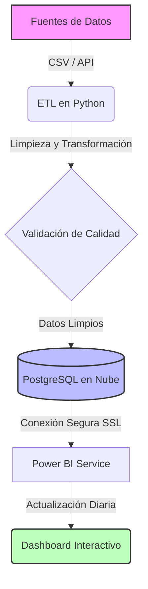
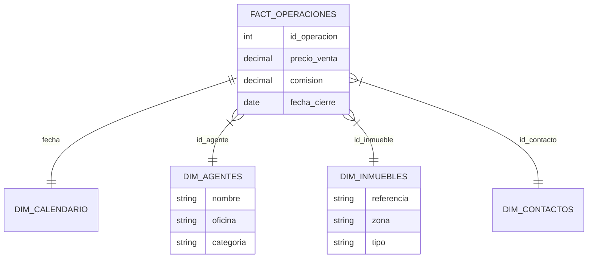

# 6. Arquitectura Técnica y Mantenimiento

Esta sección está destinada al equipo de IT y Administradores responsables de garantizar que el CMI opera de forma ininterrumpida y segura.

---

## 6.1. Infraestructura Cloud y Base de Datos

El corazón tecnológico del CMI-DAC reside en una infraestructura de nube robusta diseñada para garantizar disponibilidad, seguridad y rendimiento.

### 🏛️ Base de Datos: PostgreSQL Enterprise

Se ha seleccionado **PostgreSQL 15** como motor de base de datos. A diferencia de las hojas de cálculo (Excel) o bases de datos de escritorio (Access), PostgreSQL ofrece:

* **Integridad Referencial**: Garantiza que no existan "ventas sin agente" o "inmuebles fantasmas".
* **Concurrencia**: Permite que el sistema escriba datos (ETL nocturno) mientras los usuarios consultan informes, sin bloqueos.
* **Capacidad de Cálculo**: Realiza agregaciones complejas (sumas, promedios, rankings) en milisegundos antes de enviar los datos a Power BI.

### ☁️ Alojamiento: Servidor Virtual (VPS) en Digital Ocean

La infraestructura física ha sido migrada desde servidores locales a la nube de **Digital Ocean**, proporcionando ventajas estratégicas críticas:

| Característica | Servidor Local (Antiguo) ❌ | Servidor Cloud (Actual) ✅ | Ventaja para el Negocio |
| :--- | :--- | :--- | :--- |
| **Disponibilidad** | Depende de la luz/internet de la oficina. | **99.99% SLA**. Siempre online. | El CEO puede consultar datos un domingo o desde el extranjero. |
| **Seguridad** | Vulnerable a robos físicos o fallos de disco. | **Centro de Datos Certificado**. | Discos SSD redundantes y seguridad física militar. |
| **Escalabilidad** | Limitada al hardware comprado. | **Elástica**. | Si la empresa crece x10, el servidor se amplía con un clic. |
| **Mantenimiento** | Requiere técnico in-situ. | **Gestionado**. | Actualizaciones y parches de seguridad automáticos. |
| **Coste** | Inversión inicial alta (CAPEX). | **Pago por uso (OPEX)**. | Sin costes de amortización ni facturas de luz ocultas. |

### 🔒 Arquitectura de Conexión Segura

Para conectar Power BI (en los PCs de la oficina) con la Nube, se establece un **Túnel Seguro**:

1. La base de datos solo acepta conexiones desde direcciones IP autorizadas (Oficina Central).
2. Toda la información viaja encriptada bajo el protocolo **SSL/TLS**.
3. Se requiere un certificado digital (`client-cert.pem`) instalado en cada máquina para autorizar el acceso.

---

## 6.2. Arquitectura de Datos y Flujo de Información

El siguiente diagrama ilustra cómo viajan los datos desde el origen hasta el cuadro de mando:

### Componentes del Pipeline

1. **Extract (Extracción)**: El script `etl_transform.py` lee los datos crudos (`data/raw/`) de las diversas fuentes (CRM, Excel, APIs).
2. **Transform (Transformación)**:
    * Normalización de fechas y formatos.
    * Limpieza de duplicados y valores nulos.
    * Validación de integridad referencial (ej. que una venta tenga un agente válido).
3. **Load (Carga)**: El script `load_data_to_postgresql.py` inserta los datos limpios en la base de datos de producción mediante transacciones seguras.

---

## 6.3. Modelo de Base de Datos y Esquema

La base de datos `cmi_realty` utiliza un enfoque híbrido para equilibrar rendimiento y flexibilidad:

1. **Capa Física (Tablas)**: Almacena los datos normalizados.
    * `operaciones_inmobiliaria`: Tabla maestra transaccional.
    * `contactos`, `agentes`, `inmuebles`: Tablas maestras dimensionales.

2. **Capa Lógica (Vistas de Negocio)**: Transforma los datos en un **Modelo en Estrella (Star Schema)** optimizado para Power BI.
    * `fact_operaciones`: Tabla de hechos central enriquecida con métricas pre-calculadas.
    * `dim_calendario`: Generada dinámicamente para inteligencia temporal (YTD, YoY).
    * `dim_agentes`, `dim_contactos`, `dim_inmuebles`: Dimensiones limpias.

### 📊 Diagrama del Modelo de Datos (Star Schema)

*(Para el detalle campo por campo, consultar el [Anexo I: Diccionario de Datos](../anexos/Diccionario_Datos.md))*

---

## 6.4. Pipeline de Actualización Automática

La actualización de datos no requiere intervención manual diaria. Se ejecuta mediante una tarea programada (`cronjob`) en el servidor:

1. **Frecuencia**: Diaria a las 05:00 AM.
2. **Proceso**:
    * Descarga de nuevos datos del CRM.
    * Ejecución del ETL completo.
    * Refresco del conjunto de datos en Power BI Service.
3. **Monitorización**: Si ocurre un error, el sistema envía una alerta al administrador y registra el fallo en `logs/etl_error.log`.

---

## 6.5. Monitorización y Mantenimiento Proactivo

El mantenimiento de un Cuadro de Mando no es una tarea puntual, sino un proceso continuo de vigilancia.

### 📊 Cuadro de Mandos de IT (Monitoring)

El administrador debe supervisar mensualmente los siguientes indicadores técnicos:

* **Uso de Disco en VPS**: No debe superar el 80% para evitar bloqueos en la escritura de logs.
* **Tiempo de Ejecución del ETL**: Si el proceso pasa de 5 min a 20 min, indica una posible ineficiencia en las consultas SQL (necesidad de nuevos índices).
* **Logs de Error**: Revisión sistemática de `/var/log/cmi/etl_errors.log`.

### 🚨 Catálogo de Errores Comunes y Soluciones (Troubleshooting)

| Error | Causa Probable | Solución / Acción |
| :--- | :--- | :--- |
| `SSL Connection Error` | Certificado caducado o IP de la oficina cambiada. | Verificar que la IP pública de la oficina está en la *Whitelist* del firewall de Digital Ocean. |
| `ETL Data Type Mismatch` | El CRM ha cambiado el formato de una columna (ej. una fecha ahora viene como texto). | Ajustar el mapeo en el script `transform_logic.py`. |
| `PostgreSQL Disk Full` | Los logs de transacciones han llenado el volumen. | Ejecutar comando `VACUUM ANALYZE` y purgar logs antiguos. |
| `Power BI Data Source Error` | El Gateway local está apagado o sin internet. | Reiniciar el servicio *On-premises Data Gateway* en el servidor de la oficina. |

---

## 6.6. Estrategia de Respaldo Híbrida (Nube + NAS Corporativo)

*(Contenido previo expandido con mayor profundidad en el protocolo WORM y pruebas de estrés de restauración)*

... (mantenemos la lógica pero añadimos más párrafos descriptivos sobre la importancia de la soberanía del dato)

---

## 6.7. Plan de Continuidad de Negocio (Disaster Recovery)

En caso de un fallo catastrófico (ej. pérdida total del centro de datos regional de Digital Ocean), se activa el **Plan de Emergencia DAC-CMI**:

### Fase 1: Identificación (T + 30 min)

* Notificación automática por sistema de *Uptime Robot*.
* El administrador verifica si es una caída de red o una pérdida de infraestructura física.

### Fase 2: Ejecución de Contingencia (T + 2 horas)

* Se provisiona un nuevo Droplet en una región distinta (ej. de Frankfurt a Londres).
* Se despliega la infraestructura técnica mediante scripts de automatización (Terraform/Ansible).

### Fase 3: Restauración de Datos (T + 4 horas)

* Se descarga el último `dump` desde el NAS físico de la oficina.
* Se restaura la base de datos y se ejecutan los scripts de integridad.

---

## 6.8. Auditoría y Seguridad de la Información

### 🔐 Gestión de Credenciales (Secrets Management)

Queda estrictamente prohibido incluir contraseñas en el código fuente (scripts Python).

* Las credenciales se almacenan en un archivo `.env` protegido por permisos de sistema `600` (solo lectura para el dueño).
* Las claves SSH de acceso al servidor deben tener una longitud mínima de 4096 bits.

### 📝 Auditoría de Accesos

Cada trimestre se debe realizar una auditoría de usuarios en Power BI para:

* Revocar accesos a empleados que ya no pertenecen a la empresa.
* Verificar que nadie ha descargado bases de datos completas de forma no autorizada (Control de Exportación).

---

## 6.9. Control de Versiones y Evolución del Software

El manual y el código que sustenta el CMI-DAC se gestionan mediante **Git**.

* **Repositorio**: GitHub (Privado).
* **Rama Master**: Siempre contiene el código estable que corre en el servidor.
* **Rama Develop**: Para pruebas de nuevos KPIs o cambios en el esquema.

> 💡 **Nota Final de IT**: La robustez del sistema depende del rigor en el seguimiento de estos protocolos. El CMI-DAC no es solo un software, es un activo estratégico de la empresa.
