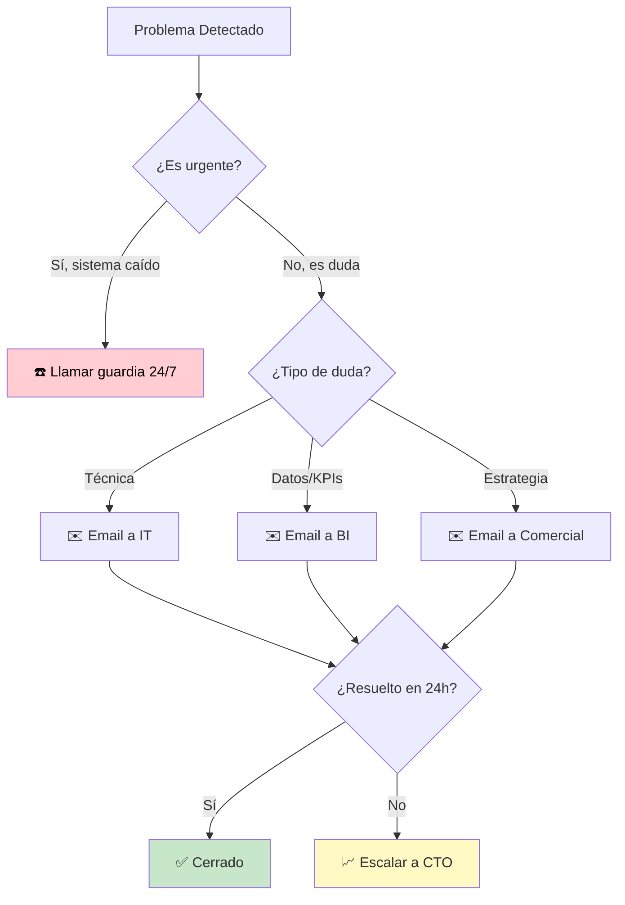

# 7. Glosario de Términos y Preguntas Frecuentes (FAQ)

Este capítulo sirve como referencia rápida para resolver dudas terminológicas y operativas comunes sin necesidad de recorrer todo el manual.

---

## 7.1. Glosario de Conceptos Clave

### 🅰️ Conceptos Analíticos (Business Intelligence)

* **Balanced Scorecard (BSC)**: Metodología de gestión estratégica que permite medir la evolución de una empresa desde cuatro perspectivas: Financiera, Cliente, Procesos y Aprendizaje.
* **CMI (Cuadro de Mando Integral)**: Herramienta visual que traduce la estrategia en indicadores medibles.
* **Dashboard**: Interfaz gráfica (en Power BI) que presenta los KPIs de forma visual e interactiva.
* **ETL (Extract, Transform, Load)**: Proceso técnico que extrae datos de fuentes sucias (Excel, CRM), los limpia y los carga en la base de datos oficial.
* **Leading Indicator (Indicador Adelantado)**: Métrica que predice resultados futuros (ej. la Captación hoy predice la Venta en 3 meses).
* **Lagging Indicator (Indicador Retardado)**: Métrica que mide resultados pasados (ej. el GCI de este mes).

### 🏠 Conceptos Inmobiliarios (Real Estate)

* **DOM (Days on Market)**: Tiempo que tarda una propiedad en venderse desde su publicación.
* **Exclusiva**: Mandato de venta único que permite a la agencia invertir recursos con garantía de retorno.
* **GCI (Gross Commission Income)**: Honorarios brutos generados por una operación.
* **Lead**: Persona interesada que deja sus datos de contacto para recibir información sobre un inmueble o servicio.
* **Listing**: Propiedad activa en cartera disponible para la venta o alquiler.
* **NOI (Net Operating Income)**: El beneficio neto tras pagar todos los gastos operativos del negocio.

---

## 7.2. Preguntas Frecuentes (FAQ)

### ❓ ¿Por qué no coinciden mis datos de Power BI con mi Excel personal?

**Respuesta**: Power BI se actualiza mediante un proceso ETL que filtra duplicados y valida datos. Si hay una diferencia, lo más probable es que su Excel personal contenga una operación que aún no ha sido marcada como "Cobrada" en el sistema oficial o no cumple con los criterios de integridad.

### ❓ ¿Con qué frecuencia se actualizan los gráficos?

**Respuesta**: Automáticamente cada madrugada a las 05:00 AM. Si necesita una actualización "en caliente" durante el día, debe solicitarla al administrador técnico.

### ❓ ¿Puedo descargar los datos a mi ordenador?

**Respuesta**: Sí, Power BI permite exportar casi cualquier visualización a **Excel o CSV**. Sin embargo, recuerde que el uso de estos datos está sujeto a la política de protección de datos (RGPD) de la empresa.

### ❓ ¿Qué significa si un KPI aparece en "Rojo"?

**Respuesta**: Significa que el valor actual está por debajo del 80% del objetivo marcado por la dirección para ese periodo. Requiere una revisión inmediata de la causa en la reunión de equipo.

### ❓ He detectado un error en un nombre de agente, ¿cómo lo cambio?

**Respuesta**: Los errores de datos "maestros" deben corregirse en la fuente de origen (CRM o Base de Datos DIM_AGENTES). Power BI reflejará el cambio automáticamente en la siguiente actualización nocturna.

---

### ⚙️ Conceptos Técnicos (IT)

* **API (Application Programming Interface)**: Puente de comunicación entre sistemas que permite extraer datos de manera automatizada.
* **DAX (Data Analysis Expressions)**: Lenguaje de fórmulas usado en Power BI para crear medidas calculadas.
* **Data Gateway**: Servicio que conecta Power BI en la nube con bases de datos locales o privadas.
* **Drill-down/Drill-up**: Navegar entre niveles de jerarquía de datos (Año → Mes → Día).
* **M Language (Power Query)**: Lenguaje de transformación de datos en Power BI.
* **RLS (Row-Level Security)**: Seguridad que filtra datos según el usuario que accede.
* **Slicing**: Cortar datos por dimensiones específicas (por fecha, zona, agente, etc.).

---

## 7.2. Preguntas Frecuentes Ampliadas (FAQ)

### 📊 Sobre los Datos y Actualización

#### ❓ ¿Con qué frecuencia se actualizan los datos?

**Respuesta**: Automáticamente cada madrugada a las 05:00 AM mediante el proceso ETL. Los datos que veas durante el día reflejan el cierre del día anterior. Si necesitas una actualización "en caliente" (por ejemplo, para una presentación urgente), contacta con IT con al menos 2 horas de antelación.

#### ❓ ¿Por qué no coinciden mis datos de Power BI con mi Excel personal?

**Respuesta**: Hay varias razones posibles:
1. **Timing**: Tu Excel puede tener datos de hoy, Power BI solo tiene hasta ayer 23:59
2. **Filtros ocultos**: Verifica que no tengas filtros activos en Power BI
3. **Definiciones diferentes**: Power BI usa definiciones estandarizadas (ej. fecha de cierre notarial), tu Excel puede usar fecha de firma de arras
4. **Datos no validados**: Power BI filtra operaciones que no pasan validaciones de calidad
5. **Row-Level Security**: Puede que no tengas permiso para ver todos los datos

**Solución**: Si la diferencia es >5%, reporta a <bi@posiciona.com> con screenshots de ambos sistemas.

#### ❓ ¿Puedo modificar los datos directamente en Power BI?

**Respuesta**: **No**. Power BI es una herramienta de **visualización**, no de edición. Los datos se modifican en:
- **CRM**: Para cambios en contactos, agentes, estados de operaciones
- **Base de Datos** (solo administradores): Para correcciones masivas
- **Archivos fuente CSV** (solo con autorización): Para importaciones históricas

Cualquier cambio en las fuentes se reflejará automáticamente en el próximo refresco nocturno.

#### ❓ ¿Qué significa "Data source error" en los gráficos?

**Respuesta**: Significa que Power BI no puede conectarse a la base de datos PostgreSQL. Causas comunes:
1. **Backup nocturno en curso** (entre 02:00-02:15 AM): Espera 5 minutos
2. **Servidor en mantenimiento**: Verifica en el canal de Slack #it-status
3. **Tu IP cambió** (si trabajas en remoto): Solicita a IT que añada tu nueva IP al firewall
4. **Certificado SSL caducado**: Reporta urgentemente a IT

**Acción inmediata**: Presiona F5 para refrescar. Si persiste >10 min, contacta IT.

---

### 🔐 Sobre Acceso y Permisos

#### ❓ No veo los datos de otros agentes, ¿es normal?

**Respuesta**: **Sí**, si tu rol es "Agente". El sistema implementa Row-Level Security (RLS) que te muestra:
- Tus propios datos completos
- Promedios anónimos del equipo (para que te compares)
- **No** verás datos individuales de compañeros (privacidad)

Si crees que deberías tener más acceso (ej. fuiste promovido a jefe de equipo), solicita cambio de rol a RRHH.

#### ❓ ¿Puedo compartir mi contraseña con mi asistente?

**Respuesta**: **NO. Absolutamente prohibido**. Es una violación de seguridad grave. Si tu asistente necesita acceso:
1. Solicitar a IT una cuenta dedicada con permisos apropiados
2. El proceso toma 24h y es gratuito
3. Compartir credenciales puede resultar en suspensión de acceso

#### ❓ Olvidé mi contraseña, ¿qué hago?

**Respuesta**:
1. Ir a portal.office.com
2. Clic en "¿Olvidaste tu contraseña?"
3. Seguir proceso de recuperación (requiere MFA activo)
4. Si no tienes MFA o no recibes el código, contacta IT: <it@legalintermedia.com>

**Tiempo de resolución**: Autoservicio: 5 min | Con IT: 2-4 horas

---

### 📈 Sobre KPIs y Métricas

#### ❓ ¿Qué significa si un KPI aparece en "Rojo"?

**Respuesta**: Significa que el valor actual está **por debajo del 80% del objetivo** marcado. Es una señal de alerta que requiere:
1. Identificar la causa raíz (ver drill-down)
2. Discutir en la próxima reunión de equipo
3. Definir acciones correctivas

**No es culpa personal**, es información para mejorar.

#### ❓ ¿Quién define los "objetivos" de los KPIs?

**Respuesta**:
- **KPIs estratégicos** (GCI, NOI, YoY): Definidos por CEO + CFO en plan anual
- **KPIs tácticos** (captaciones, conversión): Definidos por Director Comercial trimestralmente
- **KPIs operativos** (visitas, llamadas): Definidos por Jefes de Equipo mensualmente

Los objetivos se revisan y ajustan trimestralmente en función de la realidad del mercado.

#### ❓ ¿Por qué mi "Productividad" es baja si cerré muchas ventas?

**Respuesta**: La productividad no mide solo **cantidad** sino también **calidad**:
- 10 ventas de €1,000 comisión = €10,000 GCI
- 2 ventas de €8,000 comisión = €16,000 GCI

El segundo agente tiene mayor productividad aunque cerró menos operaciones. El KPI valora **eficiencia** (máximo GCI con mínimo esfuerzo).

#### ❓ ¿Cómo sé si estoy en el "Top 10" de mi oficina?

**Respuesta**:
1. Ir a página "Análisis de Agentes"
2. Filtrar por tu oficina
3. Ver tabla "Ranking de Productividad"
4. Buscar tu nombre

También recibirás un email mensual automático si estás en el Top 3 o Bottom 3 (para intervención proactiva).

---

### 🖱️ Sobre Navegación e Interfaz

#### ❓ ¿Por qué los gráficos cargan tan lento?

**Respuesta**: Causas comunes:
1. **Conexión lenta**: Verifica tu velocidad (mínimo 10 Mbps requerido)
2. **Demasiados filtros**: Simplifica la consulta
3. **Muchas pestañas abiertas**: Cierra pestañas innecesarias (Power BI consume RAM)
4. **PC antiguo**: Requiere mínimo 8GB RAM

**Truco**: Usar filtros de fecha más restrictivos (ej. "Últimos 90 días" en vez de "Todos")

#### ❓ Los colores del dashboard han cambiado, ¿qué pasó?

**Respuesta**: Probablemente el administrador actualizó el **tema visual** por:
- Mejora de accesibilidad (contraste para daltónicos)
- Rebranding corporativo
- Optimización de legibilidad en proyectores

Los colores no afectan a los datos. Si dificulta tu trabajo, reporta a UX team.

#### ❓ ¿Puedo cambiar el idioma del dashboard?

**Respuesta**: Actualmente el CMI-DAC está solo en **español**. En el Roadmap Q3 2026 está planeada la versión multiidioma (inglés, catalán).

#### ❓ ¿Qué hago si hago clic en algo y se rompe todo?

**Respuesta**: **No te preocupes**, los clics en Power BI son reversibles:
1. Presiona `Esc` para deseleccionar
2. Usa el botón "Restablecer filtros" (🗑️) en la barra superior
3. Recarga la página con `F5`

**Imposible** romper datos permanentemente desde Power BI (es solo visualización, no edición).

---

### 💾 Sobre Exportación y Compartición

#### ❓ ¿Puedo descargar todos los datos a Excel?

**Respuesta**:
- **Sí, pero con límites**: Máximo 150,000 filas por exportación
- **Requiere permisos**: Roles "Dirección" o "Admin" pueden exportar masivamente
- **Uso controlado**: Exportaciones >500 registros se auditan automáticamente

**Método**: Clic derecho en tabla → "Exportar datos" → Elegir formato

#### ❓ ¿Cómo envío un gráfico a un compañero por email?

**Respuesta**:
1. Hacer clic en el visual específico
2. Clic en "..." (más opciones) arriba a la derecha del gráfico
3. "Exportar datos" o "Exportar visual" (genera PNG)
4. Adjuntar en email

**Mejor alternativa**: Compartir enlace directo al dashboard (mantiene interactividad).

#### ❓ ¿Puedo publicar los datos del CMI en redes sociales?

**Respuesta**: **NO**. Los datos del CMI-DAC son **confidenciales** y propiedad de LegalIntermedia SL. Compartir datos fuera de la organización sin autorización escrita constituye:
- Violación de contrato
- Incumplimiento RGPD
- Posibles acciones legales

Si necesitas datos para presentación pública (ej. conferencia), solicita autorización a Dirección.

---

### 🛠️ Sobre Problemas Técnicos

#### ❓ El mapa de calor no se visualiza, solo veo gris

**Respuesta**: El mapa usa **Bing Maps API**:
1. Verifica conexión a internet
2. Desactiva VPN (puede bloquear geolocalización)
3. Permite geolocalización en configuración del navegador
4. Si persiste, usa visualización alternativa (tabla o gráfico de barras)

#### ❓ Recibo error "Insufficient memory" al abrir Power BI

**Respuesta**: Tu PC no tiene suficiente RAM disponible:
1. Cierra aplicaciones pesadas (Chrome con 50 pestañas, Photoshop, etc.)
2. Reinicia el navegador
3. Si persiste, considera usar la app móvil (más ligera) o solicitar actualización de hardware

#### ❓ Los datos muestran "(Blank)" en algunos gráficos

**Respuesta**: "(Blank)" significa que ese campo está **realmente vacío** en la base de datos:
- **Causa legítima**: Operaciones antiguas (antes de 2020) tienen datos incompletos
- **Causa errónea**: Falta rellenar campos obligatorios en el CRM

**Acción**: Si es operación reciente (< 6 meses), reporta a Calidad de Datos.

---

### 🎯 Sobre Estrategia y Uso del CMI

#### ❓ ¿Tengo que revisar el CMI todos los días?

**Respuesta**: Depende de tu rol:
- **CEO/Dirección**: Vistazo diario 5 min + revisión semanal profunda 30 min
- **Jefes de Equipo**: Diaria 10-15 min
- **Agentes**: Semanal 10 min (autoevaluación)

**No es obligatorio**, pero usar el CMI regularmente correlaciona con +25% mejora en resultados.

#### ❓ ¿Puedo proponer nuevos KPIs?

**Respuesta**: **¡Sí, por favor!** El CMI es una herramienta viva. Proceso:
1. Enviar propuesta a <bi@posiciona.com> con:
   - Nombre del KPI
   - Qué problema de negocio resuelve
   - Cómo se calcularía
   - Qué decisiones permitiría tomar
2. Evaluación por Comité de BI (2 semanas)
3. Si aprueba, desarrollo e implementación (4-6 semanas)

**KPIs aceptados recientemente** (gracias a propuestas de usuarios):
- "Tiempo medio de respuesta a lead" (propuesto por Mar, jefa de equipo)
- "% de inmuebles con tour virtual" (propuesto por IT team)

#### ❓ ¿El CMI reemplaza las reuniones 1-on-1 con mi jefe?

**Respuesta**: **No**, las complementa. El CMI proporciona:
- **Los datos objetivos** (qué está pasando)
- **El contexto cuantitativo** (comparativa con equipo)

Pero las reuniones 1-on-1 aportan:
- **El "por qué"**: Contexto cualitativo, situaciones personales
- **El "cómo mejorar"**: Coaching, formación, apoyo
- **El "qué sientes"**: Motivación, satisfacción, preocupaciones

**Combinación ideal**: Datos (CMI) + Humanidad (Conversación) = Mejora sostenible

---

## 7.3. Glosario Avanzado de Términos Específicos del Sector

### 🏠 Términos Inmobiliarios Avanzados

| Término | Definición | Relevancia en CMI |
|---------|-----------|-------------------|
| **Absorption Rate** | Ritmo al que se vende el inventario disponible en un mercado | KPI futuro en Roadmap |
| **CMA (Comparative Market Analysis)** | Análisis de precios de mercado basado en comparables | Usado en validación de captaciones |
| **Contingencia** | Condición suspensiva que puede cancelar una venta | Trackea en tasa de caída |
| **Cláusula de Exclusiva** | Mandato único que prohíbe al propietario vender con otras agencias | Medido en % Exclusividad |
| **Comisión Compartida (Co-broke)** | División de honorarios con otra agencia que trae el comprador | Afecta a Margen Bruto |
| **Pocket Listing** | Propiedad en cartera no publicitada (red privada) | Identificable en filtros avanzados |
| **Preaprobación Hipotecaria** | Certificado bancario de capacidad de endeudamiento | Mejora tasa de conversión |
| **Reserva (Arras)** | Pago inicial para "congelar" una propiedad | Fase del funnel de ventas |

---

## 7.4. Errores Comunes y Soluciones Rápidas

| ❌ Error | ✅ Solución |
|----------|-------------|
| "No puedo acceder a app.powerbi.com" | Verifica que usas tu email corporativo @cuningcc.onmicrosoft.com (no tu email personal) |
| "El dashboard está en blanco" | Presiona el botón "Restablecer filtros" (goma de borrar) en barra superior |
| "Los números parecen muy bajos" | Verifica el filtro de fecha, puede estar en "Este Mes" cuando esperabas "Este Año" |
| "No encuentro la página de Agentes" | Despliega el panel de páginas (icono ☰ si está oculto) en el lateral izquierdo |
| "El gráfico de mapa muestra ubicaciones incorrectas" | Reporta a IT con screenshot, puede ser error en geolocalización de direcciones |
| "Quiero ver datos de 2019 pero no aparecen" | Datos anteriores a 2021 están archivados, solicitar a IT restauración (toma 48h) |

---

## 7.5. Recursos Adicionales y Formación

### 📚 Materiales de Aprendizaje

* **Video Tutorial Oficial** (30 min): [Enlace interno SharePoint]
* **Webinar Mensual**: Primer miércoles de mes, 16:00h (Teams)
* **Documentación Power BI**: [Microsoft Learn](https://learn.microsoft.com/power-bi/)
* **Curso Interno de KPIs**: Solicitar a RRHH (8 horas presenciales)

### 🎓 Certificaciones Recomendadas

Para usuarios avanzados o administradores:

* **Microsoft PL-300**: Power BI Data Analyst Associate
* **DAX Patterns**: Curso especializado en optimización de medidas
* **Google Analytics**: Para entender conceptos de analítica web aplicables al CMI

---

## 7.6. Directorio de Soporte Ampliado

Si tras consultar este manual sigue teniendo dudas, contacte según tipo de problema:

| Tipo de Problema | Contacto | Horario | Tiempo Respuesta |
|------------------|----------|---------|------------------|
| **Acceso / Credenciales** | <it@legalintermedia.com> | L-V 9-18h | 2-4 horas |
| **Cálculo de KPIs** | <bi@posiciona.com> | L-V 9-14h | 24 horas |
| **Estrategia / Objetivos** | <comercial@legalintermedia.com> | L-V 10-18h | 48 horas |
| **Propuestas de Mejora** | <bi@posiciona.com> | Flexible | 2 semanas |
| **Emergencia (sistema caído)** | +34 XXX XXX XXX (guardia 24/7) | 24/7 | Inmediato |
| **Formación personalizada** | <rrhh@legalintermedia.com> | L-V 9-14h | 1 semana |

### 📞 Protocolo de Escalado

---

## 7.7. Changelog de este Manual

| Versión | Fecha | Cambios Principales |
|---------|-------|---------------------|
| **2.0** | Feb 2026 | Ampliación masiva de contenido, nuevas secciones 8-10 |
| **1.5** | Nov 2025 | Añadidos casos prácticos de Sección 5 |
| **1.2** | Ago 2025 | Actualización KPIs tras feedback de usuarios |
| **1.0** | Abr 2025 | Primera versión oficial completa |
| **0.8 Beta** | Ene 2025 | Versión piloto para equipo reducido |

**Próxima revisión programada**: Agosto 2026

---

## 7.8. Agradecimientos y Créditos

Este manual ha sido posible gracias a:

* **Equipo de T*Posiciona**: Diseño técnico y consultoría estratégica
* **LegalIntermedia SL**: Provisión de casos de uso reales y feedback continuo
* **Usuarios Beta**: María G., Carlos R., Ana M. (testing y sugerencias)
* **Comunidad Power BI**: Por bibliotecas de código abierto y best practices

**Mantenido por**: Equipo BI de T*Posiciona | <bi@posiciona.com>
**Contribuciones**: Acepted via Pull Request en GitHub (repo privado)
