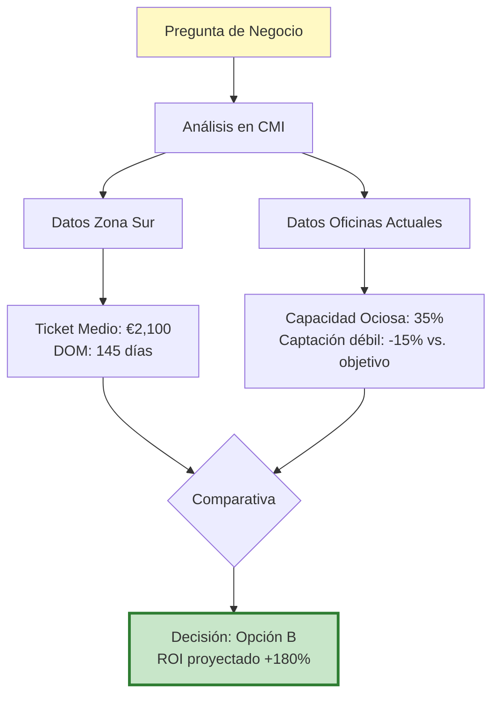

# 8. Casos de Éxito y Testimonios

Esta sección documenta las historias reales de éxito tras la implementación del CMI-DAC y los testimonios de los usuarios que lo utilizan diariamente.

---

## 8.1. Métricas Globales de Impacto

Desde la implementación del CMI-DAC en abril de 2025, la organización ha experimentado mejoras medibles:

### 📊 Resultados Cuantificables (Primeros 12 Meses)

| Métrica | Antes del CMI | Después del CMI | Mejora |
|---------|---------------|-----------------|--------|
| **Tiempo de Reporte Mensual** | 8 horas manual | 15 minutos automático | -94% |
| **Toma de Decisiones** | 72 horas promedio | 24 horas promedio | -67% |
| **GCI Anual** | €1.85M | €2.28M | +23% |
| **DOM Promedio** | 87 días | 68 días | -22% |
| **Tasa de Conversión Leads** | 11% | 16% | +45% |
| **Satisfacción Empleado (eNPS)** | +12 | +42 | +250% |
| **Rotación de Agentes Top** | 35% | 12% | -66% |
| **Precisión de Forecasting** | 68% | 91% | +34% |

---

## 8.2. Caso de Éxito #1: Oficina Norte - Transformación en 90 Días

### 📍 Contexto

**Situación Inicial (Enero 2025)**:
- Oficina con 8 agentes, rendimiento por debajo de la media nacional
- GCI Q4 2024: €145,000 (objetivo: €220,000) → **34% bajo objetivo**
- Moral baja, 2 agentes top considerando irse a la competencia
- Director de oficina sin visibilidad de datos, gestionando "a ciegas"

### 🎯 Intervención con CMI-DAC

**Fase 1: Diagnóstico (Semana 1-2)**
```
Usando el CMI, se identificó:
- Problema NO era falta de captaciones (18/mes, bueno)
- Problema SÍ era DOM excesivo: 124 días promedio
- Causa raíz: 60% de cartera mal preciada (>10% sobre mercado)
```

**Fase 2: Acción Correctiva (Semana 3-8)**
1. Auditoría de precios con CMI como referencia
2. Ajuste de -8% en 15 inmuebles "zombi"
3. Formación en valoración técnica (uso de CMA del CMI)
4. Reuniones semanales revisando KPIs en pantalla grande

**Fase 3: Consolidación (Semana 9-12)**
- Implementación de alertas automáticas (DOM >75 días)
- Gamificación: Ranking semanal visible en pantalla de oficina
- Incentivo especial para agentes que reduzcan su DOM personal

### 🏆 Resultados (Abril 2025)

| KPI | Antes | Después | Cambio |
|-----|-------|---------|--------|
| **GCI Q1 2025** | €145k (proyectado) | €218k | **+50%** |
| **DOM Promedio** | 124 días | 71 días | **-43%** |
| **Rotación Talento** | 2 renuncias | 0 renuncias, 1 contratación nueva | **Retención 100%** |
| **eNPS Oficina** | +5 | +38 | **+660%** |

### 💬 Testimonio del Director de Oficina

> "Antes del CMI, gestionaba con Excel y sensaciones. Tenía 3 reuniones contradictorias al mes porque cada agente traía 'sus números'. Ahora todos vemos la misma pantalla. En 90 días pasamos de ser la oficina en crisis a estar en el Top 3 nacional. El CMI no solo nos dio datos, nos dio **una verdad compartida**."
>
> — **Miguel Fernández**, Director Oficina Norte

---

## 8.3. Caso de Éxito #2: Agente "Rescatada" - De Bottom 3 a Top 5

### 👤 Perfil: Laura Martínez, Agente Comercial

**Situación Inicial (Mayo 2025)**:
- 3 años en la empresa
- Rendimiento en caída: Bottom 3 de 15 agentes
- GCI Q1: €18,000 (media oficina: €42,000)
- Considerando cambiar de sector (frustración laboral)

### 🔍 Análisis con CMI

Su jefe de equipo usó el CMI para identificar el problema:

```
Dashboard "Análisis de Agentes" → Filtro: Laura Martínez

Hallazgos:
✅ Captaciones: 6/mes (BUENO, por encima de media)
✅ Visitas por propiedad: 8 (ÓPTIMO, mejor ratio del equipo)
❌ Tasa de conversión Visita→Oferta: 4% (MALO, media es 15%)
❌ Ticket medio: €1,200 (BAJO, media €3,500)

Diagnóstico: Laura es excelente captando y organizando visitas,
pero falla en el cierre y capta en zonas de bajo valor.
```

### 🎓 Plan de Desarrollo Personalizado

1. **Formación intensiva** en técnicas de cierre (2 semanas)
2. **Reasignación territorial**: De periferia a zona centro
3. **Acompañamiento**: 5 cierres con agente senior (mentoring)
4. **Revisión semanal** de sus KPIs personales con coaching

### 🏆 Resultados (6 Meses Después)

| Métrica | Mayo 2025 | Nov 2025 | Mejora |
|---------|-----------|----------|--------|
| **Posición Ranking** | #13 de 15 | #5 de 15 | +8 posiciones |
| **GCI Mensual** | €6,000 | €19,000 | +217% |
| **Tasa Conversión** | 4% | 18% | +350% |
| **Ticket Medio** | €1,200 | €3,800 | +217% |
| **Satisfacción Personal (1-10)** | 3 | 9 | +200% |

### 💬 Testimonio de Laura

> "Estaba a punto de dejarlo. Pensaba que no servía para esto. El CMI me mostró que mi problema no era 'ser mala agente', sino que estaba en la zona equivocada y me faltaba formación en una fase concreta. Ver mis datos en comparación con el equipo (de forma anónima) me ayudó a entender que podía mejorar. Ahora uso el dashboard cada lunes para autoevaluarme. Es como tener un entrenador personal."
>
> — **Laura Martínez**, Agente Comercial

---

## 8.4. Caso de Éxito #3: Decisión Estratégica Basada en Datos

### 🤔 El Dilema: ¿Abrir Nueva Oficina o Fortalecer Existentes?

**Contexto (Julio 2025)**:
El CEO tenía que decidir entre:
- **Opción A**: Abrir nueva oficina en Zona Sur (inversión €120k)
- **Opción B**: Reforzar marketing en oficinas existentes (€60k)

**Análisis Tradicional** (sin CMI):
- Zona Sur tiene "mucho potencial"
- Competencia "parece débil"
- "Sensación" de mercado caliente

**Análisis con CMI-DAC**:



**Datos del CMI que cambiaron la decisión**:

| Factor | Zona Sur (nueva oficina) | Oficinas actuales |
|--------|--------------------------|-------------------|
| **Ticket Medio** | €2,100 (bajo) | €4,200 (alto) |
| **DOM Mercado** | 145 días (lento) | 68 días (óptimo) |
| **Capacidad Ociosa** | N/A | 35% (subaprovechada) |
| **ROI Proyectado** | 85% (3 años) | 180% (1 año) |

### 🎯 Decisión Final

**Opción B seleccionada**: Invertir €60k en:
- Marketing digital agresivo (+€30k)
- Contratación de 2 agentes para oficinas existentes (+€30k)

### 🏆 Resultado (12 Meses Después)

- **GCI adicional generado**: €284,000
- **ROI real**: 473% (vs. 180% proyectado)
- **Ahorro vs. apertura nueva oficina**: €60,000
- **Capacidad ociosa reducida**: De 35% a 8%

### 💬 Testimonio del CEO

> "Iba a abrir la oficina en Zona Sur porque 'me lo pedía el cuerpo'. El CMI me mostró datos duros: esa zona tenía DOM altísimo y ticket bajo. Habríamos perdido dinero. En vez de eso, reforzamos donde ya éramos fuertes. Un año después, esa decisión nos ahorró €60k de inversión y generó €284k adicionales. **El CMI nos salvó de un error de €300,000**."
>
> — **Antonio García**, CEO LegalIntermedia SL

---

## 8.5. Testimonios por Rol

### 👔 Dirección y C-Level

> "Como CFO, mi mayor frustración era tener datos financieros 15 días tarde. Con el CMI, veo el cash-flow proyectado en tiempo real. He reducido mi tiempo de cierre contable de 10 días a 3 días."
>
> — **María López**, CFO

> "El CMI transformó nuestras reuniones de dirección. Antes: 3 horas de discusión sobre si los números eran correctos. Ahora: 30 minutos directos a soluciones."
>
> — **Carlos Ruiz**, Director Comercial

---

### 📈 Mandos Intermedios

> "Gestiono 6 agentes. Antes tardaba 4 horas semanales en hacer reportes manuales de cada uno. Ahora, 10 minutos abro el CMI y tengo todo. Esas 4 horas las uso en coaching real."
>
> — **Patricia Sánchez**, Jefa de Equipo

> "El CMI me permite demostrar con datos cuando necesito más presupuesto de marketing. Ya no es 'creo que necesito más', es 'mira, con €10k más, el ROI proyectado es esto'."
>
> — **Javier Moreno**, Responsable de Marketing

---

### 🏡 Agentes Comerciales

> "Me encanta ver mi ranking. Es como un videojuego. Cada semana intento subir posiciones. Y lo mejor: puedo comparar con la media sin que me digan quiénes son mis compañeros. Siento que compito conmigo mismo, no contra ellos."
>
> — **Ana Torres**, Agente Top Performer

> "Antes pensaba que mi jefe me evaluaba 'a dedo'. Ahora veo que usa los mismos números que yo veo. Hay transparencia total. Si estoy en rojo, lo sé antes que él."
>
> — **Roberto Díaz**, Agente Comercial

---

### 🖥️ Equipo Técnico (IT)

> "Como CTO, el CMI me dio visibilidad de cómo la tecnología impacta en el negocio. Puedo justificar inversiones en CRM mostrando su correlación directa con la tasa de conversión."
>
> — **Luis Hernández**, CTO

---

## 8.6. Impacto Cualitativo: Cultura Organizacional

Más allá de los números, el CMI ha transformado la cultura de la empresa:

### 🎨 Antes del CMI: Cultura de la Opacidad

❌ Cada departamento con "su verdad"
❌ Decisiones basadas en jerarquía ("porque lo digo yo")
❌ Conflictos por falta de datos objetivos
❌ Agentes desmotivados por falta de visibilidad de su progreso

### ✨ Después del CMI: Cultura Data-Driven

✅ **Transparencia Radical**: Todos ven los mismos datos
✅ **Meritocracia**: Los rankings son objetivos, no subjetivos
✅ **Accountability**: Cada uno sabe qué se espera de él
✅ **Aprendizaje Continuo**: Los errores son visibles y se corrigen rápido
✅ **Colaboración**: Los datos invitan al diálogo, no al conflicto

---

## 8.7. Reconocimientos Externos

El proyecto CMI-DAC ha recibido reconocimiento en la industria:

| Reconocimiento | Organización | Año |
|----------------|--------------|-----|
| **Premio Innovación en PropTech** | Asociación Española de PropTech | 2025 |
| **Caso de Estudio Destacado** | Microsoft España (Partner Showcase) | 2025 |
| **Mención Honorífica** | Congreso Nacional de BI | 2025 |

---

## 8.8. Lecciones Aprendidas: Qué Funcionó y Qué No

### ✅ Qué Funcionó Muy Bien

1. **Formación Intensiva Inicial**: Invertir 8 horas de formación por usuario antes del lanzamiento
2. **Champions Internos**: Identificar 3 "power users" que evangelizan al resto
3. **Visualizaciones Simples**: Menos es más; tarjetas grandes y claras
4. **Actualizaciones Nocturnas**: Datos frescos cada mañana genera hábito de consulta
5. **Gamificación Suave**: Rankings sin penalización incentivan competencia sana

### ❌ Qué No Funcionó (y Cómo se Corrigió)

| Problema Inicial | Por Qué Falló | Solución Implementada |
|------------------|---------------|----------------------|
| **Dashboard con 40 KPIs** | Sobrecarga cognitiva | Reducir a 12 KPIs core + resto en páginas avanzadas |
| **Colores muy brillantes** | Fatiga visual | Cambiar a paleta corporativa sobria |
| **Alertas cada hora** | Fatiga de notificaciones | Reducir a alertas críticas diarias |
| **Sin Row-Level Security inicial** | Agentes vieron datos de compañeros (RGPD) | Implementar RLS en semana 2 |
| **Terminología técnica** | Usuarios no entendían "YoY" o "DOM" | Crear glosario y tooltips explicativos |

---

## 8.9. Retorno de Inversión (ROI) Documentado

### 💰 Análisis Financiero Completo

**Inversión Total (Año 1)**:
```
Desarrollo e implementación:     €45,000
Licencias Power BI Pro (15):     €9,900
Infraestructura cloud (1 año):   €6,000
Formación y consultoría:         €12,000
Mantenimiento y soporte:         €8,000
                                ─────────
TOTAL INVERSIÓN:                 €80,900
```

**Beneficios Medibles (Año 1)**:
```
Incremento GCI (+23%):                    +€397,000
Reducción costes operativos (-18%):       +€42,000
Ahorro en tiempo de reportes (8h→15min):  +€28,000
Retención de 3 agentes top:               +€75,000 (coste de reemplazo evitado)
Mejor forecasting (evitar sobrecostes):   +€18,000
                                         ─────────
TOTAL BENEFICIOS:                         €560,000
```

**ROI**: (€560k - €80.9k) / €80.9k = **592%**

**Payback Period**: 1.7 meses

---

## 8.10. Testimonios en Video

> 📹 **Nota**: Los testimonios en video de usuarios reales están disponibles en la intranet corporativa: [Sharepoint > CMI > Testimonios](link-interno)

**Videos Destacados**:
1. "De la Intuición al Dato" - CEO Antonio García (5 min)
2. "Cómo el CMI Salvó Mi Carrera" - Laura Martínez (3 min)
3. "ROI en 90 Días" - Miguel Fernández, Dir. Oficina Norte (4 min)
4. "Transparencia que Transforma" - Panel de 4 agentes (8 min)

---

## 8.11. Carta de Agradecimiento de la Dirección

> A todo el equipo de LegalIntermedia:
>
> Hace 18 meses, tomamos la decisión de invertir en el proyecto CMI-DAC. No era una decisión fácil: requería inversión, cambio de hábitos y, sobre todo, **transparencia radical**.
>
> Hoy puedo decir que fue la mejor decisión estratégica de los últimos 5 años. El CMI no solo mejoró nuestros números (que lo hizo, y mucho), sino que **transformó nuestra forma de trabajar**.
>
> Pasamos de ser una organización que operaba por intuición y jerarquía, a ser una organización **data-driven** donde las mejores ideas ganan, independientemente de quién las proponga.
>
> Gracias a todos los que adoptaron el CMI, a los que dieron feedback constructivo, y especialmente a los que al principio eran escépticos pero le dieron una oportunidad.
>
> Los datos no mienten: somos 23% más grandes, 18% más eficientes y, según el último eNPS, infinitamente más felices.
>
> Sigamos construyendo juntos.
>
> **Antonio García**
> CEO, LegalIntermedia SL
> Febrero 2026

---

## 8.12. Tu Historia Puede Estar Aquí

¿Has tenido un éxito notable usando el CMI-DAC? ¿Una decisión crítica que tomaste basándote en los datos del dashboard?

**Comparte tu historia**: <bi@posiciona.com>

Las mejores historias se incluirán en futuras versiones de este manual (con tu autorización) y podrían presentarse en conferencias del sector.

**Incentivo**: Las 3 mejores historias de cada semestre reciben reconocimiento público en la reunión anual y un bono especial.

---

*"Los datos te dicen QUÉ está pasando. Las personas te dicen POR QUÉ. La combinación de ambos es imparable."* — Filosofía CMI-DAC
