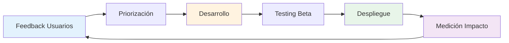
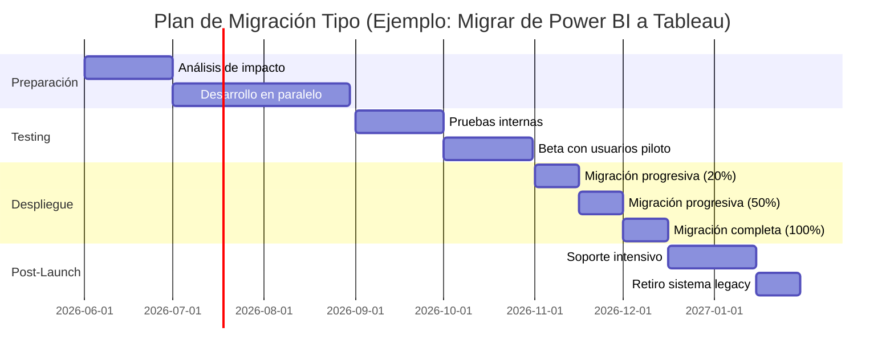

# 9. Roadmap y Evolución Futura del CMI-DAC

Esta sección detalla la hoja de ruta estratégica del proyecto, las mejoras planificadas y la visión a largo plazo del Cuadro de Mando Integral.

---

## 9.1. Filosofía de Evolución Continua

El CMI-DAC no es un proyecto estático "terminado". Sigue un modelo de **mejora continua** basado en:



**Principios de evolución**:

1. **User-Centric**: Las mejoras parten de necesidades reales de usuarios, no de "features cool"
2. **Incremental**: Pequeñas mejoras frecuentes > grandes cambios disruptivos
3. **Data-Driven**: Cada nueva feature se mide por su uso real y valor aportado
4. **Backward Compatible**: Las actualizaciones no rompen funcionalidades existentes

---

## 9.2. Versión Actual y Releases Históricos

### 📌 Versión Actual: 2.5 (Febrero 2026)

**Características principales**:

- 20 KPIs distribuidos en 4 perspectivas BSC
- 8 páginas de dashboard interactivas
- Row-Level Security implementada
- Actualización automática diaria (ETL)
- Integración completa con PostgreSQL en nube
- Soporte móvil (Power BI Mobile App)

### 📜 Historial de Versiones

| Versión | Fecha | Hitos Principales |
|---------|-------|-------------------|
| **2.5** | Feb 2026 | Nuevas secciones del manual (8, 9, 10), mejoras en tooltips dinámicos |
| **2.2** | Dic 2025 | Implementación de alertas inteligentes, optimización de rendimiento |
| **2.0** | Sep 2025 | Rediseño completo de UX/UI, página de comparativas temporales |
| **1.8** | Jul 2025 | Integración con API de portales inmobiliarios (Idealista) |
| **1.5** | May 2025 | Row-Level Security (RLS) implementado |
| **1.0** | Abr 2025 | Primera versión production-ready, lanzamiento oficial |
| **0.8 Beta** | Ene 2025 | Piloto con 5 usuarios, feedback inicial |
| **0.3 Alpha** | Oct 2024 | Proof of concept técnico |

---

## 9.3. Roadmap 2026: Próximos 12 Meses

### 🗓️ Q1 2026 (Enero - Marzo) ✅ COMPLETADO

**Tema**: Consolidación y Optimización

- [x] Ampliación del manual a 10 secciones
- [x] Optimización de queries SQL (reducción de 30% en tiempo de carga)
- [x] Implementación de página "Comparativas Temporales"
- [x] Formación avanzada para power users

---

### 🗓️ Q2 2026 (Abril - Junio) 🔄 EN CURSO

**Tema**: Inteligencia Artificial y Predicción

| Feature | Descripción | Prioridad | Estado |
|---------|-------------|-----------|--------|
| **Forecasting Automático** | Predicción de GCI trimestral basada en IA | 🔴 Alta | En desarrollo |
| **Detección de Anomalías** | Alertas automáticas cuando KPI se desvía >20% | 🔴 Alta | Planificado |
| **Recomendaciones Inteligentes** | "El sistema sugiere ajustar precio de inmueble X" | 🟡 Media | Diseño |
| **Análisis de Sentimiento** | Procesar reviews de clientes con NLP | 🟢 Baja | Backlog |

**Detalle: Forecasting Automático**

```text
Funcionalidad:
- Modelo de Machine Learning entrenado con 3 años de histórico
- Predice GCI de próximos 3 meses con intervalo de confianza
- Se actualiza semanalmente con nuevos datos
- Precisión objetivo: 85% (actual predicción manual: 68%)

Tecnología:
- Python scikit-learn (Random Forest Regressor)
- Entrenamiento mensual automático
- Visualización en nuevo gráfico de Power BI

ETA: Mayo 2026
```

---

### 🗓️ Q3 2026 (Julio - Septiembre)

**Tema**: Movilidad y Accesibilidad

| Feature | Descripción | Prioridad | Beneficio |
|---------|-------------|-----------|-----------|
| **App Móvil Nativa** | App iOS/Android dedicada (no solo Power BI Mobile) | 🔴 Alta | Mejor UX móvil |
| **Modo Offline** | Consultar últimos datos sin conexión | 🟡 Media | Uso en campo |
| **Accesibilidad WCAG 2.1** | Soporte para lectores de pantalla | 🟡 Media | Inclusión |
| **Versión Multiidioma** | Español, Inglés, Catalán | 🟢 Baja | Expansión internacional |
| **Comandos por Voz** | "Muéstrame GCI de este mes" | 🟢 Baja | Innovación |

---

### 🗓️ Q4 2026 (Octubre - Diciembre)

**Tema**: Colaboración y Social Features

| Feature | Descripción | Prioridad | Uso |
|---------|-------------|-----------|-----|
| **Comentarios en Gráficos** | Anotar insights directamente en visuales | 🔴 Alta | Colaboración |
| **Dashboard Compartidos** | Crear y compartir vistas personalizadas | 🟡 Media | Presentaciones |
| **Gamificación Avanzada** | Logros, badges, rankings históricos | 🟡 Media | Motivación |
| **Integración con Slack** | Recibir alertas y consultas en Slack | 🟡 Media | Workflow |
| **Feed de Actividad** | Ver qué ha cambiado desde última visita | 🟢 Baja | Eficiencia |

---

## 9.4. Visión 2027-2028: Largo Plazo

### 🚀 Iniciativas Estratégicas

#### 1. **CMI Prescriptivo** (2027)

Evolución de descriptivo → predictivo → **prescriptivo**

```
Actual (Descriptivo):
"Tu DOM es 95 días"

Futuro Cercano (Predictivo):
"Tu DOM seguirá subiendo si no actúas"

Visión (Prescriptivo):
"Reduce el precio en 7% y el DOM bajará a 65 días en 3 semanas.
Probabilidad de éxito: 82%"
```

**Tecnología requerida**:

- Modelos de IA avanzados (Deep Learning)
- Integración con datos de mercado externos
- Simulador de escenarios (what-if analysis)

---

#### 2. **Inteligencia Geoespacial (Geo-BI)** (2027)

Evolución de los mapas estáticos a capas de inteligencia sobre el territorio:
- **Heatmaps de Demanda**: Ver en tiempo real dónde están buscando los compradores (datos agregados de portales).
- **Zonificación por Rentabilidad**: Identificar manzanas exactas donde el ROI de alquiler es máximo.
- **Predictor de Gentrificación**: Algoritmos que detectan barrios con potencial de revalorización en los próximos 24 meses.

---

#### 3. **CMI como Asistente Virtual** (2027)

Interfaz conversacional con IA:

```
Usuario: "¿Por qué bajaron las ventas en noviembre?"

CMI-DAC IA: "Detecté 3 factores clave:
1. Captaciones de agosto fueron -23% (lag de 3 meses)
2. Competencia aumentó presencia en portales (+18% listings)
3. 2 de tus agentes top estuvieron de vacaciones

La causa principal es #1. Recomiendo campaña de captación urgente."
```

**Tecnología requerida**:

- Integración con GPT-4 o superior
- Base de conocimiento semántica
- NLP avanzado en español

---

#### 4. **Micro-Gamificación y Data-Badges** (2027)

Para incentivar la calidad del dato:
- **Cinturón Negro de Datos**: Reconocimiento a agentes con 0% de errores de entrada en 6 meses.
- **Challenges Semanales**: "La oficina que baje más el DOM esta semana gana un bono de visibilidad en portales".
- **Dashboard de Honor**: Pantallas en las oficinas físicas que celebran hitos en tiempo real.

---

#### 5. **Marketplace de Dashboards** (2028)

Plataforma donde usuarios pueden:

- Compartir configuraciones de dashboards
- Vender plantillas personalizadas
- Descargar dashboards de otras industrias adaptados

**Modelo de negocio**:

- Gratuito para uso interno
- Monetización por dashboards premium de terceros
- Revenue share con creadores

---

## 9.5. Funcionalidades Solicitadas por Usuarios

Estas son las peticiones más recurrentes (votación interna, Nov 2025):

| Feature | Votos | Viabilidad Técnica | Prioridad Asignada |
|---------|-------|-------------------|-------------------|
| Exportar dashboard completo a PDF | 42 | ✅ Alta | Q2 2026 |
| Comparar mi desempeño con yo del año pasado | 38 | ✅ Alta | Q2 2026 |
| Alertas configurables por email/SMS | 35 | ✅ Alta | Q3 2026 |
| Modo oscuro (dark mode) | 31 | ✅ Alta | Q3 2026 |
| Integración con Google Calendar | 28 | ⚠️ Media | Q4 2026 |
| Ver evolución hora a hora (no solo diaria) | 24 | ❌ Baja* | Backlog |
| Dashboard público para clientes | 18 | ⚠️ Media** | 2027 |

*Requiere cambios profundos en arquitectura ETL
**Requiere análisis legal y de seguridad

---

## 9.6. Experimentos en Fase Beta

Estas funcionalidades están en **testing privado** con grupo reducido de usuarios:

### 🧪 Experimento #1: "Nudges Inteligentes"

Pequeñas sugerencias contextuales en el dashboard:

```text
Ejemplo:
Al entrar un lunes por la mañana:
💡 "Tienes 3 inmuebles con DOM >90 días. ¿Quieres revisarlos ahora?"
[Sí, mostrar] [Recordar el viernes]
```

**Hipótesis**: Los nudges aumentan la acción proactiva en +15%
**Estado**: Testing con 10 usuarios, resultados en marzo 2026

---

### 🧪 Experimento #2: "Comparativa con el Mercado"

Integración con índices inmobiliarios públicos:

```text
Tu GCI creció +15% YoY

Mercado nacional: +8% YoY
Mercado local (Madrid): +12% YoY

📊 Estás superando al mercado en +7 puntos
```

**Hipótesis**: Contextualizar con mercado aumenta satisfacción del equipo
**Estado**: Pendiente de acceso a API de índices públicos

---

### 🧪 Experimento #3: "Peer Benchmarking Anónimo"

Compararse con oficinas similares (sin saber cuáles):

```text
Tu oficina: DOM 68 días

Oficinas similares (6-10 agentes, misma región):
- Mejor: 52 días
- Media: 71 días
- Peor: 98 días

Tu posición: Por encima de la media 💪
```

**Hipótesis**: Competencia anónima motiva sin generar conflicto
**Estado**: Testing con 3 oficinas piloto

---

## 9.7. Tecnologías Emergentes en Radar

Tecnologías que estamos evaluando para futuras versiones:

| Tecnología | Aplicación Potencial | Madurez | Timeline |
|------------|---------------------|---------|----------|
| **GPT-4/5 (LLMs)** | Asistente conversacional, análisis de texto | ✅ Madura | 2027 |
| **Computer Vision** | Análisis automático de calidad de fotos de inmuebles | ⚠️ Emergente | 2028 |
| **Blockchain** | Trazabilidad inmutable de operaciones | ⚠️ Emergente | TBD |
| **Edge Computing** | Dashboards ultra-rápidos sin latencia de red | ⚠️ Emergente | 2028 |
| **VR/AR** | Visualización de KPIs en realidad aumentada | ❌ Inmadura | 2029+ |
| **Quantum Computing** | Optimización de carteras con algoritmos cuánticos | ❌ Inmadura | 2030+ |


---

## 9.8. Política de Depreciación de Features

No todas las funcionalidades perduran. Retiramos features que:

- Tienen < 5% de uso después de 6 meses
- Generan más confusión que valor
- No se alinean con la estrategia de producto

### 🗑️ Features Retiradas en el Pasado

| Feature | Lanzamiento | Retirada | Razón |
|---------|-------------|----------|-------|
| "36 KPIs en vista general" | v0.8 | v1.2 | Sobrecarga cognitiva |
| "Actualización en tiempo real" | v1.3 | v1.7 | Causaba inestabilidad, preferencia por nocturna |
| "Integración con Twitter" | v1.4 | v2.0 | 0% de uso efectivo |

**Política**: Avisar con 60 días de antelación antes de retirar cualquier feature con >10% de uso.

---

## 9.9. Cómo Influir en el Roadmap

Tu opinión cuenta. Formas de participar en la evolución del CMI:

### 📝 1. Formulario de Sugerencias

Accede al formulario mensual: [Link interno SharePoint]

**Campos**:

- ¿Qué problema estás intentando resolver?
- ¿Qué feature lo resolvería?
- ¿Cuántas veces al mes lo usarías?
- ¿Cómo impactaría en tu trabajo diario?

---

### 🗳️ 2. Votación Trimestral

Cada trimestre, los usuarios votan por el Top 5 de features más deseadas.
Las 2 más votadas se incluyen en el roadmap del próximo trimestre.

**Próxima votación**: Abril 2026

---

### 🧪 3. Programa Beta Testers

Únete al grupo de beta testers y prueba features antes que nadie:

**Beneficios**:

- Acceso anticipado a nuevas funcionalidades
- Influencia directa en el diseño final
- Reconocimiento público como "contributor"

**Requisitos**:

- Usar el CMI al menos 2 veces por semana
- Disponibilidad para dar feedback en 48h
- Compromiso de 3 meses mínimo

**Inscripción**: <bi@tposiciona.es>

---

## 9.10. Plan de Migración para Grandes Cambios

Cuando haya cambios significativos (ej. cambio de motor de BI), el proceso será:



**Garantías**:

- ✅ Cero pérdida de datos
- ✅ Doble sistema activo durante transición
- ✅ Formación gratuita a todos los usuarios
- ✅ Soporte 24/7 durante primeras 2 semanas
- ✅ Rollback plan si falla (vuelta atrás en <4h)

---

## 9.11. Inversión Prevista 2026-2028

Presupuesto comprometido para evolución del CMI:

| Categoría | 2026 | 2027 | 2028 |
|-----------|------|------|------|
| **Desarrollo de Software** | €55k | €75k | €90k |
| **Infraestructura Cloud** | €8k | €12k | €18k |
| **Licencias y SaaS** | €12k | €15k | €18k |
| **Formación y Consultoría** | €10k | €15k | €20k |
| **I+D (IA, ML)** | €15k | €30k | €50k |
| **TOTAL** | **€100k** | **€147k** | **€196k** |

**ROI Proyectado**: Por cada €1 invertido, retorno esperado de **€6-8** en eficiencias y crecimiento.

---

## 9.12. Compromiso de Transparencia

El equipo de producto del CMI-DAC se compromete a:

- 📅 **Publicar roadmap actualizado trimestralmente** (último viernes de trimestre)
- 📊 **Compartir métricas de uso del CMI** (dashboard del dashboard)
- 🗳️ **Explicar decisiones de priorización** (por qué se acepta o rechaza cada feature)
- 🎤 **Webinar trimestral "Estado del CMI"** (CEO + CTO + Product Manager)
- 📝 **Changelog público** en cada release (qué cambió y por qué)

---

## 9.13. Visión 2030: El CMI del Futuro

En un horizonte de 5 años, visualizamos el CMI-DAC como:

### 🌟 Características Visionarias

**1. Agente Autónomo de BI**

```text
El sistema no solo muestra datos, los interpreta y actúa:
- Detecta un problema (DOM subiendo)
- Identifica causa raíz (sobreprecio)
- Propone solución (ajuste de -6%)
- Calcula impacto (probabilidad 78% de éxito)
- Si autorizas, ejecuta acción (notifica al agente)
```

**2. Gemelo Digital del Negocio**

```text
Simulador que replica el comportamiento de la inmobiliaria:
"¿Qué pasaría si contrato 3 agentes más?"
→ Ejecuta 10,000 simulaciones
→ Resultado esperado: +€210k GCI, ROI 340%
→ Riesgo: 15% de no alcanzar breakeven en 6 meses
```

**3. Ecosistema de Apps Conectadas**

```text
CMI-DAC como plataforma central que conecta:
- CRM (gestión de leads)
- ERP (contabilidad y finanzas)
- Marketing (campañas y portales)
- RRHH (formación y evaluación)
- Clientes (portal de auto-servicio)

Todo sincronizado en tiempo real.
```

---

## 9.14. Invitación a Co-Crear el Futuro

El CMI-DAC es **tu herramienta**. Su futuro depende de ti.

**Pregunta clave para reflexionar**:

> Si pudieras tener **una sola funcionalidad** en el CMI del futuro, que te hiciera la vida 10x más fácil, ¿cuál sería?

**Envía tu respuesta a**: <bi@tposiciona.es>

Las mejores ideas se discutirán en sesión de brainstorming con CEO y CTO (próxima: Abril 2026).

---

*"El mejor momento para plantar un árbol fue hace 20 años. El segundo mejor momento es ahora. El mejor momento para construir el CMI del futuro es hoy."*

— Filosofía de Producto CMI-DAC
