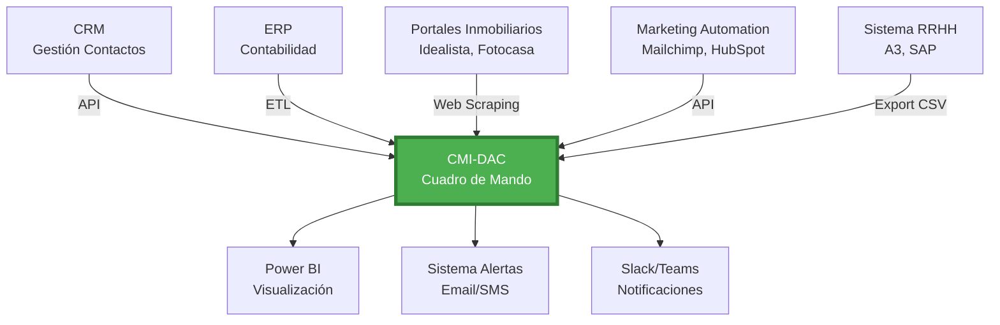
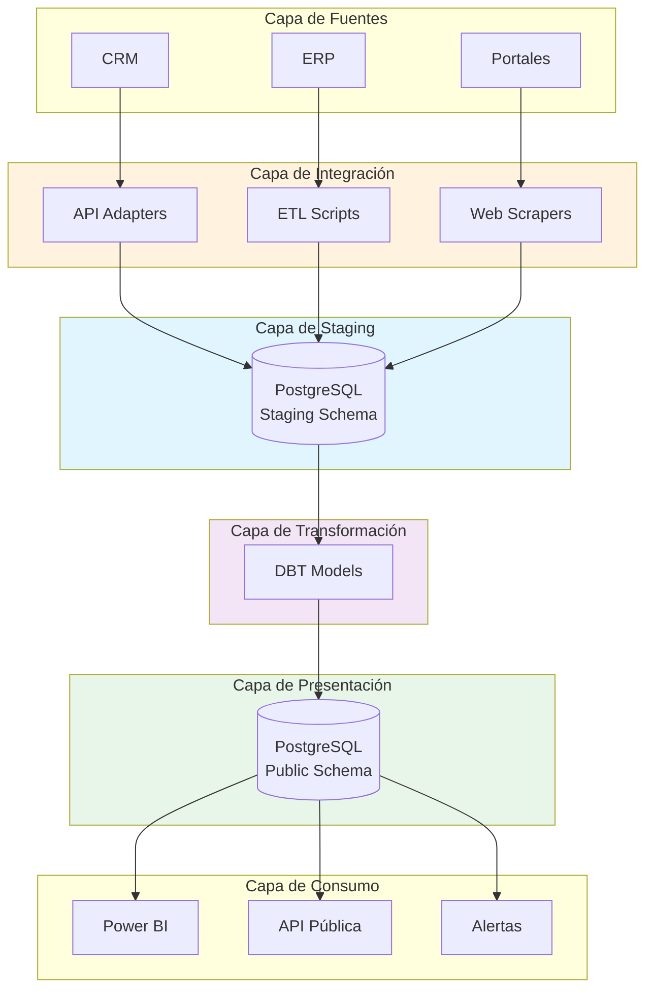

# 10. Integración con Otros Sistemas

El CMI-DAC no es una isla. Su verdadero poder reside en su capacidad de conectarse con el ecosistema tecnológico completo de la organización, centralizando información dispersa en múltiples plataformas.

---

## 10.1. Filosofía de Integración

### 🔗 El CMI como Hub Central



**Principios de Diseño**:

1. **Sin Single Point of Failure**: Si un sistema fuente cae, el CMI sigue operativo con últimos datos conocidos
2. **Tolerancia a la Latencia**: No todas las integraciones son tiempo real (aceptable 1-24h lag)
3. **Seguridad Primero**: Todas las integraciones usan autenticación OAuth 2.0 o API Keys encriptadas
4. **Idempotencia**: Las integraciones pueden ejecutarse múltiples veces sin corromper datos

---

## 10.2. Integraciones Actuales (Production)

### ✅ 1. CRM Inmobiliario (Sistema Propietario)

**Estado**: ✅ Activa
**Método de Integración**: API REST + CSV Export
**Frecuencia de Sincronización**: Diaria (05:00 AM)

**Datos Sincronizados**:

- Contactos (leads, clientes, propietarios)
- Inmuebles (propiedades en cartera)
- Actividades (llamadas, visitas, emails)
- Operaciones (ventas, alquileres)

**Flujo Técnico**:

```python
# scripts/integrations/crm_sync.py
def sync_crm_to_cmi():
    # 1. Autenticarse en CRM
    token = authenticate_crm(api_key=env.CRM_API_KEY)

    # 2. Extraer datos incrementales (solo cambios desde última sync)
    delta = get_crm_delta(since=last_sync_timestamp)

    # 3. Transformar a esquema CMI
    transformed = transform_crm_data(delta)

    # 4. Cargar en PostgreSQL
    load_to_database(transformed, table='staging_crm')

    # 5. Ejecutar merge con tablas principales
    execute_merge_procedure()

    # 6. Log de auditoría
    log_sync_success(records=len(transformed))
```

**SLA**:

- Disponibilidad: 99.5%
- Latencia máxima: 24 horas
- Precisión: >99% (validaciones automáticas)

---

### ✅ 2. ERP Contable (A3 Software)

**Estado**: ✅ Activa
**Método de Integración**: Export CSV programado + SFTP
**Frecuencia de Sincronización**: Semanal (lunes 06:00 AM)

**Datos Sincronizados**:

- Facturas emitidas
- Gastos operativos (por categoría)
- Nóminas (solo totales, sin detalle personal)
- Comisiones pagadas a agentes

**Notas de Seguridad**:

- Los datos se transfieren encriptados via SFTP
- Los archivos CSV se borran automáticamente tras importación (retención 0 días)
- No se sincronizan datos bancarios (cuentas, IBAN)

---

### ✅ 3. Microsoft 365 (Azure AD)

**Estado**: ✅ Activa
**Método de Integración**: Azure AD SSO + Microsoft Graph API
**Frecuencia de Sincronización**: Tiempo real

**Propósito**:

- **Single Sign-On (SSO)**: Un solo login para CMI, email y Office
- **Gestión de Usuarios**: Altas/bajas automáticas desde directorio corporativo
- **Row-Level Security**: Mapeo automático de roles (agente, jefe, director)

**Beneficios**:

- ✅ Experiencia sin fricción (usuario no recuerda contraseñas adicionales)
- ✅ Seguridad centralizada (MFA obligatorio en todo)
- ✅ Offboarding automático (empleado sale → acceso revocado en minutos)


---

### ✅ 4. Portales Inmobiliarios (Idealista - Próximamente Fotocasa)

**Estado**: 🟡 Piloto (solo Idealista)
**Método de Integración**: Web Scraping + API (donde disponible)
**Frecuencia de Sincronización**: Semanal

**Datos Recopilados**:

- Precios de competencia (misma zona, tipología similar)
- Días en mercado de propiedades comparables
- Volumen de oferta por zona

**Casos de Uso**:

- Benchmarking de precios (¿estamos caros?)
- Análisis de saturación de mercado
- Detección de tendencias (precios subiendo/bajando)

**Limitaciones Legales**:

- Solo datos públicos (nunca datos privados de usuarios)
- Cumplimiento TOS de cada portal
- No revendemos ni publicamos estos datos

---

## 10.3. Integraciones en Desarrollo (Q2-Q3 2026)

### 🔄 5. Google Analytics (Web Corporativa)

**Estado**: 🟡 En desarrollo (Beta interna)
**ETA**: Mayo 2026
**Método**: Google Analytics API v4

**Propósito**:
Medir efectividad de la web corporativa en generación de leads:

| Métrica GA | KPI CMI Derivado |
|------------|------------------|
| Visitantes únicos | Tráfico web mensual |
| Formulario "Contacto" completado | Leads web |
| Tiempo en página "Inmuebles" | Engagement score |
| Conversión Visita → Lead | Tasa conversión web |

**Insight esperado**:
> "Por cada 1,000 visitantes web, generamos 23 leads, de los cuales 2.1 se convierten en ventas. Coste por lead web: €4.3 (vs. €28 en portales)."

---

### 🔄 6. WhatsApp Business API

**Estado**: 🟡 Planificado
**ETA**: Agosto 2026
**Método**: WhatsApp Cloud API

**Propósito**:

- Trackear conversaciones de WhatsApp con clientes
- Medir tiempo de respuesta (KPI: <15 min)
- Analizar sentimiento de conversaciones (NLP)
- Generar alertas si cliente insatisfecho

**Ejemplo de uso**:

```
Cliente envía:
"Llevo 3 días esperando respuesta sobre la visita"

CMI detecta:
- Sentimiento: Negativo
- Tiempo sin respuesta: 72 horas (malo)
→ Alerta automática a jefe de equipo
→ KPI "Tiempo respuesta WhatsApp" en rojo
```

---

### 🔄 7. Plataforma de Formación (Moodle / Coursera)

**Estado**: 🟡 Planificado
**ETA**: Septiembre 2026

**Propósito**:
Correlacionar formación con desempeño:

```
Pregunta de negocio:
"¿Los agentes que completan el curso de cierre avanzado
tienen mejor tasa de conversión?"

Análisis CMI:
- Agentes con curso: Conversión 18.2%
- Agentes sin curso: Conversión 12.5%
- Diferencia: +5.7 puntos (+46% relativo)
- ROI del curso: €12,000 invertidos → €89,000 GCI adicional
```

---

### 🔄 8. Integración con Google Maps / Mapbox (Geo-Intelligence)

**Estado**: 🟢 Activa
**Propósito**: Enriquecer los datos de ubicación con capas de información urbana.
- **Puntos de interés (POI)**: Distancia a metros, colegios y parques.
- **Geocodificación Inversa**: Transformar coordenadas GPS en direcciones normalizadas para evitar duplicados.

---

## 10.4. Privacidad desde el Diseño (GDPR-Sync)

Cualquier integración que mueva datos personales (leads, empleados) pasa por un filtro de privacidad:

1. **Anonimización al Vuelo**: Los nombres de clientes se sustituyen por IDs únicos en la base de datos analítica si no son necesarios para el reporte.
2. **Encriptación AES-256**: Los datos se encriptan antes de salir del sistema de origen.
3. **Logs de Auditoría Inmutables**: Se registra quién, cuándo y para qué se movió cada dato.

---

## 10.5. Patrones Cloud-To-Cloud (C2C)

### 💡 8. Firma Electrónica (DocuSign / SignNow)

**Valor**:

- Trackear ciclo completo: Lead → Visita → Oferta → **Firma** → Cierre
- Medir "tiempo desde oferta aceptada hasta firma"
- Alertas si firma pendiente >7 días

---

### 💡 9. Sistema de Llamadas (VoIP / Centrales Telefónicas)

**Valor**:

- Grabar todas las llamadas (con consentimiento)
- Analizar duración promedio de llamadas efectivas
- Detectar keywords ("precio", "competencia", "pensármelo")
- Correlación: ¿Llamadas largas = mayor conversión?

---

### 💡 10. Redes Sociales (Facebook, Instagram, LinkedIn)

**Valor**:

- Medir impacto de campañas sociales en leads
- Analizar sentimiento de comentarios
- Identificar influencers que mencionan la marca

---

## 10.5. API del CMI: Integraciones Inversas

No solo el CMI consume de otros sistemas. También **expone su propia API** para que otros consuman del CMI.

### 📡 Endpoints Disponibles (API v1.0)

**Base URL**: `https://api-cmi.divisionagentes.com/v1/`

#### GET /kpis

Obtener valores actuales de KPIs:

```bash
curl -X GET https://api-cmi.divisionagentes.com/v1/kpis \
  -H "Authorization: Bearer YOUR_API_KEY" \
  -H "Content-Type: application/json"
```

**Respuesta**:

```json
{
  "timestamp": "2026-02-15T10:30:00Z",
  "kpis": [
    {
      "code": "FIN-01-GCI",
      "value": 2280000,
      "unit": "EUR",
      "target": 2500000,
      "status": "yellow",
      "trend": "up"
    },
    {
      "code": "PRO-01-DOM",
      "value": 68,
      "unit": "days",
      "target": 60,
      "status": "yellow",
      "trend": "down"
    }
  ]
}
```

---

#### POST /alerts

Enviar alerta personalizada al CMI:

```bash
curl -X POST https://api-cmi.divisionagentes.com/v1/alerts \
  -H "Authorization: Bearer YOUR_API_KEY" \
  -H "Content-Type: application/json" \
  -d '{
    "title": "Servidor CRM Caído",
    "severity": "high",
    "description": "El CRM no responde desde hace 15 minutos",
    "source": "Monitoring System"
  }'
```

---

### 🔐 Autenticación de API

**Método**: Bearer Token (JWT)
**Obtención de Token**:

1. Solicitar a IT: <it@dac-sl.es>
2. Justificar caso de uso
3. Recibir token con permisos específicos (solo lectura / escritura)

**Seguridad**:

- Tokens expiran cada 90 días
- Rate limit: 100 requests/hora
- IP whitelisting opcional

---

## 10.6. Casos de Uso de Integraciones

### 📊 Caso de Uso #1: Dashboard TV en Recepción

**Objetivo**: Mostrar KPIs en tiempo real en pantalla grande de oficina

**Solución**:

```html
<!-- dashboard_tv.html -->
<!DOCTYPE html>
<html>
<head>
    <title>CMI Live</title>
    <script>
        // Llamar a API CMI cada 5 minutos
        setInterval(function() {
            fetch('https://api.cmi-dac.../v1/kpis', {
                headers: {'Authorization': 'Bearer TOKEN'}
            })
            .then(response => response.json())
            .then(data => {
                document.getElementById('gci').innerText =
                    data.kpis.find(k => k.code === 'FIN-01-GCI').value;
            });
        }, 300000); // 5 min
    </script>
</head>
<body>
    <h1>GCI Mensual: €<span id="gci">-</span></h1>
</body>
</html>
```

**Resultado**: Pantalla que se autoactualiza sin intervención manual.

---

### 📊 Caso de Uso #2: Alertas en Slack

**Objetivo**: Recibir notificaciones de KPIs críticos en Slack

**Solución**:

```python
# scripts/integrations/cmi_to_slack.py
import requests

def check_kpis_and_alert():
    # 1. Consultar CMI API
    kpis = requests.get('https://api.cmi-dac.../v1/kpis',
                        headers={'Authorization': f'Bearer {API_KEY}'}).json()

    # 2. Verificar umbrales
    for kpi in kpis['kpis']:
        if kpi['status'] == 'red':
            # 3. Enviar a Slack
            slack_webhook = 'https://hooks.slack.com/services/YOUR_WEBHOOK'
            message = {
                "text": f"🚨 ALERTA: {kpi['code']} está en ROJO\n"
                        f"Valor: {kpi['value']} (objetivo: {kpi['target']})"
            }
            requests.post(slack_webhook, json=message)

# Ejecutar vía cron cada hora
if __name__ == '__main__':
    check_kpis_and_alert()
```

---

## 10.7. Arquitectura de Integración

### 🏗️ Patrón ETL vs. ELT

El CMI utiliza un patrón **híbrido**:

**ETL (Extract-Transform-Load)**: Para sistemas legacy sin API

```
CRM Antiguo → CSV Export → Python Transform → PostgreSQL
```

**ELT (Extract-Load-Transform)**: Para sistemas modernos con API

```
API Moderna → PostgreSQL (raw) → DBT Transform → Vista Final
```

### 🧩 Diagrama de Capas



---

## 10.8. Gestión de Errores de Integración

### 🚨 Tipos de Errores y Respuestas

| Error | Causa | Respuesta del Sistema |
|-------|-------|----------------------|
| **Connection Timeout** | Sistema fuente no responde | Reintentar 3 veces con backoff exponencial |
| **Authentication Failed** | Token expirado | Regenerar token automático, alertar si falla |
| **Data Format Changed** | Sistema fuente cambió esquema | Abortar carga, alertar a IT inmediatamente |
| **Duplicate Data** | Re-procesamiento accidental | Ignorar duplicados (check por primary key) |
| **Partial Data** | Carga incompleta | Marcar batch como "incompleto", no publicar |

### 📧 Sistema de Alertas de Integración

```yaml
# config/integration_alerts.yml
alerts:
  crm_sync_failed:
    severity: high
    notify: [it@dac-sl.es, cto@dac-sl.es]
    retry: auto (3 attempts)
    escalate_after: 4 hours

  erp_data_format_error:
    severity: critical
    notify: [it@dac-sl.es, cfo@dac-sl.es]
    retry: manual only
    escalate_after: immediate

  portal_scraping_blocked:
    severity: medium
    notify: [it@dac-sl.es]
    retry: auto (wait 24h, then retry)
    escalate_after: 3 days
```

---

## 10.9. Mejores Prácticas de Integración

### ✅ Checklist para Nueva Integración

Antes de integrar un nuevo sistema:

- [ ] **Justificación de negocio**: ¿Qué pregunta de negocio responde?
- [ ] **Análisis de costo**: ¿El valor supera el coste de mantenimiento?
- [ ] **Due diligence técnica**: ¿El sistema fuente tiene API estable?
- [ ] **Seguridad y privacidad**: ¿Cumple RGPD? ¿Datos sensibles?
- [ ] **SLA del proveedor**: ¿Garantiza disponibilidad >99%?
- [ ] **Plan de contingencia**: ¿Qué hacemos si la integración falla?
- [ ] **Documentación**: ¿Está el flujo documentado para futuro mantenimiento?
- [ ] **Testing en staging**: ¿Probado en entorno no-productivo?
- [ ] **Rollback plan**: ¿Podemos desactivar si causa problemas?
- [ ] **Formación de usuarios**: ¿Saben interpretar los nuevos datos?

---

## 10.10. Solicitar Nueva Integración

Si necesitas integrar un sistema que no está en la lista:

### 📝 Proceso de Solicitud

1. **Rellenar Formulario**: [Link interno SharePoint]

   **Campos obligatorios**:
   - Sistema a integrar
   - Problema de negocio que resuelve
   - Datos específicos necesarios
   - Frecuencia de actualización deseada
   - Impacto estimado en decisiones
   - Usuarios beneficiados

2. **Evaluación Técnica** (IT Team, 1 semana):
   - Viabilidad técnica
   - Estimación de esfuerzo (horas/€)
   - Riesgos identificados

3. **Aprobación de Comité** (Dirección, 2 semanas):
   - ROI proyectado
   - Prioridad vs. otros proyectos

4. **Desarrollo** (4-12 semanas):
   - Desarrollo en ambiente de pruebas
   - Testing con usuarios piloto
   - Despliegue a producción

**Tiempo total estimado**: 8-16 semanas

---

## 10.11. Integraciones Rechazadas y Por Qué

Transparencia: estas integraciones fueron solicitadas pero rechazadas:

| Sistema Solicitado | Por Qué se Rechazó | Alternativa Propuesta |
|--------------------|---------------------|----------------------|
| **Salesforce** | Coste prohibitivo (€50k/año) | Mantener CRM actual + mejorar integración |
| **Tableau** | Ya tenemos Power BI, redundante | Mejorar dashboards existentes |
| **Hojas de Google** | Falta de seguridad, difícil auditar | Migrar a Excel + OneDrive con permisos |
| **APIs de Redes Sociales** | ROI dudoso, datos poco accionables | Posponer a 2027, reevaluar |

---

## 10.12. Futuro: Integración Plug-and-Play

**Visión 2028**: Marketplace de integraciones pre-construidas

```
Imagina:
1. Entras al "CMI App Store"
2. Buscas "Integración Mailchimp"
3. Clic en "Instalar"
4. Introduces tus credenciales de Mailchimp
5. Listo: En 5 minutos, tus campañas de email están en el CMI
```

**Tecnología habilitante**:

- Conectores estandarizados (Apache Kafka, Airbyte)
- Orquestación visual (n8n, Zapier)
- Zero-code integrations

---

## 10.13. Monitoreo de Integraciones

Dashboard interno "Salud de Integraciones" (solo IT):

| Integración | Última Sync | Estado | Records | Errores 7d |
|-------------|-------------|--------|---------|------------|
| **CRM** | Hoy 05:02 AM | 🟢 OK | 1,245 | 0 |
| **ERP** | Lun 06:05 AM | 🟢 OK | 342 | 0 |
| **Idealista** | Dom 08:12 AM | 🟡 Warning | 1,823 | 2 (timeout) |
| **Microsoft 365** | Tiempo real | 🟢 OK | - | 0 |

**Alertas activas**: Idealista tiene 2 timeouts → Investigar si están bloqueando nuestro scraper.

---

## 10.14. Soporte para Integraciones

**Contacto**: <it@dac-sl.es>

**SLA de Soporte**:

- 🔴 Integración crítica caída (CRM, ERP): Respuesta <2h, resolución <8h
- 🟡 Integración secundaria con errores: Respuesta <24h, resolución <72h
- 🟢 Nueva integración solicitada: Respuesta <1 semana, desarrollo 8-16 semanas

---

*"La verdadera inteligencia de negocio surge cuando conectas puntos que antes estaban separados."* — Filosofía de Integración CMI-DAC
